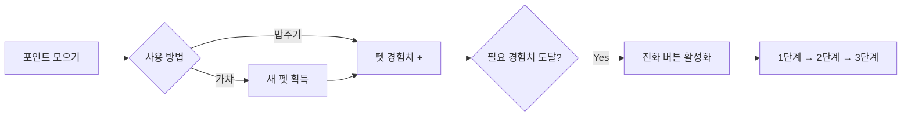
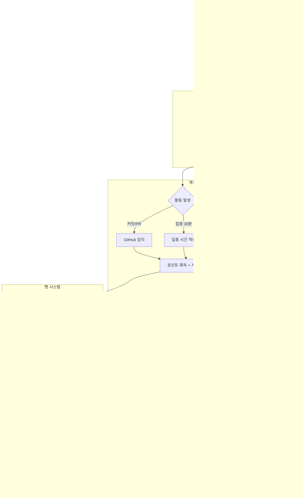
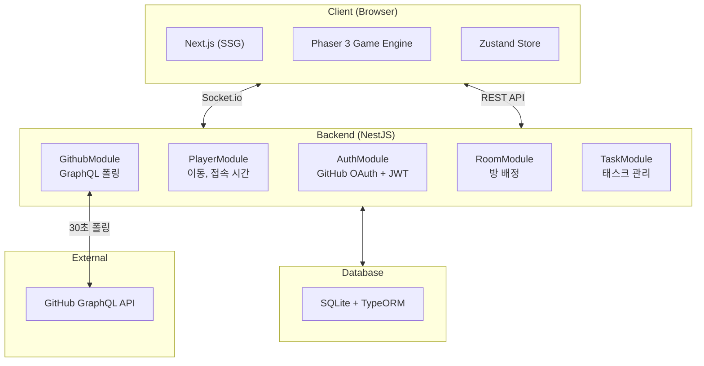

# [🌱 온라인 모각코 서비스 - 잔디 심고 갈래?](https://jandiplease.duckdns.org/)

<a href="https://jandiplease.duckdns.org/">
  
  
</a>
<p align="center"><em>이미지를 클릭하면 서비스로 이동합니다.</em></p>

# 🌱 잔디 심고 갈래?
혼자 코딩하지만 함께 몰입하고 있다는 감각을 전달하는 GitHub 기반 온라인 모각코 서비스

## 💡 이런 서비스입니다

`늦은 밤, 혼자 코딩할 때 슬랙에서 동료의 파란 불을 보며 힘을 얻은 적 있으신가요?`

**잔디 심고 갈래?** 는 바로 그 느낌을 온라인 공간으로 옮겨왔습니다. **캠·마이크 없이** 같은 공간에서 함께 코딩하는 경험을 제공합니다.


### 핵심 가치
- 🌍 **공동의 성장**: 개발자들의 GitHub 활동이 모여 맵을 변화(예: 황무지를 숲으로 변화)시킵니다
- ⏱️ **집중의 시각화**: 커밋, PR, 집중 시간이 실시간으로 반영됩니다
- 🐾 **펫과 함께**: 활동으로 얻은 포인트로 펫을 뽑고 성장시킵니다
- 🤝 **느슨한 연대**: 캠/마이크 없이, 같은 공간에서 함께 코딩하는 경험을 제공합니다

---


## 🎯 이런 분들을 위한 서비스입니다

**홀로 작업하며 동기부여**를 원하거나, **오프라인 모각코는 부담**스럽지만 **함께하는 느낌**을 원하는 개발자

---

## 🆚 기존 서비스와의 차별점

| 기존 서비스 | 한계점 | **잔디 심고 갈래?** |
| --- | --- | --- |
| 온라인 모각코 | 진입장벽 (규칙, 화면/캠 공유) | **규칙 없이 즉시 참여** ✅ |
| 메타버스(ZEP, 게더타운) | 개발자 특화 기능 부재 | **GitHub 연동 개발자 특화** ✅ |
| 디스코드/슬랙 | 공간감·시각적 성취 부족 | **유대감·시각적 성취** ✅ |
| 오프라인 모각코 | 지리적 한계,<br/>내향적 성향 부담 | **온라인으로 가볍게 접속** ✅ |

---

## ✨ 주요 기능

### 1️⃣ 함께 성장하는 가상 세계

모두의 활동이 모여 맵이 변화. **7일 시즌제**로 주기적 리셋이 이루어지고, 테마가 변경됨.


#### 테마


### 2️⃣ 실시간 캐릭터 시스템

**GitHub 프로필·마스코트** 캐릭터로 표현. **닉네임·집중시간·태스크** 표시, **실시간 상호작용**.


### 3️⃣ GitHub 활동 자동 연동 및 리더보드

**OAuth 간편 로그인**, **30초 간격** 자동 감지. 활동 시 포인트가 쌓이고, 포인트에 따라 맵 변화 **게이지 상승**.

#### 리더보드


### 4️⃣ 개인 성취 시각화

**잔디·캘린더**를 통한 날짜별 **집중시간·태스크·활동** 내역 확인

**히팅맵 및 개인잔디**

포인트 획득에 따라 달라지는 개인 잔디에서 수집한 펫과 활동들을 확인 가능


#### 세부 활동

해당 날짜에 진행한 깃허브 활동 상세 내역이나 자신의 Task(To-do)를 확인 가능


### 5️⃣ 펫 시스템 🐾

포인트로 **가챠·육성·진화**(3단계). **대표 펫**이 캐릭터 동행.

#### 펫과 캐릭터 이동


#### 펫 뽑기

펫을 뽑아 새로운 펫들을 수집 가능


#### 펫 도감

펫 도감을 통해 수집한 펫들을 관리하고, 대표 펫으로 설정하여 함께 이동 가능


#### 펫 밥주기

펫에게 밥을 주어 다음 단계로 성장시켜, 도감 수집 가능


#### 펫 획득 & 성장



- **가챠**: 포인트로 랜덤 펫 뽑기
- **밥주기**: 보유 펫에게 포인트를 투자하여 경험치 누적
- **진화**: 필요 경험치 도달 시 다음 단계로 진화 (최대 3단계)
- **대표 펫**: 선택한 펫이 캐릭터를 따라다니며 동행

---

## 사용자 시나리오



---

## 시스템 아키텍처



---

## 기술 스택

### Frontend
<div>
  
  
  
  
  
  
</div>

### Backend
<div>
  
  
  
  
  
</div>

### Infra
<div>
  
  
  
</div>

---

## 프로젝트 구조

```text
.
├── backend/          # NestJS 백엔드 (포트 8080)
│   ├── src/
│   │   ├── auth/     # GitHub OAuth, JWT
│   │   ├── player/   # 플레이어 관리
│   │   ├── github/   # GitHub 폴링
│   │   ├── room/     # 방 관리
│   │   └── task/     # 태스크 관리
│   └── public/       # 프론트엔드 빌드 결과물
│
├── frontend/         # Next.js 프론트엔드
│   ├── src/
│   │   ├── app/      # 페이지, 컴포넌트
│   │   ├── game/     # Phaser 게임 엔진
│   │   └── stores/   # Zustand 상태 관리
│   └── public/       # 정적 에셋
│
└── docs/             # 문서
```

---

## 팀 소개 [Estrogen Quattro]

에스트로겐 충만한 개발자 4인의 웹 개발 프로젝트 🤓

<table>
  <thead>
    <tr>
      <th align="center">이름</th>
      <th align="center">
        <a href="https://github.com/heisjun" target="_blank" rel="noopener noreferrer">김준혁</a>
      </th>
      <th align="center">
        <a href="https://github.com/honki12345" target="_blank" rel="noopener noreferrer">김훈기</a>
      </th>
      <th align="center">
        <a href="https://github.com/songhaechan" target="_blank" rel="noopener noreferrer">송해찬</a>
      </th>
      <th align="center">
        <a href="https://github.com/ldh-dodo" target="_blank" rel="noopener noreferrer">이도현</a>
      </th>
    </tr>
  </thead>
  <tbody>
    <tr>
      <td align="center">캠퍼 ID</td>
      <td align="center">J070</td>
      <td align="center">J086</td>
      <td align="center">J147</td>
      <td align="center">J181</td>
    </tr>
    <tr>
      <td align="center">사진</td>
      <td align="center">
        
      </td>
      <td align="center">
        
      </td>
      <td align="center">
        
      </td>
      <td align="center">
        
      </td>
    </tr>
  </tbody>
</table>

---


## 📚 더 알아보기

- 🔗 [서비스 접속](https://jandiplease.duckdns.org/)
- 📖 [GitHub Repository](https://github.com/boostcampwm2025/web19-estrogenquattro/wiki)

### 주요 문서

- 🏗️ [아키텍처 개요](https://github.com/boostcampwm2025/web19-estrogenquattro/blob/main/docs/architecture/OVERVIEW.md)
- 🎮 [게임 엔진 구조](https://github.com/boostcampwm2025/web19-estrogenquattro/blob/main/docs/architecture/GAME_ENGINE.md)
- 📡 [REST API 명세](https://github.com/boostcampwm2025/web19-estrogenquattro/blob/main/docs/api/REST_ENDPOINTS.md)
- 🔌 [소켓 이벤트](https://github.com/boostcampwm2025/web19-estrogenquattro/blob/main/docs/api/SOCKET_EVENTS.md)
- 🐙 [GitHub 폴링](https://github.com/boostcampwm2025/web19-estrogenquattro/blob/main/docs/api/GITHUB_POLLING.md)
- 💻 [개발 가이드](https://github.com/boostcampwm2025/web19-estrogenquattro/blob/main/docs/guides/DEVELOPMENT.md)

---

*함께 코딩하고 있다는 느낌, 지금 바로 경험해보세요!* 🌱

## 라이선스

본 프로젝트는 오픈소스 마스코트(Go, Java, Android, KDE, Linux, Rust, Jenkins)를 기반으로 AI 생성된 펫 이미지를 사용합니다.

자세한 라이선스 정보는 [LICENSES.md](./LICENSES.md)를 참고하세요.
