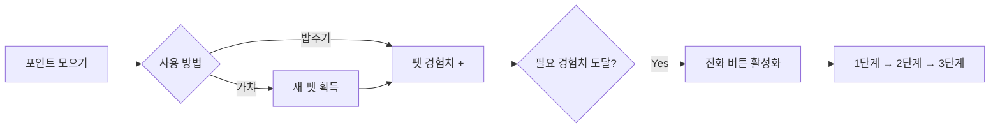
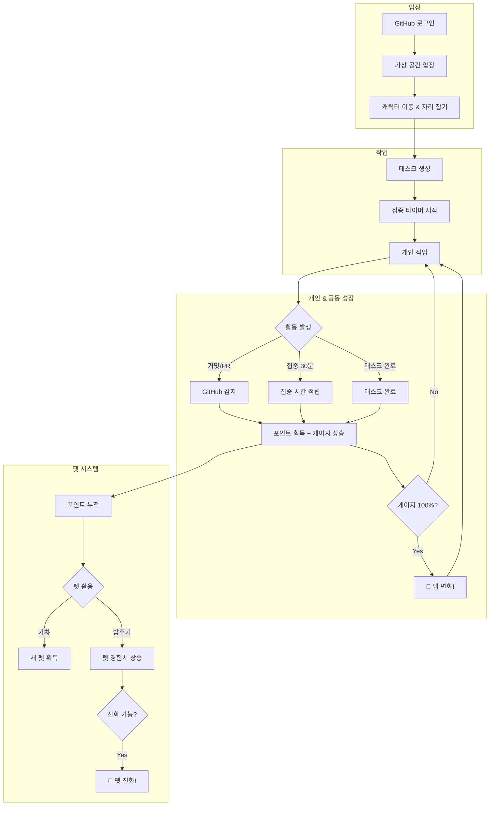
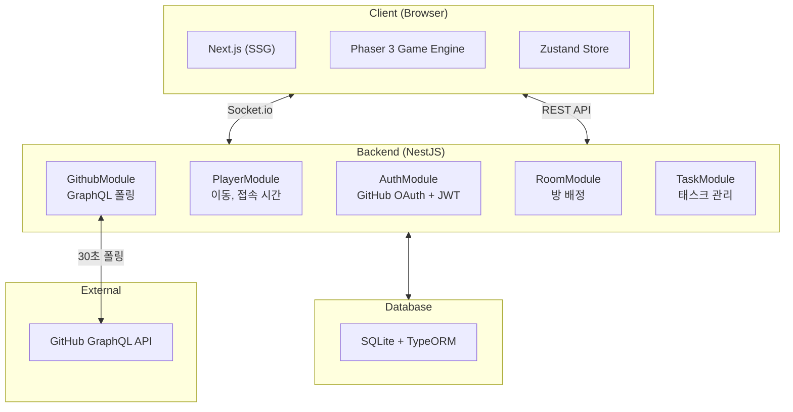

# [🌱 온라인 모각코 서비스 - 잔디 심고 갈래?](https://jandiplease.duckdns.org/)

<a href="https://jandiplease.duckdns.org/">
  
</a>
<p align="center"><em>이미지를 클릭하면 서비스로 이동합니다.</em></p>

## 프로젝트 소개

**🌱 잔디 심고 갈래?** 는 혼자 코딩하지만 **함께 몰입하고 있다는 감각**을 전달하는 GitHub 기반 온라인 모각코 서비스입니다.

- 🌍 **공동의 성장**: 개발자들의 GitHub 활동이 모여 황무지를 숲으로 변화시킵니다
- ⏱️ **집중의 시각화**: 커밋, PR, 집중 시간이 실시간으로 반영됩니다
- 🐾 **펫과 함께**: 활동으로 얻은 포인트로 펫을 뽑고 성장시킵니다
- 🤝 **느슨한 연대**: 캠/마이크 없이, 같은 공간에서 함께 코딩하는 경험을 제공합니다

---

## 기획 배경

> 혼자보다 함께할 때 힘을 얻은 적이 있나요?

저희 팀원들은 늦은 밤까지 작업할 때 슬랙 파란 불을 보며 힘을 얻었던 경험에 공감했습니다.

실제로는 곁에 없지만, **함께 코딩하고 있고 혼자가 아니라는 그 느낌**에 주목했습니다.

### 타겟 유저

- 늦은 시간 홀로 작업하면서 동기부여를 원하는 개발자
- 주변 지역에 동료가 없는 개발자
- 성장하고 싶지만 내향적인 성격을 가진 개발자

---

## 기존 서비스와의 차별점

| 기존 서비스 | 문제점과 한계 | 우리 서비스 |
|-------------|---------------|-------------|
| 온라인 모각코 | 진입장벽 존재 (접속 규칙, 화면/캠 공유) | 규칙 없이 즉시 참여 가능 |
| 메타버스 (ZEP, 게더타운) | 개발자 특화 기능 부재 | GitHub 연동으로 개발자 특화 기능 제공 |
| 디스코드/슬랙 | 공간감, 시각적 성취 부족 | 함께한다는 유대감, 시각적 성취 제공 |
| 오프라인 모각코 | 지리적 한계, 내향적인 성향 | 지리적 제한 없이 온라인으로 가볍게 접속 |

---

## 주요 기능

### 🗺️ 변화하는 가상 공간

사용자들의 개발 활동에 따라 **황무지에서 숲으로** 점진적으로 변화하는 공동의 세계

- 커밋, PR, 집중 시간 등 다양한 요소가 글로벌 진행 게이지에 반영
- 목표 달성 시 맵이 성장하며 모든 접속자에게 동시 반영
- **7일 시즌제**로 주기적인 리셋과 새로운 목표 제공

### 👤 실시간 캐릭터 시스템

- GitHub 프로필 사진 또는 마스코트로 캐릭터 표현
- 캐릭터 위에 닉네임, 현재 집중 시간, 작업 중인 태스크 표시
- 실시간 이동 및 다른 사용자와의 상호작용

### 🐙 GitHub 활동 연동

- GitHub OAuth 로그인으로 간편 접속
- 커밋, PR 등 개발 활동을 **30초 간격으로 감지**
- 활동 감지 시 캐릭터 이펙트 발생 + 글로벌 게이지 상승

### 📊 개인 성취 시각화

- 잔디/캘린더로 일별 활동 기록 확인
- 집중 시간, 완료한 태스크, GitHub 활동 카운트 표시
- 포인트 시스템으로 활동에 대한 보상 제공

### 🐾 펫 시스템

개발 활동으로 포인트를 모아 나만의 펫을 키워보세요!

#### 포인트 획득 방법

| 활동 | 포인트 | 비고 |
|------|--------|------|
| 커밋 (Push) | 3 | 실시간 적립 |
| PR 생성 | 2 | 실시간 적립 |
| PR 머지 | 4 | 실시간 적립 |
| PR 리뷰 | 4 | 실시간 적립 |
| 이슈 생성 | 1 | 실시간 적립 |
| 집중 30분 | 1 | 자정 정산 |
| 태스크 완료 | 1 | 즉시 적립 |

#### 펫 획득 & 성장



- **가챠**: 포인트로 랜덤 펫 뽑기
- **밥주기**: 보유 펫에게 포인트를 투자하여 경험치 누적
- **진화**: 필요 경험치 도달 시 다음 단계로 진화 (최대 3단계)
- **대표 펫**: 선택한 펫이 캐릭터를 따라다니며 동행

---

## 사용자 시나리오



---

## 시스템 아키텍처



---

## 기술 스택

### Frontend
<div>
  
  
  
  
  
  
</div>

### Backend
<div>
  
  
  
  
  
</div>

### Infra
<div>
  
  
  
</div>

---

## 프로젝트 구조

```text
.
├── backend/          # NestJS 백엔드 (포트 8080)
│   ├── src/
│   │   ├── auth/     # GitHub OAuth, JWT
│   │   ├── player/   # 플레이어 관리
│   │   ├── github/   # GitHub 폴링
│   │   ├── room/     # 방 관리
│   │   └── task/     # 태스크 관리
│   └── public/       # 프론트엔드 빌드 결과물
│
├── frontend/         # Next.js 프론트엔드
│   ├── src/
│   │   ├── app/      # 페이지, 컴포넌트
│   │   ├── game/     # Phaser 게임 엔진
│   │   └── stores/   # Zustand 상태 관리
│   └── public/       # 정적 에셋
│
└── docs/             # 문서
```

---

## 팀 소개 [Estrogen Quattro]

에스트로겐 충만한 개발자 4인의 웹 개발 프로젝트 🤓

<table>
  <thead>
    <tr>
      <th align="center">이름</th>
      <th align="center">
        <a href="https://github.com/heisjun" target="_blank" rel="noopener noreferrer">김준혁</a>
      </th>
      <th align="center">
        <a href="https://github.com/honki12345" target="_blank" rel="noopener noreferrer">김훈기</a>
      </th>
      <th align="center">
        <a href="https://github.com/songhaechan" target="_blank" rel="noopener noreferrer">송해찬</a>
      </th>
      <th align="center">
        <a href="https://github.com/ldh-dodo" target="_blank" rel="noopener noreferrer">이도현</a>
      </th>
    </tr>
  </thead>
  <tbody>
    <tr>
      <td align="center">캠퍼 ID</td>
      <td align="center">J070</td>
      <td align="center">J086</td>
      <td align="center">J147</td>
      <td align="center">J181</td>
    </tr>
    <tr>
      <td align="center">사진</td>
      <td align="center">
        
      </td>
      <td align="center">
        
      </td>
      <td align="center">
        
      </td>
      <td align="center">
        
      </td>
    </tr>
  </tbody>
</table>

---

## 문서

자세한 내용은 [docs/](./docs/README.md)를 참고하세요.

| 문서 | 설명 |
|------|------|
| [아키텍처 개요](./docs/architecture/OVERVIEW.md) | 프로젝트 전체 구조 |
| [게임 엔진 구조](./docs/architecture/GAME_ENGINE.md) | Phaser 게임 엔진 |
| [REST API 명세](./docs/api/REST_ENDPOINTS.md) | REST API 엔드포인트 |
| [소켓 이벤트](./docs/api/SOCKET_EVENTS.md) | Socket.io 이벤트 명세 |
| [GitHub 폴링](./docs/api/GITHUB_POLLING.md) | GitHub GraphQL 폴링 |
| [개발 가이드](./docs/guides/DEVELOPMENT.md) | 개발 환경 설정 |
