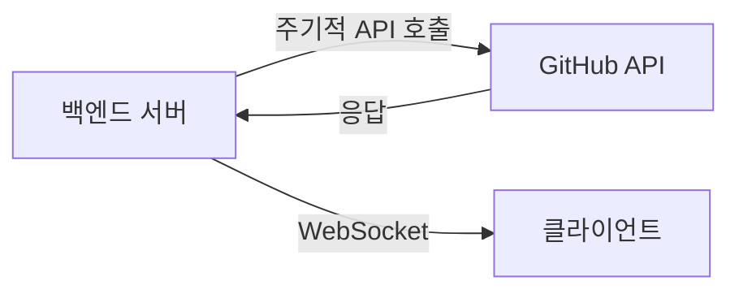
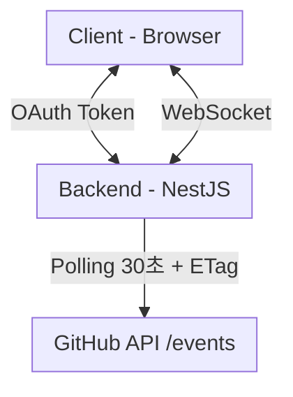

# GitHub API 전략 - Polling 방식

## 방식 비교 및 선택 이유

| 요구사항 | Polling | Webhooks | GitHub App |
|----------|---------|----------|------------|
| 모든 레포 감지 | ✅ | ❌ | ✅ |
| 기존 OAuth 활용 | ✅ | ✅ | ❌ |
| 구현 난이도 | 쉬움 | 중간 | 어려움 |

→ **모든 레포 감지 + 기존 OAuth 활용 + 빠른 구현** = Polling 선택

---

## 동작 방식



---

## 사용 API

```
GET /users/{username}/events
```

**응답 예시 (PushEvent)**

```json
{
  "id": "12345678",
  "type": "PushEvent",
  "created_at": "2025-12-17T10:30:00Z",
  "repo": { "name": "user/repo" },
  "payload": {
    "commits": [
      { "sha": "abc123", "message": "feat: 새 기능 추가" }
    ]
  }
}
```

---

## 필요한 OAuth Scope

| Scope | 감지 범위 |
|-------|----------|
| (없음) | public 레포 활동만 |
| `repo` | public + private 레포 활동 |

---

## Rate Limit

| 항목 | 값 |
|------|-----|
| 인증된 요청 한도 | 5,000 req/hour |
| 분당 가능 횟수 | ~83 req/min |

**Polling 주기별 소모량 (사용자 1명 기준)**

| 주기 | 시간당 요청 | 여유분 |
|------|------------|--------|
| 60초 | 60 req | 4,940 |
| 30초 | 120 req | 4,880 |
| 10초 | 360 req | 4,640 |

→ 각 사용자 본인 토큰 사용 시 사용자 수 무관하게 확장 가능

### OAuth App별 Rate Limit 분리

GitHub Rate Limit은 **OAuth App 단위로 분리**됩니다.

```
사용자 A의 Rate Limit:
├── 우리 서비스 OAuth App    → 5,000/hour (독립)
├── 다른 서비스 B OAuth App  → 5,000/hour (독립)
└── 다른 서비스 C OAuth App  → 5,000/hour (독립)
```

| 시나리오 | 우리 서비스 영향 |
|----------|-----------------|
| 사용자가 다른 서비스에서 GitHub API 많이 사용 | ❌ 영향 없음 |
| 사용자가 GitHub CLI로 API 많이 사용 | ❌ 영향 없음 |
| 사용자가 Personal Access Token(PAT) 직접 사용 | ❌ 영향 없음 (OAuth와 별개) |

**핵심**: 우리 서비스의 OAuth App으로 발급받은 토큰은 우리 서비스에서만 사용되므로,
다른 서비스가 사용자의 Rate Limit을 소모하지 않습니다.

---

## 최적화: Conditional Request (ETag)

### ETag란?

**ETag (Entity Tag)** 는 HTTP 리소스의 특정 버전을 식별하는 고유한 문자열입니다.

```
ETag: "abc123def456"
```

웹 서버가 응답할 때 `ETag` 헤더로 현재 데이터의 "버전"을 알려주고, 클라이언트가 다음 요청 시 `If-None-Match` 헤더로 이전 버전을 보내면:

- **데이터가 변경됨**: 새 데이터 + 새 ETag 반환 (200 OK)
- **데이터가 동일함**: 본문 없이 "변경 없음" 응답 (304 Not Modified)

### 왜 유용한가?

1. **대역폭 절약**: 데이터가 변경되지 않았으면 본문을 전송하지 않음
2. **Rate Limit 절약**: GitHub API는 304 응답 시 Rate Limit을 차감하지 않음
3. **서버 부하 감소**: 불필요한 데이터 처리 방지

### GitHub API에서의 동작

GitHub API는 `ETag` 헤더를 지원합니다. 이전 응답의 ETag를 다음 요청에 포함하면:

- **변경 있음**: 200 OK + 새 데이터 (rate limit 차감)
- **변경 없음**: 304 Not Modified (rate limit 미차감)

**구현 예시**

```typescript
class GitHubPoller {
  private etagMap = new Map<string, string>(); // userId -> etag

  async pollUserEvents(userId: string, token: string) {
    const lastETag = this.etagMap.get(userId);

    const response = await fetch(
      `https://api.github.com/users/${userId}/events`,
      {
        headers: {
          Authorization: `Bearer ${token}`,
          'If-None-Match': lastETag ?? '',
        },
      },
    );

    // 변경 없음 - rate limit 미차감
    if (response.status === 304) {
      return null;
    }

    // 새 이벤트 있음
    const events = await response.json();
    const newETag = response.headers.get('ETag');

    if (newETag) {
      this.etagMap.set(userId, newETag);
    }

    return events;
  }
}
```

**효과**

```
일반 Polling (30초 간격, 1시간) → 120 req 소모
ETag Polling (30초 간격, 1시간, 실제 변경 5회) → 5 req 소모 (96% 절약)
```

### ETag와 Rate Limit의 관계

ETag와 Rate Limit은 **독립적으로 동작**합니다.

| 상황 | ETag 동작 | 결과 |
|------|----------|------|
| Rate Limit 초기화 (매시간) | ETag 여전히 유효 | 304 정상 반환 |
| 다음 날 | 데이터 변경 없으면 304, 있으면 200 | 정상 동작 |
| ETag가 오래되어 무효화 | GitHub이 200 반환 | 새 ETag 수신 |
| 서버 재시작 | etagMap 초기화 | 첫 요청만 200, 이후 304 |

**핵심 포인트**

- ETag = "이 데이터의 버전" (콘텐츠 기반)
- Rate Limit = "API 호출 횟수 제한" (시간 기반)
- ETag가 유효하지 않으면 에러가 아니라 200으로 새 데이터 반환
- 서버 재시작 시 etagMap이 초기화되어도 첫 요청만 200이고 이후 정상 동작

**고려사항**

현재 etagMap은 메모리에 저장되어 서버 재시작 시 초기화됩니다.
대규모 서비스에서는 Redis 등 외부 저장소에 ETag를 저장할 수 있지만,
현재 규모에서는 불필요합니다.

---

## 감지 가능한 주요 이벤트 타입

| 이벤트 | 설명 |
|--------|------|
| `PushEvent` | 커밋 푸시 |
| `PullRequestEvent` | PR 생성/수정/머지 |
| `IssuesEvent` | 이슈 생성/수정 |
| `IssueCommentEvent` | 이슈/PR 코멘트 |
| `CreateEvent` | 브랜치/태그 생성 |

---

## 권장 설정

| 항목 | 권장값 | 비고 |
|------|--------|------|
| Polling 주기 | **30초** | 안전하고 실시간성 균형 |
| ETag 캐싱 | 필수 | Rate Limit 절약 |

---

## 폴링 주기 설계 근거

### 왜 30초인가?

| 주기 | 장점 | 단점 |
|------|------|------|
| 10초 | 빠른 반응 | Rate Limit 소모 큼, GitHub 권장 미준수 |
| **30초** | 실시간성과 안정성 균형 | - |
| 60초 | GitHub 권장, 안전 | 반응 느림 |

### GitHub API 제약 사항

#### 1. `X-Poll-Interval` 헤더

GitHub Events API는 응답에 권장 폴링 간격을 포함:

```
X-Poll-Interval: 60
```

이 값보다 자주 폴링하면 `429 Too Many Requests` 발생 가능.
단, ETag 사용 시 304 응답은 이 제한에서 제외.

#### 2. Events API는 실시간이 아님

이벤트 발생 → API 반영까지 **수 초 ~ 수 분** 지연 존재.
폴링을 아무리 자주 해도 이벤트 자체의 지연은 해결 불가.

### 사용자 수 확장성

**핵심: 각 사용자의 OAuth 토큰 사용 시 Rate Limit이 사용자별로 분리**

```
사용자 A 토큰 → A의 Rate Limit (5,000/hour)
사용자 B 토큰 → B의 Rate Limit (5,000/hour)
```

| 사용자 수 | 30초 폴링 | Rate Limit |
|----------|----------|------------|
| 1명 | 120 req/hour | 각자 5,000 |
| 100명 | 각자 120 req/hour | 각자 5,000 |
| 1,000명 | 각자 120 req/hour | 각자 5,000 |

→ **사용자 수 무관하게 확장 가능**

### 서버 부하 고려

Rate Limit은 사용자별이지만, 백엔드 서버 처리량은 증가:

| 사용자 수 | 서버 처리량 |
|----------|-----------|
| 10명 | 20 req/min |
| 100명 | 200 req/min |
| 1,000명 | 2,000 req/min |

**대규모 확장 시 고려사항:**
- Room 단위 폴링 통합 (같은 방 사용자는 1회만 폴링)
- Webhook 방식 전환 검토

### 실시간성 비교

| 방식 | 지연 시간 | 비고 |
|------|----------|------|
| Polling 30초 | 30초 + API 지연 | 현재 방식 |
| Polling 10초 | 10초 + API 지연 | 공격적 |
| Webhook | 수 초 | 레포별 등록 필요 |
| GitHub App | 수 초 | 구현 복잡 |

---

## 아키텍처



1. 사용자 OAuth 로그인 → 토큰 저장
2. 백엔드에서 주기적으로 `/users/{username}/events` 호출
3. 새 이벤트 감지 시 WebSocket으로 클라이언트에 전송
4. ETag로 불필요한 rate limit 소모 방지

---

## 참고: 다른 방식과의 비교

### Webhooks

- 레포지토리마다 개별 웹훅 등록 필요
- 사용자가 레포 admin 권한 필요
- 모든 레포 감지 불가능

### GitHub App

- GitHub에서 별도 App 생성 필요
- 사용자에게 App 설치 단계 추가
- 구현 복잡도 높음
- 장기적으로는 더 좋은 선택지
