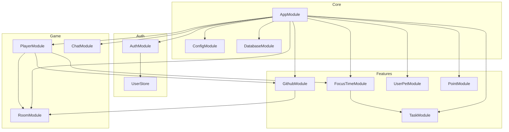
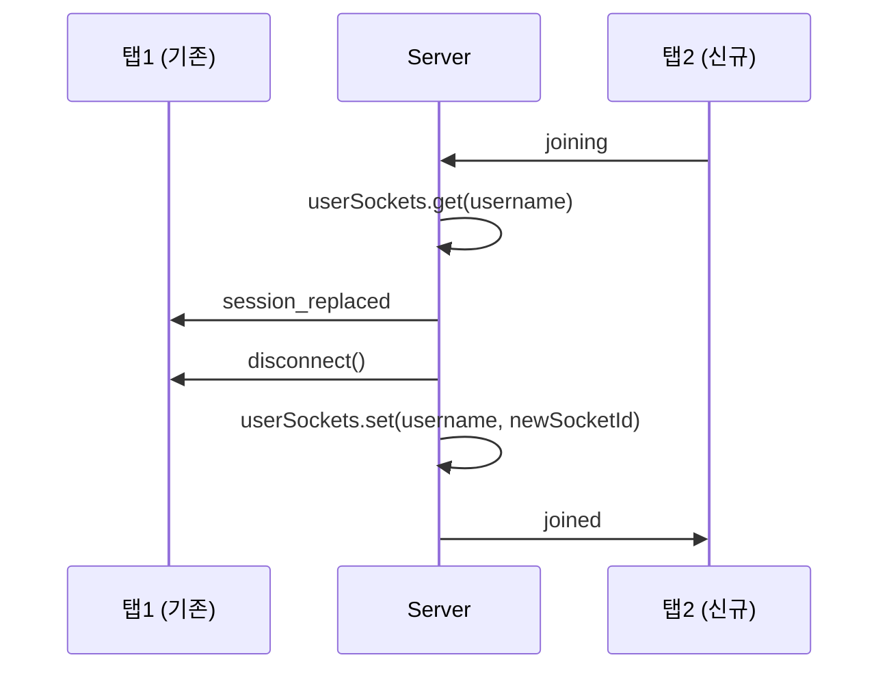
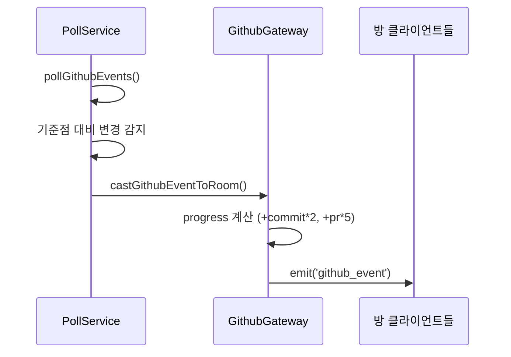

# 백엔드 모듈 구조

## 개요

NestJS 기반 백엔드의 모듈 구조 및 각 모듈의 책임

---

## 모듈 의존성 다이어그램



---

## 모듈 상세

### AuthModule

GitHub OAuth 인증 및 JWT 관리

| 파일 | 역할 |
|------|------|
| `auth.controller.ts` | 인증 엔드포인트 (`/auth/*`) |
| `github.strategy.ts` | Passport GitHub 전략 |
| `jwt.strategy.ts` | Passport JWT 전략 |
| `ws-jwt.guard.ts` | WebSocket JWT 검증 |
| `user.store.ts` | 인메모리 사용자 저장소 |

**주요 엔드포인트:**
- `GET /auth/github` - OAuth 시작
- `GET /auth/github/callback` - OAuth 콜백
- `GET /auth/me` - 현재 사용자 정보
- `GET /auth/logout` - 로그아웃

**UserStore:**
```typescript
class UserStore {
  private users = new Map<githubId, User>();

  findOrCreate(user: User): User;
  findByGithubId(githubId: string): User | undefined;
}
```

> **Note:** 서버 재시작 시 UserStore 초기화됨

---

### PlayerModule

플레이어 접속, 이동, 상태 관리

| 파일 | 역할 |
|------|------|
| `player.gateway.ts` | 소켓 이벤트 처리 |
| `player.service.ts` | 플레이어 DB 조회/수정 |
| `player.controller.ts` | REST API |

**Gateway 상태:**
```typescript
players: Map<socketId, PlayerData>;     // 접속 중인 플레이어
userSockets: Map<username, socketId>;   // 중복 접속 방지
```

**주요 이벤트:**
| 이벤트 | 방향 | 설명 |
|--------|------|------|
| `joining` | C→S | 방 입장 요청 |
| `joined` | S→C | 입장 완료 (roomId, focusTime) |
| `players_synced` | S→C | 기존 플레이어 목록 |
| `player_joined` | S→C | 새 플레이어 입장 알림 |
| `player_left` | S→C | 플레이어 퇴장 알림 |
| `moving` | C→S | 위치 업데이트 |
| `moved` | S→C | 다른 플레이어 이동 |

**중복 세션 처리:**


---

### RoomModule

방 배정 및 관리

| 파일 | 역할 |
|------|------|
| `room.service.ts` | 방 배정 로직 |

**설정:**
```typescript
capacity = 14;           // 방당 최대 인원
initialRooms = 3;        // 초기 방 개수
```

**주요 메서드:**
| 메서드 | 설명 |
|--------|------|
| `randomJoin(socketId)` | 여유 있는 방에 랜덤 배정 |
| `exit(socketId)` | 방 퇴장 |
| `addPlayer(roomId, playerId)` | 플레이어 추가 |
| `removePlayer(roomId, playerId)` | 플레이어 제거 |
| `getPlayerIds(roomId)` | 방의 플레이어 ID 목록 |

**방 상태 관리:**
```typescript
rooms: Map<roomId, { size: number }>;
roomPlayers: Map<roomId, Set<playerId>>;
availableRooms: roomId[];  // O(1) 랜덤 선택용
```

---

### FocusTimeModule

집중/휴식 상태 및 시간 관리

| 파일 | 역할 |
|------|------|
| `focustime.gateway.ts` | 소켓 이벤트 처리 |
| `focustime.service.ts` | 시간 계산, DB 관리 |
| `focustime.controller.ts` | REST API |

**DB 엔티티 (DailyFocusTime):**
```typescript
{
  id: number;
  player: Player;
  total_focus_seconds: number;
  status: 'FOCUSING' | 'RESTING';
  created_date: Date;              // YYYY-MM-DD
  last_focus_start_time: Date;     // nullable
  current_task_id: number;         // nullable
}
```

**주요 이벤트:**
| 이벤트 | 방향 | 설명 |
|--------|------|------|
| `focusing` | C→S | 집중 시작 |
| `focused` | S→C | 집중 시작 알림 (브로드캐스트) |
| `resting` | C→S | 휴식 시작 |
| `rested` | S→C | 휴식 시작 알림 (브로드캐스트) |
| `focus_task_updating` | C→S | Task 이름 변경 |
| `focus_task_updated` | S→C | Task 이름 변경 알림 |

**시간 계산:**
```typescript
// 집중 시작
startFocusing(playerId, taskId?):
  status = 'FOCUSING'
  lastFocusStartTime = now()
  currentTaskId = taskId

// 휴식 시작
startResting(playerId):
  elapsed = now() - lastFocusStartTime
  totalFocusSeconds += elapsed
  task.totalFocusSeconds += elapsed  // Task에도 누적
  status = 'RESTING'
```

---

### TaskModule

Task CRUD 및 완료 처리

| 파일 | 역할 |
|------|------|
| `task.service.ts` | Task CRUD 로직 |
| `task.controller.ts` | REST API |

**주요 엔드포인트:**
| Method | Path | 설명 |
|--------|------|------|
| GET | `/api/tasks` | 목록 조회 (date 파라미터) |
| POST | `/api/tasks` | 생성 |
| PATCH | `/api/tasks/:id` | 수정 |
| DELETE | `/api/tasks/:id` | 삭제 |
| PATCH | `/api/tasks/completion/:id` | 완료 처리 |
| PATCH | `/api/tasks/uncompletion/:id` | 완료 취소 |

**DB 엔티티 (Task):**
```typescript
{
  id: number;
  player: Player;
  description: string;           // 100자 제한
  total_focus_seconds: number;
  completed_date: Date | null;   // 완료 시 날짜
  created_date: Date;            // YYYY-MM-DD
}
```

---

### GithubModule

GitHub 폴링 및 이벤트 관리

| 파일 | 역할 |
|------|------|
| `github.gateway.ts` | 방별 상태 관리, 이벤트 브로드캐스트 |
| `github.poll-service.ts` | GraphQL 폴링 스케줄링 |
| `github.service.ts` | 활동 기록 DB 관리 |
| `github.controller.ts` | REST API |

**Gateway 상태:**
```typescript
roomStates: Map<roomId, {
  progress: number;                      // 0-99
  contributions: Record<string, number>; // username -> count
}>;
```

**폴링 시스템:**
```typescript
POLL_INTERVAL = 30_000;         // 30초
POLL_INTERVAL_BACKOFF = 120_000; // 429 응답 시

pollingSchedules: Map<username, {
  timeout: NodeJS.Timeout;
  username, accessToken, roomId, playerId;
  clientIds: Set<string>;  // 중복 폴링 방지
}>;

userBaselines: Map<username, {
  lastCommitCount, lastPRCount;
  isFirstPoll: boolean;
}>;
```

**이벤트 흐름:**


---

### UserPetModule

펫 관리 (뽑기, 진화, 장착)

| 파일 | 역할 |
|------|------|
| `userpet.service.ts` | 펫 로직 |
| `userpet.controller.ts` | REST API |

**주요 엔드포인트:**
| Method | Path | 설명 |
|--------|------|------|
| GET | `/api/pets/all` | 전체 펫 마스터 목록 |
| GET | `/api/pets/inventory/:playerId` | 보유 펫 목록 |
| GET | `/api/pets/codex/:playerId` | 도감 (수집한 펫 ID) |
| POST | `/api/pets/gacha` | 가챠 |
| POST | `/api/pets/feed` | 먹이주기 |
| POST | `/api/pets/evolve` | 진화 |

**소켓 이벤트 (PlayerGateway에서 처리):**
| 이벤트 | 방향 | 설명 |
|--------|------|------|
| `pet_equipping` | C→S | 펫 장착 요청 |
| `pet_equipped` | S→C | 펫 장착 알림 (브로드캐스트) |

---

### PointModule

포인트 조회 (현재 읽기만 구현)

| 파일 | 역할 |
|------|------|
| `point.service.ts` | 포인트 조회 |
| `point.controller.ts` | REST API |

**주요 엔드포인트:**
| Method | Path | 설명 |
|--------|------|------|
| GET | `/api/points` | 포인트 조회 |

> **Note:** 포인트 획득 로직은 미구현 상태

---

### ChatModule

채팅 브로드캐스트

| 파일 | 역할 |
|------|------|
| `chat.gateway.ts` | 채팅 이벤트 처리 |

**이벤트:**
| 이벤트 | 방향 | 설명 |
|--------|------|------|
| `chatting` | C→S | 채팅 메시지 전송 |
| `chatted` | S→C | 채팅 메시지 브로드캐스트 |

---

### ConfigModule

환경 변수 및 로깅 설정

| 파일 | 역할 |
|------|------|
| `config.module.ts` | ConfigModule 설정 |
| `env.validation.ts` | 환경 변수 검증 |
| `logger/` | Winston 로거 설정 |

---

### DatabaseModule

TypeORM 및 마이그레이션

| 파일 | 역할 |
|------|------|
| `database.module.ts` | TypeORM 설정 |
| `migrations/` | 마이그레이션 파일들 |

**설정:**
```typescript
TypeOrmModule.forRoot({
  type: 'sqlite',
  database: 'database.sqlite',
  synchronize: false,  // 프로덕션에서는 마이그레이션 사용
  migrations: ['dist/database/migrations/*.js'],
})
```

---

## 모듈 간 통신 패턴

### Gateway → Service

```typescript
@SubscribeMessage('focusing')
async handleFocusing(client, data) {
  const result = await this.focusTimeService.startFocusing(
    client.data.user.playerId,
    data.taskId
  );
  return { success: true, data: result };
}
```

### Service → Service (의존성 주입)

```typescript
@Injectable()
export class FocusTimeService {
  constructor(
    private taskService: TaskService,  // Task 시간 누적용
  ) {}
}
```

### Gateway 간 이벤트 전달

```typescript
// PlayerGateway에서 GithubGateway 호출
this.githubGateway.castGithubEventToRoom(event, roomId);
```

---

## 관련 문서

- [SOCKET_EVENTS.md](../api/SOCKET_EVENTS.md) - 소켓 이벤트 명세
- [REST_ENDPOINTS.md](../api/REST_ENDPOINTS.md) - REST API 명세
- [ERD.md](../guides/ERD.md) - 데이터베이스 스키마
