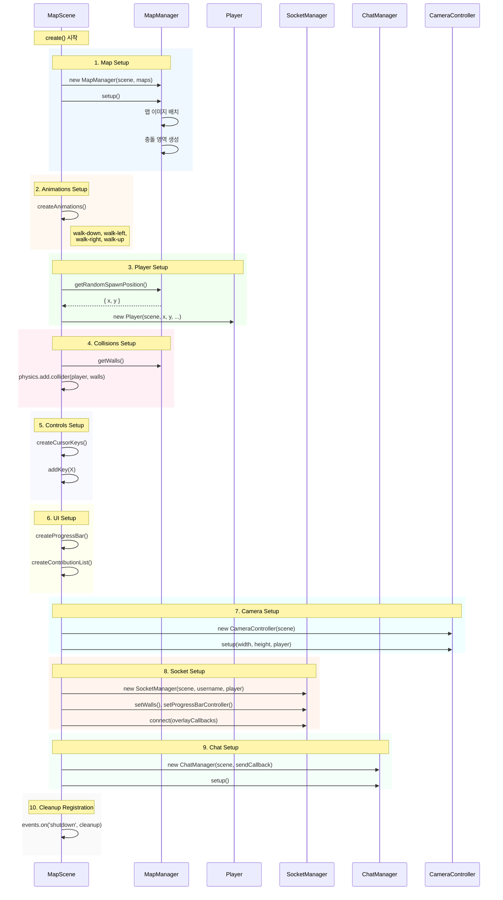
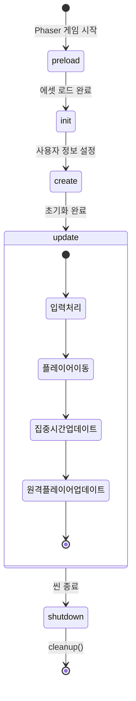
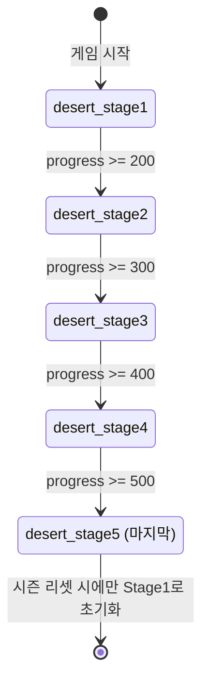
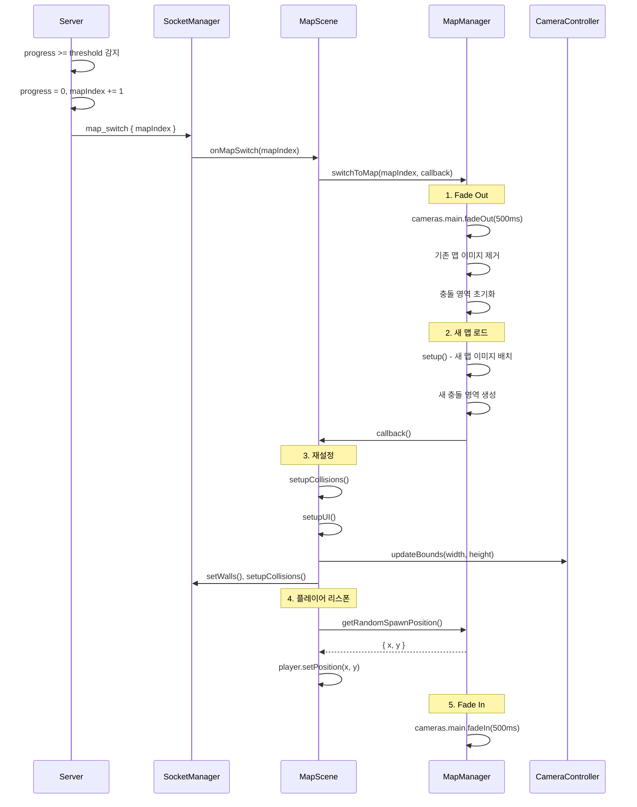

# Phaser 게임 엔진 구조

## 개요

Phaser 3 Arcade Physics 기반의 2D 멀티플레이어 게임

## 게임 설정

```typescript
// frontend/src/game/config.ts
export const gameConfig: Phaser.Types.Core.GameConfig = {
  type: Phaser.AUTO,
  parent: "game-container",
  scale: {
    mode: Phaser.Scale.RESIZE,
    width: "100%",
    height: "100%",
  },
  audio: {
    noAudio: true,
  },
  backgroundColor: "#303032",
  physics: {
    default: "arcade",
    arcade: {
      gravity: { x: 0, y: 0 },
      debug: false,
    },
  },
  scene: [MapScene],
};
```

---

## Scene 구조

### MapScene

메인 게임 화면을 담당하는 Scene

```
MapScene
├── preload()     # 에셋 로드 (맵 이미지, 스프라이트 시트, Tiled JSON)
├── create()      # 게임 오브젝트 생성, 소켓 이벤트 바인딩
└── update()      # 프레임별 업데이트 (플레이어 이동 처리)
```

**주요 책임:**
- 맵 렌더링 및 충돌 영역 설정
- 로컬 플레이어 (Player) 생성 및 조작
- 원격 플레이어 (RemotePlayer) 동기화
- UI 컴포넌트 (프로그레스바, 기여도 목록) 관리
- Socket.io 이벤트 처리

### 씬 초기화 흐름 (create)



### 씬 라이프사이클



---

## Player 클래스 구조

```
BasePlayer (추상 클래스)
├── 렌더링: 얼굴 스프라이트, 몸통 애니메이션
├── Physics: Arcade Physics Body
├── UI: 닉네임 텍스트, 접속 시간
└── 채팅: 말풍선 표시

Player extends BasePlayer
├── 키보드 입력 처리
├── 이동 이벤트 전송 (moving)
└── 카메라 팔로우

RemotePlayer extends BasePlayer
├── 서버 위치 데이터 수신
├── Lerp 기반 부드러운 이동
├── 애니메이션 동기화
└── 집중 상태/시간 실시간 표시
```

### Player (로컬 플레이어)

```typescript
// frontend/src/game/players/Player.ts
export class Player extends BasePlayer {
  // 키보드 입력 → Arcade Physics 이동
  // moving 이벤트 전송 (30ms 쓰로틀)
}
```

### RemotePlayer (원격 플레이어)

```typescript
// frontend/src/game/players/RemotePlayer.ts
export class RemotePlayer extends BasePlayer {
  // 서버에서 수신한 위치로 Lerp 이동
  // 방향에 따른 애니메이션 재생
  // 집중 상태 및 시간 표시
}
```

**FocusTime 기능:**

- `setFocusState(isFocusing, options)`: 집중/휴식 상태 설정
- 집중 중일 때 1초마다 경과 시간 UI 업데이트 (로컬 계산)
- `options.taskName`: 현재 작업 중인 태스크 이름 (말풍선 표시)
- `options.totalFocusSeconds`: 누적 집중 시간 (초)
- `options.currentSessionSeconds`: 현재 세션 경과 시간 (서버에서 계산하여 전달)

---

## 맵 시스템

### 에셋 구조

```
frontend/public/assets/
├── maps/
│   ├── desert_stage1.webp   # 맵 이미지 1
│   ├── desert_stage2.webp   # 맵 이미지 2
│   ├── desert_stage3.webp   # 맵 이미지 3
│   ├── desert_stage4.webp   # 맵 이미지 4
│   └── desert_stage5.webp   # 맵 이미지 5
├── tilemaps/
│   ├── desert_stage1.json   # Tiled 충돌 데이터 1
│   ├── desert_stage2.json   # Tiled 충돌 데이터 2
│   ├── desert_stage3.json   # Tiled 충돌 데이터 3
│   ├── desert_stage4.json   # Tiled 충돌 데이터 4
│   └── desert_stage5.json   # Tiled 충돌 데이터 5
├── grass/
│   ├── grass_level_0.webp   # 잔디 레벨 0 (활동 없음)
│   ├── grass_level_1.webp   # 잔디 레벨 1
│   ├── grass_level_2.webp   # 잔디 레벨 2
│   └── grass_level_3.webp   # 잔디 레벨 3 (활동 많음)
└── body.png                  # 캐릭터 스프라이트 시트
```

### Tiled JSON 충돌 영역

Tiled 에디터로 충돌 영역을 정의하고 JSON으로 export

```json
{
  "layers": [
    {
      "name": "Collisions",
      "objects": [
        {
          "class": "wall",
          "x": 100,
          "y": 200,
          "width": 32,
          "height": 32
        }
      ]
    }
  ]
}
```

### 맵 전환

서버에서 progress가 기준값 도달 감지 시 `map_switch` 이벤트로 전체 클라이언트에 맵 전환 지시

#### 맵별 기준값

| 맵 전환 | 기준값 |
|---------|--------|
| 맵 0 → 맵 1 | 200 |
| 맵 1 → 맵 2 | 300 |
| 맵 2 → 맵 3 | 400 |
| 맵 3 → 맵 4 | 500 |
| 맵 4 | 500 도달 시 멈춤 (전환 없음) |

#### 맵 진행 상태



> **Note:** 마지막 맵(Stage5)에서는 순환하지 않고, 시즌 리셋(매주 월요일 00:00 KST) 시에만 Stage1으로 초기화됩니다.

#### 맵 전환 시퀀스 (서버 주도)



**맵 전환 트리거:**

| 케이스 | 트리거 | 경로 |
|--------|--------|------|
| 정상 전환 | `map_switch` | `onMapSwitch` → `performMapSwitch` |
| 신규 접속 | `game_state` | `onMapSyncRequired` → `performMapSwitch` |
| 재접속 | `game_state` | `onMapSyncRequired` → `performMapSwitch` |
| 유실 복구 | `progress_update` | `onMapSyncRequired` → `performMapSwitch` |

---

## UI 컴포넌트

### 프로그레스바

프로그래스바는 게임 외부의 React 컴포넌트로 구현되어 있으며, Zustand 스토어를 통해 상태를 관리합니다.

```typescript
// frontend/src/_components/ui/ProgressBar.tsx
// React 컴포넌트로 구현 (맵 외부 UI)

// frontend/src/stores/useProgressStore.ts
interface ProgressState {
  progress: number;
  mapIndex: number;
  setProgress: (progress: number) => void;
  setMapIndex: (index: number) => void;
  reset: () => void;
}
```

- React 컴포넌트로 렌더링 (게임 외부 UI)
- `useProgressStore`를 통해 상태 관리
- **절대값 동기화**: 서버에서 받은 `targetProgress`를 그대로 표시 (클라이언트 계산 없음)
- CSS 애니메이션으로 부드러운 진행

### 기여도 목록

```typescript
// frontend/src/_components/ui/ContributionList.tsx
// frontend/src/stores/useContributionStore.ts
interface ContributionStore {
  contributions: Record<string, number>; // { username: points }
  setContributions: (data: Record<string, number>) => void;
  reset: () => void;
}
```

- 상위 3명 포인트 순 정렬 표시 (MAX_DISPLAY_COUNT = 3)
- 메달 이미지(금/은/동)와 username 표시

---

## Socket.io 연동

### 이벤트 바인딩 (create)

```typescript
socket.on('players_synced', (players) => {
  // 기존 플레이어들 RemotePlayer로 생성
  // FocusTime 상태(status, lastFocusStartTime, totalFocusSeconds) 반영
});

socket.on('player_joined', (data) => {
  // 새 플레이어 RemotePlayer 생성
});

socket.on('moved', (data) => {
  // RemotePlayer 위치 업데이트
});

socket.on('game_state', (data) => {
  // 프로그레스바/기여도 초기값 설정
  // mapIndex 동기화 (신규/재접속자)
});

socket.on('progress_update', (data) => {
  // 프로그레스바 절대값 설정 (data.targetProgress)
  // 기여도 목록 업데이트
  // mapIndex 동기화 (map_switch 유실 복구)
});

socket.on('map_switch', (data) => {
  // 서버 지시로 맵 전환 (data.mapIndex)
});

socket.on('focused', (data) => {
  // RemotePlayer 집중 상태로 전환
  // taskName, totalFocusSeconds, currentSessionSeconds 반영
});

socket.on('rested', (data) => {
  // RemotePlayer 휴식 상태로 전환
  // totalFocusSeconds 업데이트
});
```

### 이벤트 전송 (update)

```typescript
// 이동 중일 때만 전송 (쓰로틀 적용)
socket.emit('moving', {
  x: player.x,
  y: player.y,
  isMoving: true,
  direction: currentDirection,
  timestamp: Date.now(),
});
```

---

## 애니메이션

### 캐릭터 스프라이트 시트

```
body.png (4방향 x 4프레임)
├── Row 0: 아래 방향 걷기
├── Row 1: 왼쪽 방향 걷기
├── Row 2: 오른쪽 방향 걷기
└── Row 3: 위쪽 방향 걷기
```

### 애니메이션 정의

```typescript
this.anims.create({
  key: 'walk-down',
  frames: this.anims.generateFrameNumbers('body', { start: 0, end: 3 }),
  frameRate: 10,
  repeat: -1,
});
```

> **Note:** 애니메이션 키는 kebab-case 사용 (예: `walk-down`, `walk-up`, `walk-left`, `walk-right`)
