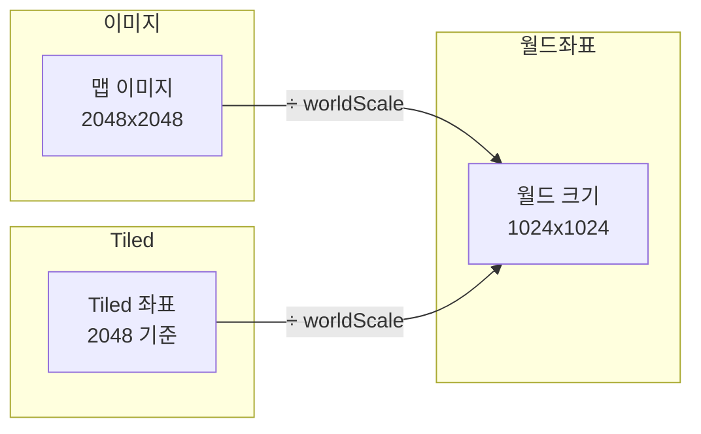
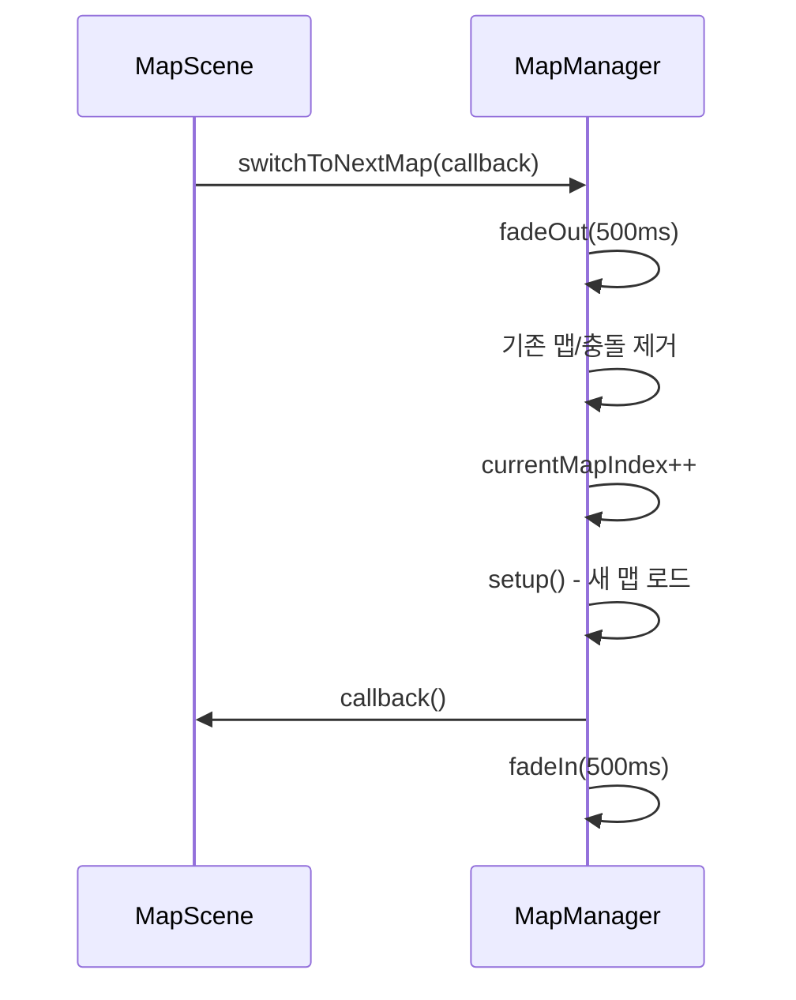
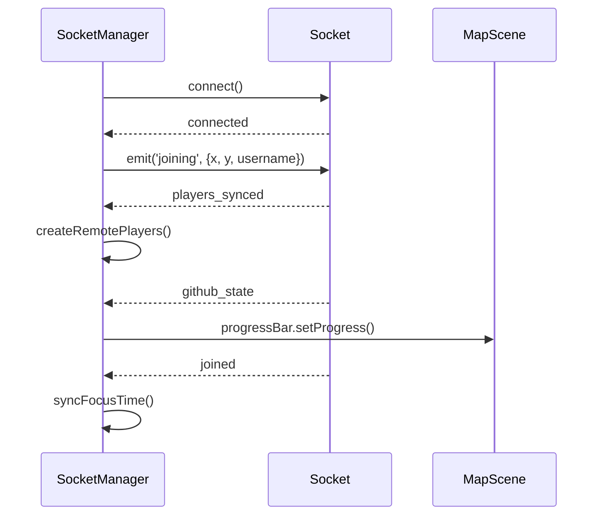
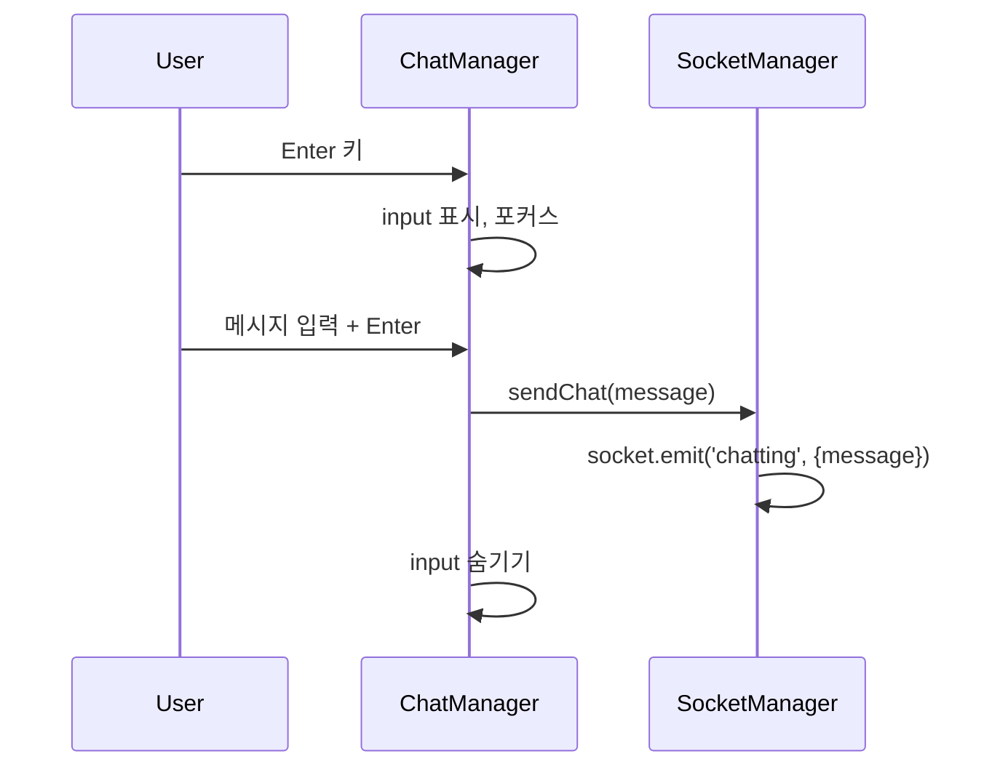
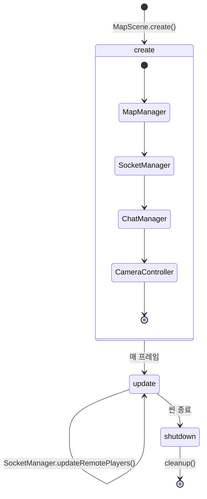

# 게임 매니저 및 컨트롤러

## 개요

Phaser 게임의 핵심 로직을 담당하는 매니저/컨트롤러 클래스들

---

## 구조 개요

```
MapScene
├── MapManager        # 맵 렌더링, 충돌, 좌표 시스템
├── SocketManager     # 소켓 이벤트, 원격 플레이어 동기화
├── ChatManager       # 채팅 UI (DOM 기반)
└── CameraController  # 카메라 줌, 팔로우
```

---

## MapManager

맵 렌더링 및 충돌 영역 관리

### 위치

`frontend/src/game/managers/MapManager.ts`

### 핵심 설정

```typescript
private worldScale: number = 2;   // 이미지 2배, 좌표 원본 기준
private tileSize: number = 32;    // 타일 크기
```

### 좌표 시스템



### 주요 메서드

| 메서드 | 설명 |
|--------|------|
| `setup()` | 맵 이미지 배치, Tiled JSON에서 충돌 영역 생성 |
| `getMapSize()` | 월드 좌표 기준 맵 크기 반환 |
| `getWalls()` | 충돌용 StaticGroup 반환 |
| `getRandomSpawnPosition()` | 벽과 겹치지 않는 스폰 위치 계산 |
| `switchToNextMap(callback)` | 페이드 애니메이션 + 다음 맵 전환 |
| `getWorldScale()` | worldScale 값 반환 (= 2) |

### 맵 전환 흐름



### 스폰 위치 계산

```typescript
getRandomSpawnPosition(): SpawnPosition {
  // 맵 중앙 ±20% 범위에서 랜덤 선택
  // 벽과 충돌 검사 (AABB)
  // 최대 10회 시도, 실패 시 중앙 반환
}
```

---

## SocketManager

소켓 이벤트 처리 및 원격 플레이어 관리

### 위치

`frontend/src/game/managers/SocketManager.ts`

### 상태 관리

```typescript
private otherPlayers: Map<userId, RemotePlayer>;
```

### 이벤트 핸들러 목록

| 이벤트 | 처리 |
|--------|------|
| `joined` | roomId 저장, focusTime 동기화 |
| `players_synced` | 기존 플레이어들 RemotePlayer 생성 |
| `player_joined` | 새 플레이어 RemotePlayer 추가 |
| `player_left` | RemotePlayer 제거 |
| `moved` | RemotePlayer 위치/방향 업데이트 |
| `chatted` | 말풍선 표시 |
| `github_event` | 프로그레스/기여도 업데이트 |
| `focused` | RemotePlayer 집중 상태 설정 |
| `rested` | RemotePlayer 휴식 상태 설정 |
| `focus_task_updated` | 말풍선 Task 이름 업데이트 |
| `pet_equipped` | RemotePlayer 펫 이미지 변경 |
| `session_replaced` | 세션 종료 오버레이 표시 |

### 연결 흐름



### RemotePlayer 생성

```typescript
private createRemotePlayer(data: PlayerData): RemotePlayer {
  const remote = new RemotePlayer(
    this.scene,
    data.x, data.y,
    data.username,
    data.userId,
    data.roomId,
    data.playerId
  );

  // 집중 상태 설정
  if (data.status === 'FOCUSING') {
    remote.setFocusState(true, {
      taskName: data.taskName,
      totalFocusSeconds: data.totalFocusSeconds,
      currentSessionSeconds: data.currentSessionSeconds
    });
  }

  // 펫 설정
  if (data.petImage) {
    remote.setPet(data.petImage);
  }

  return remote;
}
```

### 위치 업데이트

```typescript
updateRemotePlayers(): void {
  this.otherPlayers.forEach(player => {
    player.update();  // Lerp 이동
  });
}
```

---

## ChatManager

게임 내 채팅 UI 관리

### 위치

`frontend/src/game/managers/ChatManager.ts`

### 특징

- HTML `<input>` 요소 사용 (Phaser 객체 아님)
- 게임 캔버스 위에 오버레이
- 키보드 이벤트 처리

### 키 바인딩

| 키 | 동작 |
|---|------|
| Enter | input 열기 / 메시지 전송 |
| ESC | input 닫기 |

### 주요 메서드

| 메서드 | 설명 |
|--------|------|
| `setup()` | input 엘리먼트 생성, 이벤트 바인딩 |
| `closeInput()` | input 숨기기, 포커스 해제 |
| `destroy()` | 엘리먼트 제거, 이벤트 정리 |

### 메시지 전송 흐름



---

## CameraController

카메라 줌 및 팔로우 관리

### 위치

`frontend/src/game/controllers/CameraController.ts`

### 줌 설정

```typescript
private minZoom: number;  // 동적 계산 (맵 전체 보이도록)
private maxZoom: number = 2;
```

### 주요 메서드

| 메서드 | 설명 |
|--------|------|
| `setup(mapWidth, mapHeight, target?)` | 초기 설정, 팔로우 대상 지정 |
| `handleZoom(deltaY)` | 마우스 휠 줌 처리 |
| `updateBounds(width, height)` | 맵 전환 시 bounds 업데이트 |
| `handleResize()` | 화면 크기 변경 시 minZoom 재계산 |

### 줌 계산

```typescript
// minZoom: 맵 전체가 화면에 보이는 줌 레벨
minZoom = Math.min(
  screenWidth / mapWidth,
  screenHeight / mapHeight
);

// 마우스 휠 줌
handleZoom(deltaY: number): void {
  const zoomDelta = deltaY > 0 ? -0.1 : 0.1;  // 위 = 줌아웃
  const newZoom = Phaser.Math.Clamp(
    currentZoom + zoomDelta,
    minZoom,
    maxZoom
  );
  camera.setZoom(newZoom);
}
```

### 팔로우 설정

```typescript
setup(mapWidth, mapHeight, target?: Phaser.GameObjects.Container): void {
  camera.setBounds(0, 0, mapWidth, mapHeight);

  if (target) {
    camera.startFollow(target, true, 0.1, 0.1);
  }
}
```

---

## 생명주기



---

## 관련 문서

- [GAME_ENGINE.md](./GAME_ENGINE.md) - 전체 게임 엔진 구조
- [MAP_COORDINATES.md](./MAP_COORDINATES.md) - 좌표 시스템 상세
- [SOCKET_EVENTS.md](../api/SOCKET_EVENTS.md) - 소켓 이벤트 명세
