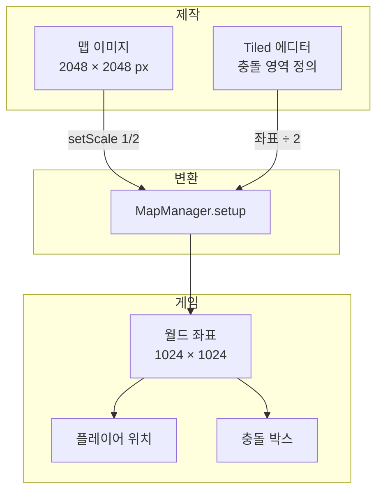

# 맵 스케일링과 좌표 시스템

## 개요

Phaser 게임의 좌표 시스템과 맵 이미지 스케일링 방식

---

## 핵심 개념

### worldScale

이미지와 좌표 간 변환 비율

```typescript
private worldScale: number = 2;
```

**의미:**
- 맵 이미지는 **2배 크기**로 제작됨 (고해상도)
- 게임 좌표는 **원본 크기** 기준으로 동작
- 렌더링 시 이미지를 `1/2`로 축소하여 표시

### 좌표 체계

| 좌표 체계 | 기준 | 사용처 |
|----------|------|--------|
| **이미지 좌표** | 2048x2048 (예시) | 맵 이미지 파일 |
| **월드 좌표** | 1024x1024 (예시) | 플레이어 위치, 물리 연산 |
| **Tiled 좌표** | 2048x2048 (예시) | 충돌 영역 JSON |

---

## 좌표 변환 다이어그램



---

## MapManager 좌표 처리

### 맵 이미지 배치

```typescript
setup(): void {
  const mapImage = this.scene.add.image(0, 0, currentMap.image);
  mapImage.setOrigin(0, 0);

  // 이미지를 1/2 스케일로 축소 (시각적으로 원본 크기)
  mapImage.setScale(1 / this.worldScale);

  // 월드 좌표는 원본 크기 기준
  const worldWidth = mapImage.width / this.worldScale;
  const worldHeight = mapImage.height / this.worldScale;

  this.scene.physics.world.setBounds(0, 0, worldWidth, worldHeight);
}
```

### 충돌 영역 변환

Tiled에서 정의한 좌표를 월드 좌표로 변환:

```typescript
// Tiled JSON의 충돌 객체
{
  "x": 200,      // Tiled 좌표 (이미지 기준)
  "y": 400,
  "width": 64,
  "height": 64
}

// 월드 좌표로 변환
const wall = this.scene.add.rectangle(
  (obj.x + obj.width / 2) / this.worldScale,   // 중심 X
  (obj.y + obj.height / 2) / this.worldScale,  // 중심 Y
  obj.width / this.worldScale,                  // 너비
  obj.height / this.worldScale,                 // 높이
);
```

### 변환 공식

```
월드좌표 = Tiled좌표 ÷ worldScale
월드좌표 = 이미지좌표 ÷ worldScale
```

| 이미지/Tiled | worldScale | 월드 좌표 |
|-------------|------------|----------|
| (200, 400) | 2 | (100, 200) |
| (64, 64) 크기 | 2 | (32, 32) 크기 |

---

## 플레이어 위치

### 로컬 플레이어

```typescript
// 월드 좌표로 직접 조작
player.setPosition(x, y);  // x, y는 월드 좌표

// 이동 이벤트 전송 (월드 좌표)
socket.emit('moving', {
  x: player.x,      // 월드 좌표
  y: player.y,
  direction: 'down'
});
```

### 원격 플레이어

```typescript
// 서버에서 수신한 좌표도 월드 좌표
socket.on('moved', (data) => {
  remotePlayer.setTargetPosition(data.x, data.y);  // 월드 좌표
});
```

---

## 스폰 위치 계산

```typescript
getRandomSpawnPosition(): SpawnPosition {
  const { width: mapWidth, height: mapHeight } = this.getMapSize();

  // 중앙 부근 범위 (맵 중앙 기준 ±20%)
  const centerX = mapWidth / 2;   // 월드 좌표 기준
  const centerY = mapHeight / 2;
  const rangeX = mapWidth * 0.2;
  const rangeY = mapHeight * 0.2;

  // 랜덤 위치 선택
  const x = centerX + (Math.random() - 0.5) * rangeX;
  const y = centerY + (Math.random() - 0.5) * rangeY;

  // 벽 충돌 검사 (월드 좌표 기준)
  const collides = this.checkWallCollision(x, y);

  return { x, y };
}
```

---

## 충돌 검사 (AABB)

```typescript
private rectIntersects(
  x1: number, y1: number, w1: number, h1: number,  // 플레이어
  x2: number, y2: number, w2: number, h2: number   // 벽
): boolean {
  return x1 < x2 + w2 &&
         x1 + w1 > x2 &&
         y1 < y2 + h2 &&
         y1 + h1 > y2;
}
```

---

## 카메라 설정

```typescript
// CameraController.setup()
camera.setBounds(0, 0, mapWidth, mapHeight);  // 월드 좌표 기준

// 줌 계산
minZoom = Math.min(
  screenWidth / mapWidth,    // 맵 전체가 화면에 보이는 줌
  screenHeight / mapHeight
);
```

---

## Tiled 에디터 설정

### 맵 제작 시 주의사항

1. **이미지 크기**: 최종 월드 크기의 2배로 제작
2. **충돌 영역**: 이미지 좌표 기준으로 정의
3. **타일 크기**: 64px (월드에서는 32px로 표시)

### 충돌 레이어 설정

```json
{
  "layers": [
    {
      "name": "Collisions",
      "type": "objectgroup",
      "objects": [
        {
          "class": "wall",
          "x": 128,
          "y": 256,
          "width": 64,
          "height": 64
        }
      ]
    }
  ]
}
```

---

## 디버깅

### 충돌 박스 시각화

```typescript
// MapManager에서 충돌 박스 생성 시
const wall = this.scene.add.rectangle(...);
wall.setVisible(false);  // true로 변경하면 빨간 박스 표시
```

### 좌표 확인

```typescript
// 플레이어 위치 로깅
console.log(`Player: (${player.x}, ${player.y})`);  // 월드 좌표

// 맵 크기 확인
const { width, height } = mapManager.getMapSize();
console.log(`Map size: ${width} x ${height}`);  // 월드 좌표 기준
```

---

## 요약

| 항목 | 값 |
|------|---|
| worldScale | 2 |
| 이미지 → 월드 | ÷ 2 |
| Tiled → 월드 | ÷ 2 |
| 타일 크기 (이미지) | 64px |
| 타일 크기 (월드) | 32px |

---

## 관련 문서

- [GAME_ENGINE.md](./GAME_ENGINE.md) - 게임 엔진 전체 구조
- [GAME_MANAGERS.md](./GAME_MANAGERS.md) - MapManager 상세
