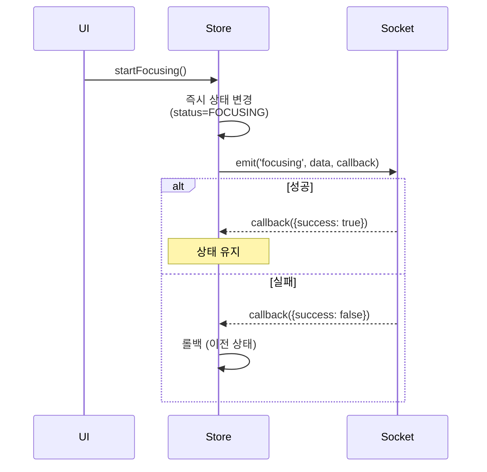
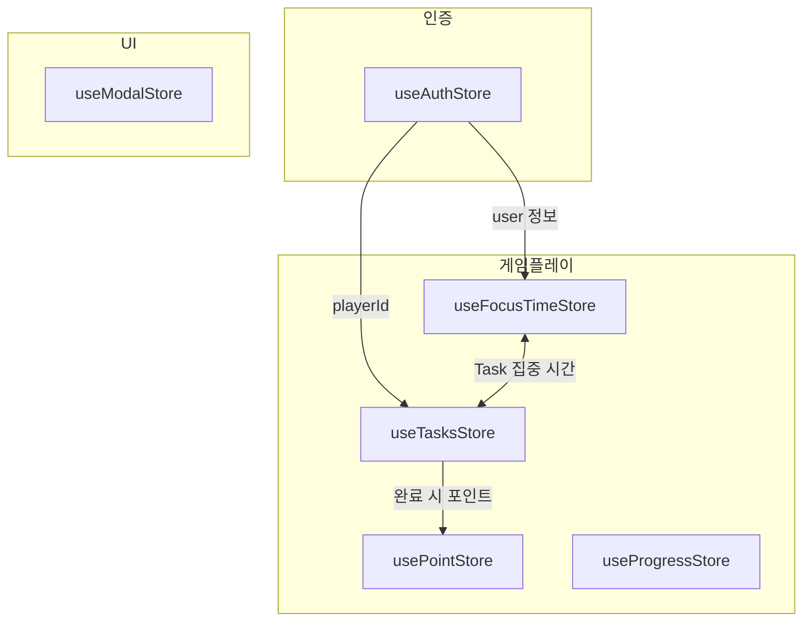

# 프론트엔드 상태 관리

## 개요

Zustand를 사용한 클라이언트 상태 관리 구조

---

## 스토어 목록

| 스토어 | 위치 | 책임 |
|--------|------|------|
| **useAuthStore** | `authStore.ts` | 인증 상태, 사용자 정보 |
| **useFocusTimeStore** | `useFocusTimeStore.ts` | 집중/휴식 상태, 시간 관리 |
| **useTasksStore** | `useTasksStore.ts` | Task CRUD, 타이머 |
| **usePointStore** | `pointStore.ts` | 포인트 (현재 Mock) |
| **useModalStore** | `useModalStore.ts` | 전역 모달 상태 (UserInfo, Leaderboard 등) |
| **useProgressStore** | `useProgressStore.ts` | 게임 프로그레스바, 기여도 |

---

## 스토어 상세

### useAuthStore

인증 상태 및 사용자 정보 관리

```typescript
interface AuthState {
  user: User | null;        // {sub, username, playerId}
  isLoading: boolean;
  isAuthenticated: boolean;
}

interface AuthActions {
  fetchUser(): Promise<void>;  // GET /auth/me
  logout(): void;              // 리다이렉트 /auth/logout
}
```

**사용 시점:**
- 앱 시작 시 `fetchUser()` 호출
- 로그인 상태 확인
- 사용자 정보 접근

---

### useFocusTimeStore

집중/휴식 상태 및 시간 관리

```typescript
interface FocusTimeState {
  // 상태
  status: 'FOCUSING' | 'RESTING';
  isFocusTimerRunning: boolean;
  error: string | null;

  // 서버 기준 타임스탬프 (브라우저 쓰로틀링 무관 시간 계산용)
  baseFocusSeconds: number;           // 이전 세션까지의 누적 시간
  serverCurrentSessionSeconds: number; // 서버가 계산한 현재 세션 경과 시간
  serverReceivedAt: number;           // 서버 응답 수신 시점 (클라이언트 시간)
}

interface FocusTimeActions {
  // 계산된 표시값 getter (타임스탬프 기반 계산)
  getFocusTime(): number;

  // 로컬 전용 (하위 호환성)
  setFocusTime(time: number): void;
  resetFocusTime(): void;
  setFocusTimerRunning(isRunning: boolean): void;

  // 소켓 연동 (낙관적 업데이트)
  startFocusing(taskName?: string, taskId?: number): void;
  stopFocusing(): void;

  // 서버 동기화
  syncFromServer(data: FocusTimeData): void;
}
```

> **Note:** 기존 `incrementFocusTime()` 방식에서 `getFocusTime()` 타임스탬프 기반으로 변경됨.

**낙관적 업데이트 흐름:**



---

### useTasksStore

Task CRUD 및 타이머 관리

```typescript
interface TasksState {
  tasks: Task[];
  isLoading: boolean;
  error: string | null;
  pendingTaskIds: number[];  // 중복 요청 방지
}

interface Task {
  id: number;
  description: string;
  isCompleted: boolean;
  totalFocusSeconds: number;
  createdAt: string;  // ISO datetime
  // 로컬 전용 (타임스탬프 기반)
  isRunning?: boolean;       // 타이머 실행 중
  time: number;              // 누적 시간 (초)
  baseTime: number;          // 시작 시점 기준 시간
  startTimestamp: number | null;  // 타이머 시작 시점
}

interface TasksActions {
  // API 연동
  fetchTasks(date?: string): Promise<void>;
  addTask(text: string): Promise<void>;
  editTask(id: number, newText: string): Promise<void>;
  deleteTask(id: number): Promise<void>;
  toggleTask(id: number): Promise<void>;

  // 로컬 타이머 (타임스탬프 기반)
  toggleTaskTimer(id: number): void;
  stopAllTasks(): void;
  getTaskDisplayTime(task: Task): number;  // 타임스탬프 기반 시간 계산
}
```

> **Note:** 기존 `incrementTaskTime()` 방식에서 `getTaskDisplayTime()` 타임스탬프 기반으로 변경됨.

**낙관적 업데이트 적용:**
- `toggleTask`: 완료 상태 토글
- `deleteTask`: 목록에서 제거
- `editTask`: 설명 수정 + 소켓 브로드캐스트

**중복 요청 방지:**

```typescript
// pendingTaskIds로 추적
if (pendingTaskIds.includes(id)) return;

set({ pendingTaskIds: [...pendingTaskIds, id] });
try {
  await api.call();
} finally {
  set({ pendingTaskIds: pendingTaskIds.filter(x => x !== id) });
}
```

---

### usePointStore

포인트 관리 (현재 Mock 데이터)

```typescript
interface PointState {
  points: number;  // 기본값: 1000
}

interface PointActions {
  addPoints(amount: number): void;
  subtractPoints(amount: number): boolean;  // 실패 시 false
  setPoints(amount: number): void;
}
```

> **Note:** 현재 백엔드 연동 없이 로컬 상태만 관리

---

### useModalStore

전역 모달 상태 관리 (UserInfo, Leaderboard 등 상호 배제적 모달)

```typescript
type ModalType = "userInfo" | "leaderboard" | null;

interface UserInfoPayload {
  playerId: number;
  username: string;
}

interface ModalState {
  activeModal: ModalType;
  userInfoPayload: UserInfoPayload | null;

  openModal: (type: ModalType, payload?: UserInfoPayload) => void;
  closeModal: () => void;
  toggleModal: (type: ModalType) => void;
}
```

**특징:**
- `activeModal`을 통해 한 번에 하나의 모달만 열리도록 관리
- `userInfo` 모달의 경우 `userInfoPayload`로 데이터 전달

---

### useProgressStore

게임 프로그레스바 및 기여도 상태 관리

```typescript
interface ProgressState {
  progress: number;                           // 현재 프로그레스 (0-99)
  contributions: Record<string, number>;      // username -> 기여 횟수

  setProgress: (progress: number) => void;
  setContributions: (contributions: Record<string, number>) => void;
  reset: () => void;
}
```

**특징:**
- 소켓 이벤트(`progress_update`, `game_state`)에서 상태 업데이트
- React 컴포넌트(`ProgressBar.tsx`)에서 구독하여 렌더링
- 맵 전환(`map_switch`) 시 자동 리셋

---

## 스토어 간 상호작용



### 주요 상호작용

1. **Task 집중 시작:**
   - `useTasksStore.toggleTaskTimer(id)` 호출
   - `useFocusTimeStore.startFocusing(taskName, taskId)` 연동

2. **집중 종료 시:**
   - `useFocusTimeStore.stopFocusing()` 호출
   - 서버에서 Task에 집중 시간 누적

3. **Task 이름 변경 시:**
   - `useTasksStore.editTask(id, newText)`
   - 집중 중이면 `socket.emit('focus_task_updating')` 전송

---

## 초기화 시점

```typescript
// app 시작 시 (useEffect)
useAuthStore.getState().fetchUser();

// 게임 입장 시 (MapScene.create)
// joined 이벤트 수신 후
useFocusTimeStore.getState().syncFromServer(focusTimeData);

// 게임 페이지 진입 시
useTasksStore.getState().fetchTasks();
```

---

## 타이머 구현 (타임스탬프 기반)

### 전역 집중 타이머

기존 `setInterval` + `incrementFocusTime()` 방식 대신 타임스탬프 기반 계산:

```typescript
// UI 컴포넌트에서 렌더링 시 직접 계산
const focusTime = useFocusTimeStore.getState().getFocusTime();

// getFocusTime() 구현
getFocusTime(): number {
  if (status === 'FOCUSING' && serverReceivedAt > 0) {
    const clientElapsed = Math.floor((Date.now() - serverReceivedAt) / 1000);
    return baseFocusSeconds + serverCurrentSessionSeconds + clientElapsed;
  }
  return baseFocusSeconds;
}
```

### Task 개별 타이머

```typescript
// 타임스탬프 기반 시간 계산
getTaskDisplayTime(task: Task): number {
  if (task.isRunning && task.startTimestamp) {
    return task.baseTime + Math.floor((Date.now() - task.startTimestamp) / 1000);
  }
  return task.time;
}
```

> **장점:**
> - 브라우저 탭 비활성화 시에도 정확한 시간 표시
> - `setInterval` 쓰로틀링 영향 없음

---

## 에러 처리

각 스토어는 `error` 상태를 관리:

```typescript
try {
  await api.call();
  set({ error: null });
} catch (e) {
  set({ error: '작업 실패 메시지' });
  // 낙관적 업데이트 롤백
}
```

UI에서 에러 표시:

```typescript
const { error } = useTasksStore();
if (error) {
  return <ErrorMessage>{error}</ErrorMessage>;
}
```

---

## 관련 문서

- [OPTIMISTIC_UPDATE.md](../guides/OPTIMISTIC_UPDATE.md) - 낙관적 업데이트 패턴
- [FOCUS_TIME.md](../features/FOCUS_TIME.md) - 포커스 타임 상세
- [SOCKET_EVENTS.md](../api/SOCKET_EVENTS.md) - 소켓 이벤트 연동
