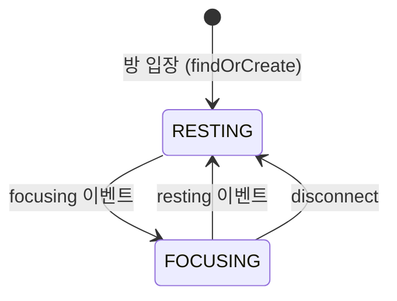
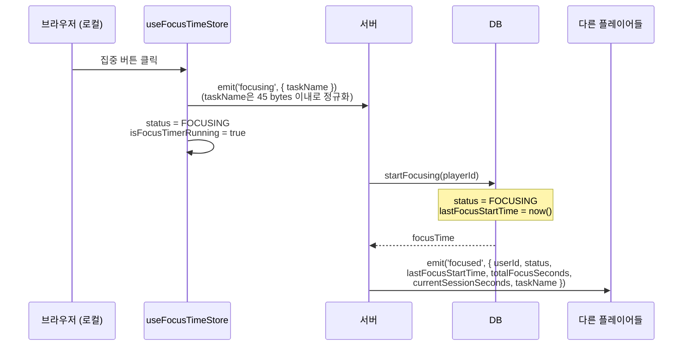
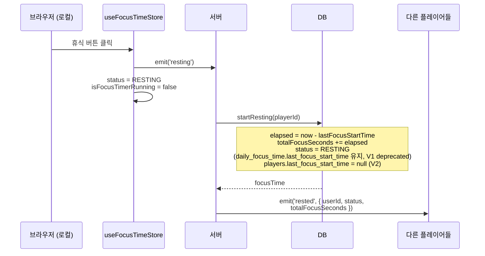
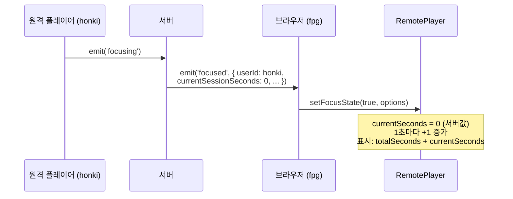
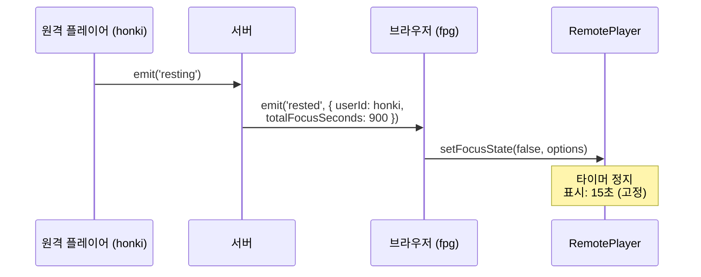
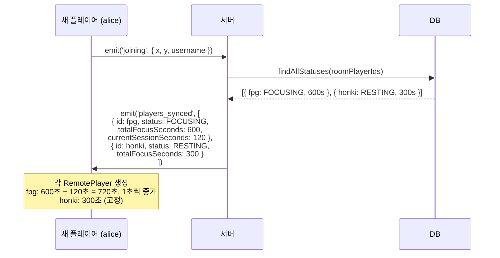
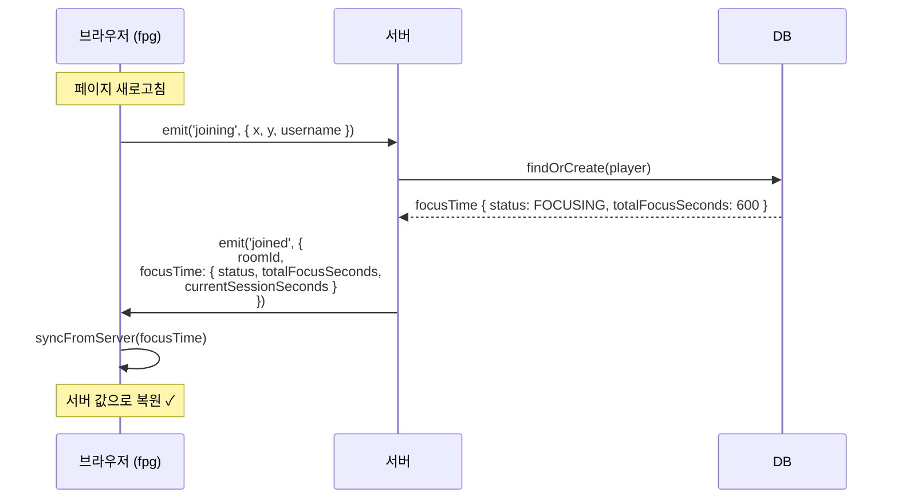
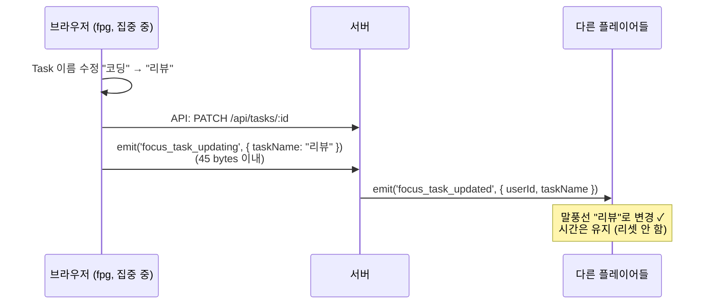

# 포커스 타임

## 개요

플레이어의 일별 집중 상태와 누적 집중 시간을 기록한다. 상태는 `FOCUSING` 또는 `RESTING`이며,
집중 시작/종료는 소켓 이벤트로 전파된다.

---

## 데이터 모델

`DailyFocusTime`은 하루에 하나의 레코드를 사용한다.

| 필드 | 타입 | 설명 |
|------|------|------|
| `player_id` | bigint | 플레이어 ID |
| `total_focus_seconds` | int | 누적 집중 시간(초) |
| `created_at` | datetime | 집계 기준일 (KST 00:00) |
| `status` | enum | `FOCUSING` \| `RESTING` (V2에서 deprecated) |
| `last_focus_start_time` | datetime | V2에서 deprecated |
| `current_task_id` | int | V2에서 deprecated |

> **V2 상태 소스:** 실제 집중 상태는 `players.last_focus_start_time`(=`Player.lastFocusStartTime`, null 여부), 현재 집중 태스크는 `players.focusing_task_id`(=`Player.focusingTaskId`)를 사용합니다.

---

## 상태 전이

1. **방 입장**: `findOrCreate`로 당일 레코드 생성/조회
2. **focusing**: `Player.lastFocusStartTime` 기록, `Player.focusingTaskId` 저장 (선택)
3. **resting**: 집중 시간 누적 후 `players.last_focus_start_time`(V2) = `null`, `players.focusing_task_id` = `null`
4. **disconnect**: `RESTING` 처리 시도 (예외는 로깅)



---

## 소켓 이벤트

### 클라이언트 → 서버

```typescript
socket.emit('focusing', { taskName?: string, taskId?: number });  // taskName(선택, UTF-8 45 bytes 이하), taskId(선택)
socket.emit('focus_task_updating', { taskName: string });         // taskName(UTF-8 45 bytes 이하)
socket.emit('resting');
```

**입력 제한 정책:**
- `taskName`은 trim 기준 빈 문자열이면 전송하지 않는다.
- `taskName`이 45 bytes(UTF-8)를 초과하거나 타입이 올바르지 않으면 ack 실패(`{ success: false, error }`)를 반환한다.
- `players_synced`/`player_joined`로 전송되는 `taskName`도 UTF-8 45 bytes 이내로 정규화된다.

### 서버 → 클라이언트

```typescript
socket.on('focused', (data: {
  userId: string,
  username: string,
  status: 'FOCUSING',
  lastFocusStartTime: string,
  totalFocusSeconds: number,
  currentSessionSeconds: number,  // 서버가 계산한 경과 시간
  taskName?: string
}) => {});

socket.on('rested', (data: {
  userId: string,
  username: string,
  status: 'RESTING',
  totalFocusSeconds: number
}) => {});
```

---

## 시퀀스 다이어그램

### 1. 로컬 플레이어 집중 시작



### 2. 로컬 플레이어 휴식 시작



### 3. 다른 플레이어 집중 시작 (focused 이벤트 수신)



### 4. 다른 플레이어 휴식 시작 (rested 이벤트 수신)



### 5. 새 플레이어 입장 (players_synced)



### 6. 새로고침 (joined 이벤트)



### 7. Task 이름 변경



---

## 시간 계산 방식

### 문제점

클라이언트에서 `Date.now() - lastFocusStartTime`으로 계산하면 클라이언트 시계에 의존하게 되어 음수가 발생할 수 있음.

### 해결 방식

서버에서 `currentSessionSeconds`를 계산하여 전송:

```typescript
// 서버
currentSessionSeconds = Math.floor((Date.now() - lastFocusStartTime.getTime()) / 1000)

// 클라이언트
let seconds = currentSessionSeconds;  // 서버 값으로 시작
setInterval(() => seconds++, 1000);   // 1초마다 +1 증가
```

---

## 주의사항

- 방 입장 전에 `focusing/resting`을 호출하면 에러가 발생할 수 있다.
- 조회 시 `startAt`, `endAt` UTC 범위를 기준으로 `created_at`(datetime) 필드를 사용한다.
- 클라이언트 시계와 서버 시계가 다를 수 있으므로 시간 계산은 서버에서 수행한다.
