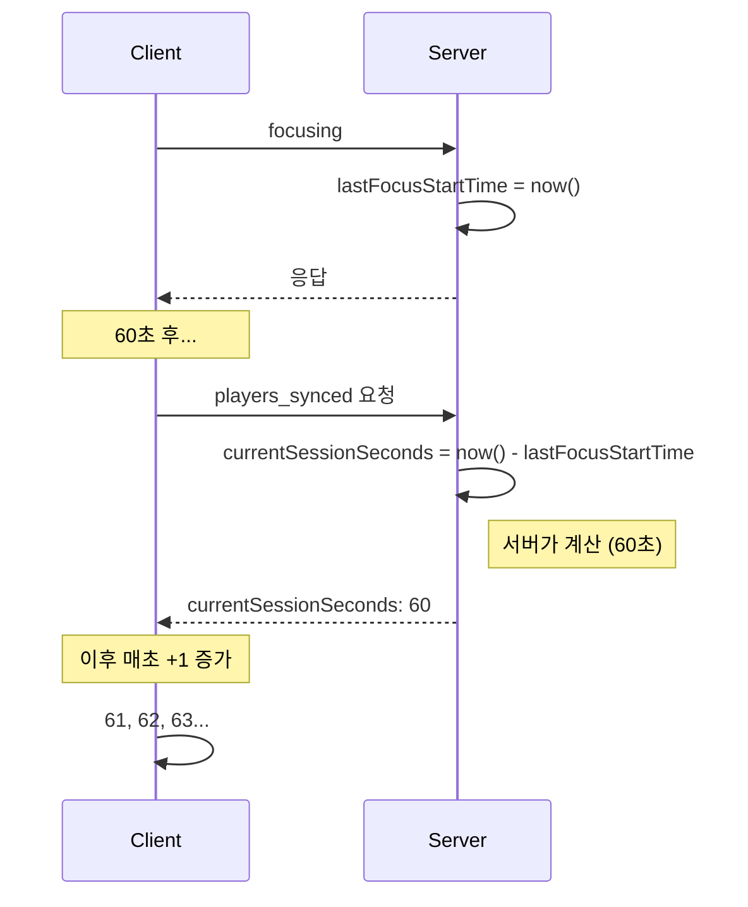
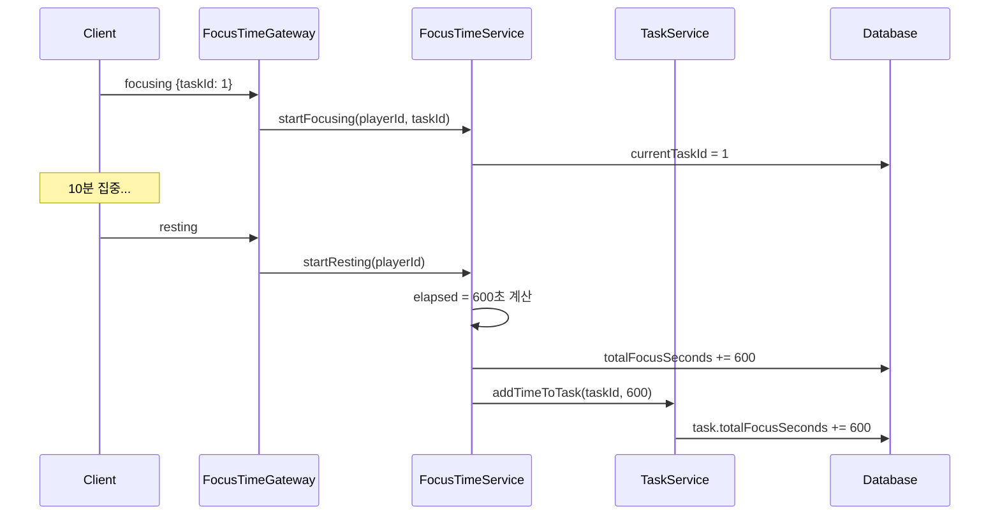

# 포커스 타임 구현 상세

## 개요

집중/휴식 상태 관리의 클라이언트-서버 구현 세부사항

> 기본 개념은 [FOCUS_TIME.md](./FOCUS_TIME.md) 참조

---

## 시간 계산 아키텍처

### 문제점: 클라이언트 시계 의존

```typescript
// ❌ 문제가 있는 방식
const elapsed = Date.now() - serverLastFocusStartTime.getTime();
// 클라이언트 시계가 서버보다 느리면 음수 발생!
```

### 해결책: 서버 계산 + 클라이언트 증가



---

## 클라이언트 상태 (useFocusTimeStore)

### 핵심 상태

```typescript
interface FocusTimeState {
  // 표시용
  focusTime: number;              // 현재 표시할 누적 초
  baseFocusSeconds: number;       // 집중 시작 시점의 누적 시간

  // 상태
  status: 'FOCUSING' | 'RESTING';
  isFocusTimerRunning: boolean;

  // 타이밍
  focusStartTimestamp: number | null;  // 클라이언트 시계 (로컬 계산용)
}
```

### 시간 계산 공식

```typescript
// 표시 시간 = 기준 시간 + 경과 시간
displayTime = baseFocusSeconds + (Date.now() - focusStartTimestamp) / 1000;

// 또는 incrementFocusTime()으로 매초 +1
displayTime = focusTime;  // 매초 증가되는 값
```

---

## 서버 동기화

### syncFromServer 로직

```typescript
syncFromServer(data: FocusTimeData) {
  const { status, totalFocusSeconds, currentSessionSeconds } = data;

  if (status === 'FOCUSING') {
    // 1. 총 시간 = 누적 + 현재 세션
    const totalTime = totalFocusSeconds + (currentSessionSeconds || 0);

    // 2. focusStartTimestamp 역산
    //    서버의 경과시간을 클라이언트 시계로 변환
    const focusStartTimestamp = Date.now() - (currentSessionSeconds || 0) * 1000;

    set({
      focusTime: totalTime,
      baseFocusSeconds: totalFocusSeconds,
      status: 'FOCUSING',
      isFocusTimerRunning: true,
      focusStartTimestamp,
    });
  } else {
    set({
      focusTime: totalFocusSeconds,
      baseFocusSeconds: totalFocusSeconds,
      status: 'RESTING',
      isFocusTimerRunning: false,
      focusStartTimestamp: null,
    });
  }
}
```

### 역산 로직 설명

```
서버 시간: 10:00:00에 집중 시작
현재 서버 시간: 10:01:00 (60초 경과)
서버가 계산: currentSessionSeconds = 60

클라이언트 수신 시각: 10:01:02 (네트워크 지연 2초)
클라이언트 계산: focusStartTimestamp = 10:01:02 - 60초 = 10:00:02

→ 클라이언트 시계 기준으로 60초 전에 시작한 것처럼 설정
→ 이후 클라이언트에서 자체 계산해도 서버와 대략 일치
```

---

## 서버 구현 (FocusTimeService)

### startFocusing

```typescript
async startFocusing(playerId: number, taskId?: number): Promise<DailyFocusTime> {
  return this.dataSource.transaction(async (manager) => {
    const focusTime = await this.findOrCreate(playerId);

    // 이미 FOCUSING 중이면 이전 시간 먼저 누적 (타이머 오버플로우 방지)
    if (focusTime.status === FocusStatus.FOCUSING && focusTime.lastFocusStartTime) {
      const elapsed = this.calculateElapsed(focusTime.lastFocusStartTime);
      focusTime.totalFocusSeconds += elapsed;

      // 이전 Task에도 시간 누적
      if (focusTime.currentTaskId) {
        await this.addTimeToTask(focusTime.currentTaskId, elapsed, manager);
      }
    }

    // 상태 변경
    focusTime.status = FocusStatus.FOCUSING;
    focusTime.lastFocusStartTime = new Date();

    // Task 연결 (소유권 검증)
    if (taskId) {
      const task = await manager.findOne(Task, {
        where: { id: taskId, player: { id: playerId } }
      });
      if (task) {
        focusTime.currentTaskId = taskId;
      }
    }

    return manager.save(focusTime);
  });
}
```

### startResting

```typescript
async startResting(playerId: number): Promise<DailyFocusTime> {
  return this.dataSource.transaction(async (manager) => {
    const focusTime = await this.findOne(playerId);
    if (!focusTime) throw new NotFoundException();

    // FOCUSING → RESTING 전환 시 시간 누적
    if (focusTime.status === FocusStatus.FOCUSING && focusTime.lastFocusStartTime) {
      const elapsed = this.calculateElapsed(focusTime.lastFocusStartTime);
      focusTime.totalFocusSeconds += elapsed;

      // Task에도 시간 누적
      if (focusTime.currentTaskId) {
        await this.addTimeToTask(focusTime.currentTaskId, elapsed, manager);
      }
    }

    focusTime.status = FocusStatus.RESTING;
    // lastFocusStartTime은 유지 (마지막 집중 시작 시각 기록)

    return manager.save(focusTime);
  });
}
```

### 경과 시간 계산

```typescript
private calculateElapsed(lastFocusStartTime: Date): number {
  const now = new Date();
  const elapsed = Math.floor((now.getTime() - lastFocusStartTime.getTime()) / 1000);
  return Math.max(0, elapsed);  // 음수 방지
}
```

---

## Task 연동

### 집중 시간 누적 흐름



### Task 시간 누적 메서드

```typescript
private async addTimeToTask(
  taskId: number,
  seconds: number,
  manager: EntityManager
): Promise<void> {
  await manager.increment(
    Task,
    { id: taskId },
    'totalFocusSeconds',
    seconds
  );
}
```

---

## 클라이언트 타이머

### 전역 집중 타이머

```typescript
// FocusTimer 컴포넌트 또는 훅
useEffect(() => {
  if (!isFocusTimerRunning) return;

  const interval = setInterval(() => {
    useFocusTimeStore.getState().incrementFocusTime();
  }, 1000);

  return () => clearInterval(interval);
}, [isFocusTimerRunning]);
```

### incrementFocusTime 구현

```typescript
incrementFocusTime() {
  set((state) => ({
    focusTime: state.focusTime + 1
  }));
}
```

---

## RemotePlayer 시간 표시

### 집중 상태 설정

```typescript
// SocketManager에서
socket.on('focused', (data) => {
  const remote = otherPlayers.get(data.userId);
  remote?.setFocusState(true, {
    taskName: data.taskName,
    totalFocusSeconds: data.totalFocusSeconds,
    currentSessionSeconds: data.currentSessionSeconds
  });
});
```

### RemotePlayer.setFocusState

```typescript
setFocusState(isFocusing: boolean, options?: FocusOptions) {
  this.isFocusing = isFocusing;

  if (isFocusing && options) {
    // 서버에서 받은 경과 시간으로 시작
    this.currentSeconds = options.currentSessionSeconds || 0;
    this.totalSeconds = options.totalFocusSeconds || 0;

    // 1초마다 증가
    this.focusTimer = setInterval(() => {
      this.currentSeconds++;
      this.updateFocusTimeDisplay();
    }, 1000);

    // Task 이름 표시
    if (options.taskName) {
      this.showTaskBubble(options.taskName);
    }
  } else {
    // 휴식 상태
    clearInterval(this.focusTimer);
    this.totalSeconds = options?.totalFocusSeconds || this.totalSeconds;
    this.hideTaskBubble();
  }

  this.updateFocusTimeDisplay();
}
```

### 시간 표시 형식

```typescript
private formatTime(seconds: number): string {
  const hours = Math.floor(seconds / 3600);
  const minutes = Math.floor((seconds % 3600) / 60);
  const secs = seconds % 60;

  if (hours > 0) {
    return `${hours}:${String(minutes).padStart(2, '0')}:${String(secs).padStart(2, '0')}`;
  }
  return `${minutes}:${String(secs).padStart(2, '0')}`;
}
```

---

## 새로고침 복원

### joined 이벤트에 focusTime 포함

```typescript
// 서버 (PlayerGateway)
@SubscribeMessage('joining')
async handleJoin(client, data) {
  // ... 방 입장 처리

  const focusTime = await this.focusTimeService.findOrCreate(playerId);

  // currentSessionSeconds 계산
  let currentSessionSeconds = 0;
  if (focusTime.status === 'FOCUSING' && focusTime.lastFocusStartTime) {
    currentSessionSeconds = this.calculateElapsed(focusTime.lastFocusStartTime);
  }

  client.emit('joined', {
    roomId,
    focusTime: {
      status: focusTime.status,
      totalFocusSeconds: focusTime.totalFocusSeconds,
      currentSessionSeconds
    }
  });
}
```

### 클라이언트 복원

```typescript
// SocketManager
socket.on('joined', (data) => {
  if (data.focusTime) {
    useFocusTimeStore.getState().syncFromServer(data.focusTime);
  }
});
```

---

## 에러 처리

### disconnect 시 시간 누적

```typescript
// PlayerGateway
handleDisconnect(client) {
  const { playerId } = client.data.user;

  // FOCUSING 상태면 RESTING으로 전환하며 시간 누적
  try {
    await this.focusTimeService.startResting(playerId);
  } catch (error) {
    this.logger.error(`Failed to rest on disconnect: ${error.message}`);
  }
}
```

### 트랜잭션 사용

모든 시간 관련 작업은 트랜잭션으로 보호:

```typescript
return this.dataSource.transaction(async (manager) => {
  // 읽기
  const focusTime = await manager.findOne(...);

  // 계산 및 수정
  focusTime.totalFocusSeconds += elapsed;

  // 저장
  return manager.save(focusTime);
});
```

---

## 알려진 이슈

### 버그 #121: 새로고침 시 시간 초기화

**상태:** 해결됨 (joined 이벤트에 focusTime 포함)

### 버그 #122: Task 이름 변경 미전파

**상태:** 해결됨 (focus_task_updating 이벤트 추가)

---

## 관련 문서

- [FOCUS_TIME.md](./FOCUS_TIME.md) - 기본 개념 및 상태 전이
- [STATE_MANAGEMENT.md](../architecture/STATE_MANAGEMENT.md) - 클라이언트 상태 관리
- [SOCKET_EVENTS.md](../api/SOCKET_EVENTS.md) - 소켓 이벤트 명세
