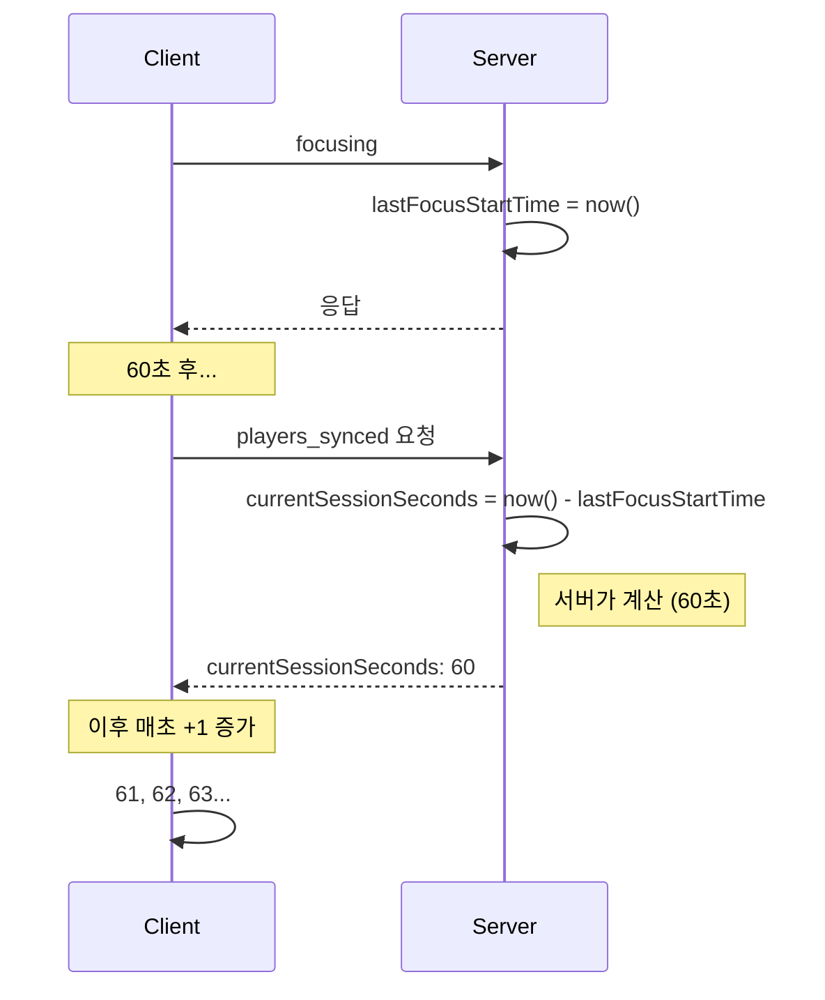
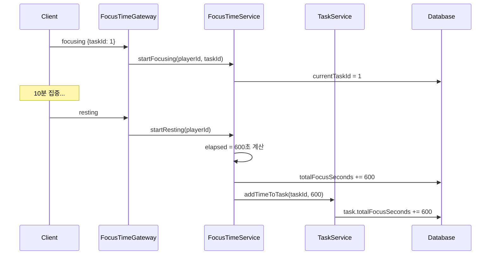
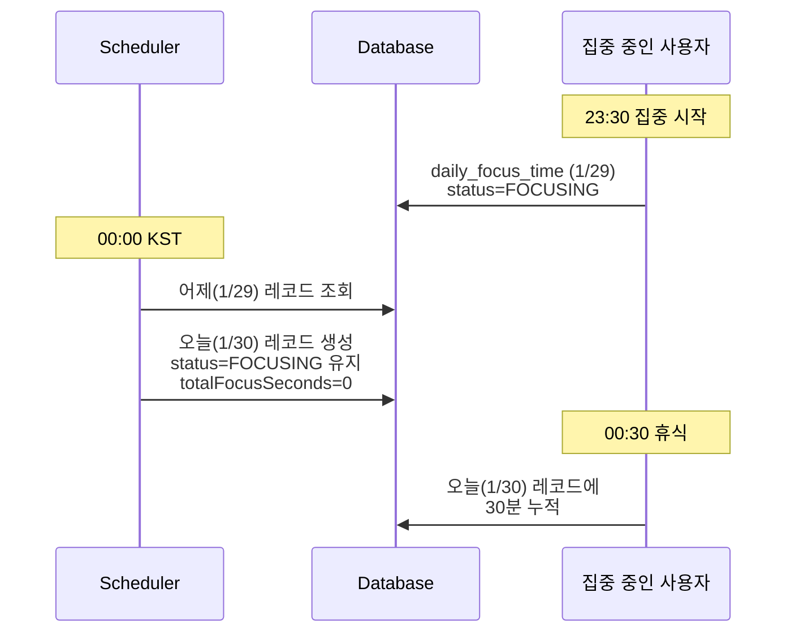

# 포커스 타임 구현 상세

## 개요

집중/휴식 상태 관리의 클라이언트-서버 구현 세부사항

> 기본 개념은 [FOCUS_TIME.md](./FOCUS_TIME.md) 참조

---

## 시간 계산 아키텍처

### 문제점: 클라이언트 시계 의존

```typescript
// ❌ 문제가 있는 방식
const elapsed = Date.now() - serverLastFocusStartTime.getTime();
// 클라이언트 시계가 서버보다 느리면 음수 발생!
```

### 해결책: 서버 계산 + 클라이언트 증가



---

## 클라이언트 상태 (useFocusTimeStore)

### 핵심 상태

```typescript
interface FocusTimeState {
  // 상태
  status: 'FOCUSING' | 'RESTING';
  isFocusTimerRunning: boolean;
  error: string | null;

  // 서버 기준 타임스탬프 (브라우저 쓰로틀링 무관 시간 계산용)
  baseFocusSeconds: number;           // 이전 세션까지의 누적 시간
  serverCurrentSessionSeconds: number; // 서버가 계산한 현재 세션 경과 시간
  serverReceivedAt: number;           // 서버 응답 수신 시점 (클라이언트 시간)
}
```

### 시간 계산 공식

```typescript
// 타임스탬프 기반 시간 계산 (쓰로틀링 무관)
getFocusTime(): number {
  if (status === 'FOCUSING' && serverReceivedAt > 0) {
    const clientElapsed = Math.floor((Date.now() - serverReceivedAt) / 1000);
    return baseFocusSeconds + serverCurrentSessionSeconds + clientElapsed;
  }
  return baseFocusSeconds;
}
```

> **Note:** 기존 `incrementFocusTime()` 방식에서 타임스탬프 기반 `getFocusTime()` 방식으로 변경됨.
> 브라우저 탭 비활성화 시에도 정확한 시간 계산 가능.

---

## 서버 동기화

### syncFromServer 로직

```typescript
syncFromServer(data: FocusTimeData) {
  const { status, totalFocusSeconds, currentSessionSeconds } = data;
  const isFocusing = status === 'FOCUSING';

  set({
    status: data.status,
    isFocusTimerRunning: isFocusing,
    baseFocusSeconds: totalFocusSeconds,
    serverCurrentSessionSeconds: isFocusing ? currentSessionSeconds : 0,
    serverReceivedAt: isFocusing ? Date.now() : 0,
    error: null,
  });
}
```

### 타임스탬프 기반 계산 설명

```
서버 시간: 10:00:00에 집중 시작
현재 서버 시간: 10:01:00 (60초 경과)
서버가 계산: currentSessionSeconds = 60

클라이언트 수신 시각: 10:01:02 (네트워크 지연 2초)
클라이언트 저장:
  - baseFocusSeconds = totalFocusSeconds (이전 세션 누적)
  - serverCurrentSessionSeconds = 60
  - serverReceivedAt = Date.now() (10:01:02)

10:01:05에 getFocusTime() 호출:
  clientElapsed = (10:01:05 - 10:01:02) / 1000 = 3초
  displayTime = baseFocusSeconds + 60 + 3 = 이전누적 + 63초

→ 브라우저 탭 비활성화 후 복귀해도 정확한 시간 표시
→ setInterval 쓰로틀링 영향 없음
```

---

## 서버 구현 (FocusTimeService)

### startFocusing

```typescript
async startFocusing(playerId: number, taskId?: number): Promise<DailyFocusTime> {
  return this.dataSource.transaction(async (manager) => {
    const focusTime = await this.findOrCreate(playerId);

    // 이미 FOCUSING 중이면 이전 시간 먼저 누적 (타이머 오버플로우 방지)
    if (focusTime.status === FocusStatus.FOCUSING && focusTime.lastFocusStartTime) {
      const elapsed = this.calculateElapsed(focusTime.lastFocusStartTime);
      focusTime.totalFocusSeconds += elapsed;

      // 이전 Task에도 시간 누적
      if (focusTime.currentTaskId) {
        await this.addTimeToTask(focusTime.currentTaskId, elapsed, manager);
      }
    }

    // 상태 변경
    focusTime.status = FocusStatus.FOCUSING;
    focusTime.lastFocusStartTime = new Date();

    // Task 연결 (소유권 검증)
    if (taskId) {
      const task = await manager.findOne(Task, {
        where: { id: taskId, player: { id: playerId } }
      });
      if (task) {
        focusTime.currentTaskId = taskId;
      }
    }

    return manager.save(focusTime);
  });
}
```

### startResting

```typescript
async startResting(playerId: number): Promise<DailyFocusTime> {
  return this.dataSource.transaction(async (manager) => {
    const focusTime = await this.findOne(playerId);
    if (!focusTime) throw new NotFoundException();

    // FOCUSING → RESTING 전환 시 시간 누적
    if (focusTime.status === FocusStatus.FOCUSING && focusTime.lastFocusStartTime) {
      const elapsed = this.calculateElapsed(focusTime.lastFocusStartTime);
      focusTime.totalFocusSeconds += elapsed;

      // Task에도 시간 누적
      if (focusTime.currentTaskId) {
        await this.addTimeToTask(focusTime.currentTaskId, elapsed, manager);
      }
    }

    focusTime.status = FocusStatus.RESTING;
    // lastFocusStartTime은 유지 (마지막 집중 시작 시각 기록)

    return manager.save(focusTime);
  });
}
```

### 경과 시간 계산

```typescript
private calculateElapsed(lastFocusStartTime: Date): number {
  const now = new Date();
  const elapsed = Math.floor((now.getTime() - lastFocusStartTime.getTime()) / 1000);
  return Math.max(0, elapsed);  // 음수 방지
}
```

---

## Task 연동

### 집중 시간 누적 흐름



### Task 시간 누적 메서드

```typescript
private async addTimeToTask(
  taskId: number,
  seconds: number,
  manager: EntityManager
): Promise<void> {
  await manager.increment(
    Task,
    { id: taskId },
    'totalFocusSeconds',
    seconds
  );
}
```

---

## 클라이언트 타이머

### 타임스탬프 기반 시간 표시

기존 `setInterval` + `incrementFocusTime()` 방식 대신 타임스탬프 기반 계산 사용:

```typescript
// UI 컴포넌트에서
const focusTime = useFocusTimeStore((state) => state.getFocusTime());

// 또는 렌더링 시점에 직접 호출
const displayTime = useFocusTimeStore.getState().getFocusTime();
```

> **장점:**
> - 브라우저 탭 비활성화 시에도 정확한 시간
> - `setInterval` 쓰로틀링 영향 없음
> - 서버-클라이언트 시간 동기화 개선

---

## RemotePlayer 시간 표시

### 집중 상태 설정

```typescript
// SocketManager에서
socket.on('focused', (data) => {
  const remote = otherPlayers.get(data.userId);
  remote?.setFocusState(true, {
    taskName: data.taskName,
    totalFocusSeconds: data.totalFocusSeconds,
    currentSessionSeconds: data.currentSessionSeconds
  });
});
```

### RemotePlayer.setFocusState (타임스탬프 기반)

```typescript
// 상태 변수
private baseFocusSeconds: number = 0;        // 이전 세션까지의 누적 시간
private serverCurrentSessionSeconds: number = 0; // 서버가 계산한 현재 세션 경과 시간
private serverReceivedAt: number = 0;        // 서버 응답 수신 시점

setFocusState(isFocusing: boolean, options?: FocusOptions) {
  this.isFocusing = isFocusing;
  this.baseFocusSeconds = options?.totalFocusSeconds ?? 0;

  if (isFocusing) {
    this.serverCurrentSessionSeconds = options?.currentSessionSeconds ?? 0;
    this.serverReceivedAt = Date.now();
  } else {
    this.serverCurrentSessionSeconds = 0;
    this.serverReceivedAt = 0;
  }

  // 초기 표시
  this.updateFocusDisplay();
  this.updateTaskBubble({ isFocusing, taskName: options?.taskName });
}

// 타임스탬프 기반 표시 시간 계산 (브라우저 쓰로틀링 무관)
getDisplayTime(): number {
  if (this.isFocusing && this.serverReceivedAt > 0) {
    const clientElapsed = Math.floor((Date.now() - this.serverReceivedAt) / 1000);
    return this.baseFocusSeconds + this.serverCurrentSessionSeconds + clientElapsed;
  }
  return this.baseFocusSeconds;
}

// UI 업데이트 (getDisplayTime 결과를 화면에 반영)
updateFocusDisplay() {
  this.updateFocusTime(this.getDisplayTime());
}
```

> **Note:** 기존 `setInterval` 기반에서 타임스탬프 기반으로 변경됨.
> `SocketManager.updateRemotePlayers()`에서 매 프레임 `updateFocusDisplay()` 호출.

### 시간 표시 형식

```typescript
private formatTime(seconds: number): string {
  const hours = Math.floor(seconds / 3600);
  const minutes = Math.floor((seconds % 3600) / 60);
  const secs = seconds % 60;

  if (hours > 0) {
    return `${hours}:${String(minutes).padStart(2, '0')}:${String(secs).padStart(2, '0')}`;
  }
  return `${minutes}:${String(secs).padStart(2, '0')}`;
}
```

---

## 새로고침 복원

### joined 이벤트에 focusTime 포함

```typescript
// 서버 (PlayerGateway)
@SubscribeMessage('joining')
async handleJoin(client, data) {
  // ... 방 입장 처리

  const focusTime = await this.focusTimeService.findOrCreate(playerId);

  // currentSessionSeconds 계산
  let currentSessionSeconds = 0;
  if (focusTime.status === 'FOCUSING' && focusTime.lastFocusStartTime) {
    currentSessionSeconds = this.calculateElapsed(focusTime.lastFocusStartTime);
  }

  client.emit('joined', {
    roomId,
    focusTime: {
      status: focusTime.status,
      totalFocusSeconds: focusTime.totalFocusSeconds,
      currentSessionSeconds
    }
  });
}
```

### 클라이언트 복원

```typescript
// SocketManager
socket.on('joined', (data) => {
  if (data.focusTime) {
    useFocusTimeStore.getState().syncFromServer(data.focusTime);
  }
});
```

---

## 에러 처리

### disconnect 시 시간 누적

```typescript
// PlayerGateway
handleDisconnect(client) {
  const { playerId } = client.data.user;

  // FOCUSING 상태면 RESTING으로 전환하며 시간 누적
  try {
    await this.focusTimeService.startResting(playerId);
  } catch (error) {
    this.logger.error(`Failed to rest on disconnect: ${error.message}`);
  }
}
```

### 트랜잭션 사용

모든 시간 관련 작업은 트랜잭션으로 보호:

```typescript
return this.dataSource.transaction(async (manager) => {
  // 읽기
  const focusTime = await manager.findOne(...);

  // 계산 및 수정
  focusTime.totalFocusSeconds += elapsed;

  // 저장
  return manager.save(focusTime);
});
```

---

## 자정 초기화 스케줄러

### 문제점

자정을 넘어서도 집중 중인 사용자의 경우:
- 어제 날짜의 `daily_focus_time` 레코드에 집중 상태가 기록됨
- 오늘 날짜로 조회 시 레코드가 없어 집중 상태가 초기화됨

### 해결책: FocusTimeMidnightScheduler

KST 00:00 (UTC 15:00)에 실행되는 크론 스케줄러:

```typescript
@Cron('0 0 0 * * *', { timeZone: 'Asia/Seoul' })
async handleMidnight(): Promise<void> {
  // 어제의 모든 focustime 레코드 조회
  const yesterdayRecords = await this.focusTimeRepository.find({
    where: { createdAt: Between(start, end) },
    relations: ['player'],
  });

  // 새 레코드 생성 (상태 유지, 누적 시간 초기화)
  const newRecords = yesterdayRecords.map((record) =>
    this.focusTimeRepository.create({
      player: record.player,
      totalFocusSeconds: 0,           // 누적 시간 초기화
      status: record.status,          // 상태 유지 (FOCUSING/RESTING)
      createdAt: now,                 // 오늘 날짜
      lastFocusStartTime: record.lastFocusStartTime,  // 시작 시간 유지
      currentTaskId: record.currentTaskId,            // Task 연결 유지
    }),
  );
  await this.focusTimeRepository.save(newRecords);
}
```

### 동작 방식



**핵심 포인트:**
- 상태(`status`)와 시작 시간(`lastFocusStartTime`) 유지
- 누적 시간(`totalFocusSeconds`)은 0으로 초기화 (일별 집계)
- 현재 Task 연결(`currentTaskId`) 유지

---

## 알려진 이슈

### 버그 #121: 새로고침 시 시간 초기화

**상태:** 해결됨 (joined 이벤트에 focusTime 포함)

### 버그 #122: Task 이름 변경 미전파

**상태:** 해결됨 (focus_task_updating 이벤트 추가)

---

## 관련 문서

- [FOCUS_TIME.md](./FOCUS_TIME.md) - 기본 개념 및 상태 전이
- [STATE_MANAGEMENT.md](../architecture/STATE_MANAGEMENT.md) - 클라이언트 상태 관리
- [SOCKET_EVENTS.md](../api/SOCKET_EVENTS.md) - 소켓 이벤트 명세
