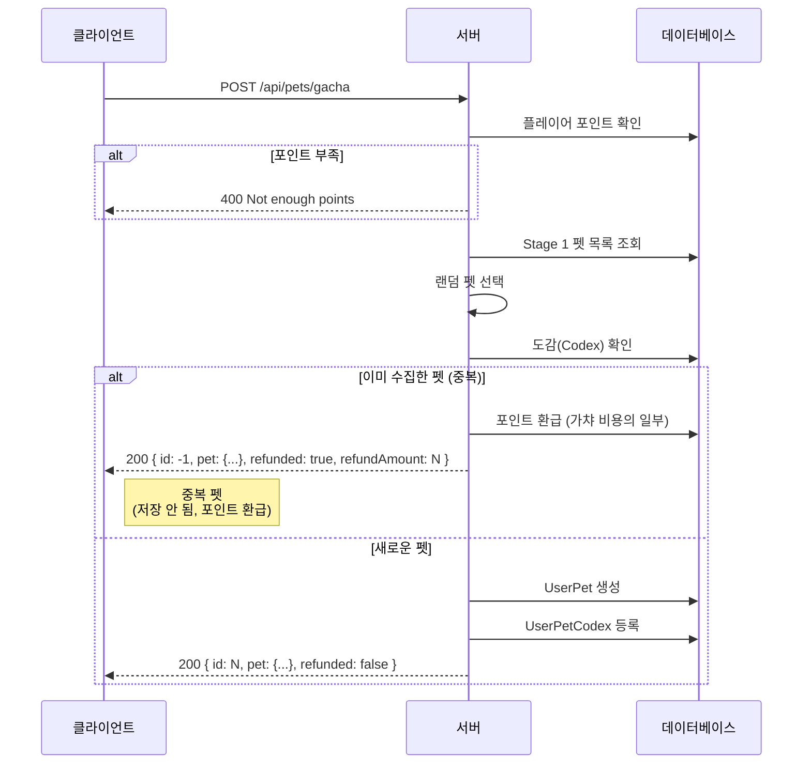
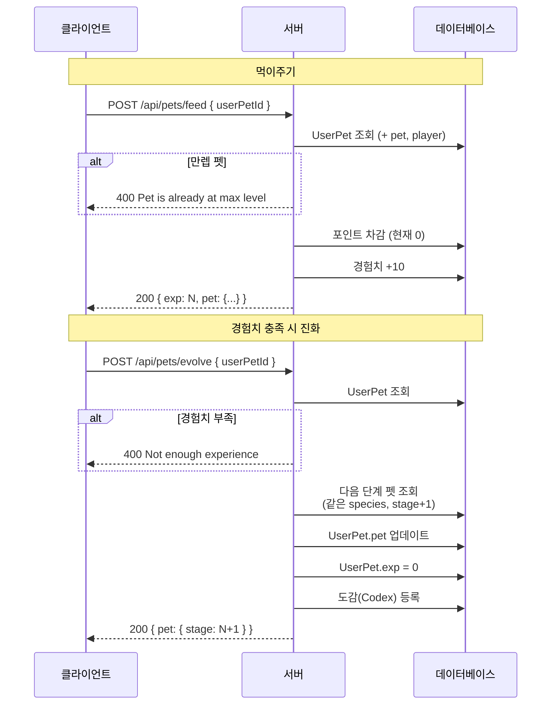
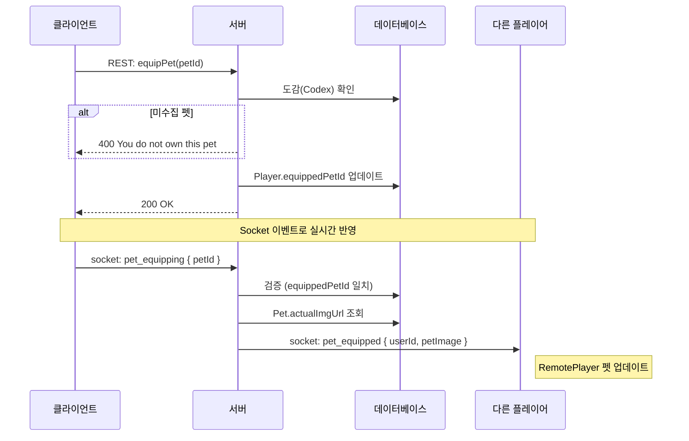
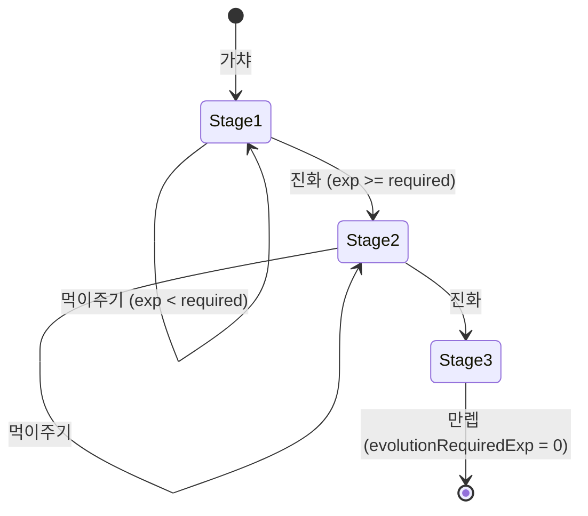
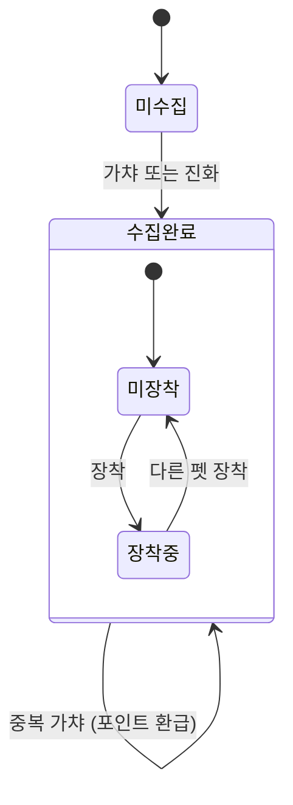

# 펫 시스템

## 개요

플레이어가 펫을 수집하고, 성장시키며, 장착하는 시스템

---

## 핵심 개념

### 엔티티 관계

```
Player (플레이어)
  ├── equipped_pet_id → Pet (장착된 펫)
  ├── UserPet[] (보유 펫 목록, 경험치 관리)
  └── UserPetCodex[] (펫 도감, 수집 이력)

Pet (펫 마스터)
  ├── species: 종 (예: gopher, duke)
  ├── evolutionStage: 진화 단계 (1, 2, 3)
  └── evolutionRequiredExp: 다음 진화에 필요한 경험치
```

### 주요 흐름

1. **가챠(Gacha)**: 랜덤 펫 획득
2. **먹이주기(Feed)**: 경험치 획득
3. **진화(Evolve)**: 다음 단계로 성장
4. **장착(Equip)**: 게임에서 표시할 펫 선택

---

## REST API

| Method | Endpoint | 설명 |
|--------|----------|------|
| GET | `/api/pets/all` | 전체 펫 목록 (마스터) |
| GET | `/api/pets/inventory/:playerId` | 보유 펫 목록 |
| GET | `/api/pets/codex/:playerId` | 펫 도감 (수집한 펫 ID 목록) |
| POST | `/api/pets/gacha` | 가챠 실행 |
| POST | `/api/pets/feed` | 먹이주기 |
| POST | `/api/pets/evolve` | 진화 |

---

## 시퀀스 다이어그램

### 1. 가챠 (Gacha)



> **중복 환급 로직:** 이미 수집한 펫이 다시 뽑힐 경우 가챠 비용의 일부를 포인트로 환급합니다.

### 2. 먹이주기 → 진화 (Feed → Evolve)



### 3. 펫 장착 (Equip) - 실시간



---

## 상태 다이어그램

### 펫 진화 상태



### 펫 수집 상태 (도감)



---

## 비용 및 보상

| 액션 | 포인트 비용 | 획득 |
|------|------------|------|
| 가챠 | 0 | Stage 1 펫 (랜덤) |
| 가챠 (중복) | 0 | 포인트 환급 |
| 먹이주기 | 0 | 경험치 +10 |
| 진화 | 0 | 다음 단계 펫 |

> **Note:** 현재 모든 비용이 0으로 설정되어 있음. 중복 펫 뽑기 시 일부 포인트 환급.

---

## 데이터 예시

### Pet (마스터 데이터)

```json
[
  { "id": 1, "name": "Gopher", "species": "gopher", "evolutionStage": 1, "evolutionRequiredExp": 100 },
  { "id": 2, "name": "Gopher Pro", "species": "gopher", "evolutionStage": 2, "evolutionRequiredExp": 200 },
  { "id": 3, "name": "Gopher Master", "species": "gopher", "evolutionStage": 3, "evolutionRequiredExp": 0 }
]
```

### UserPet (보유 펫)

```json
{
  "id": 1,
  "playerId": 101,
  "petId": 2,
  "exp": 50,
  "pet": { "name": "Gopher Pro", "evolutionStage": 2 }
}
```

### UserPetCodex (도감)

```json
[
  { "playerId": 101, "petId": 1, "acquiredAt": "2026-01-15T10:00:00Z" },
  { "playerId": 101, "petId": 2, "acquiredAt": "2026-01-20T15:30:00Z" }
]
```
