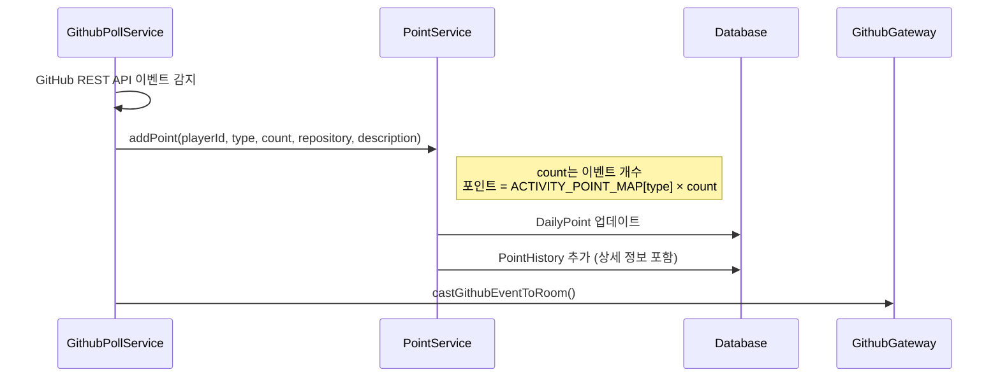
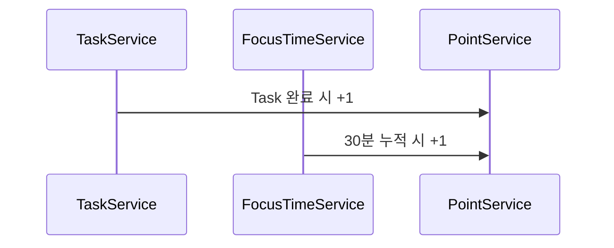
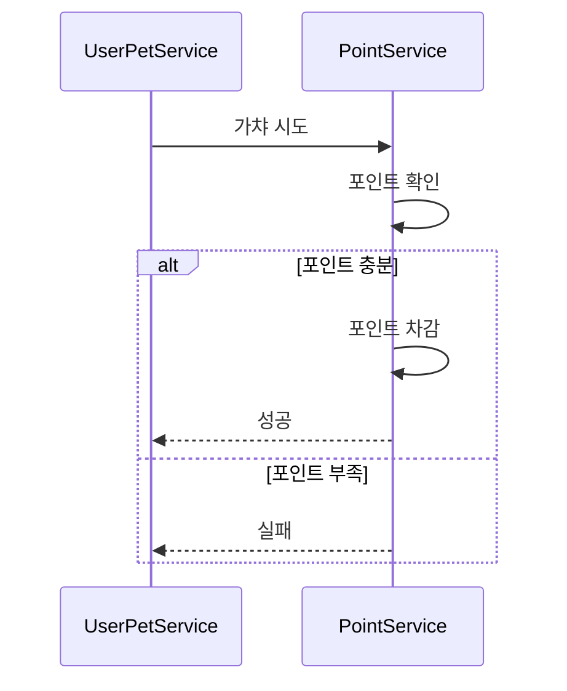
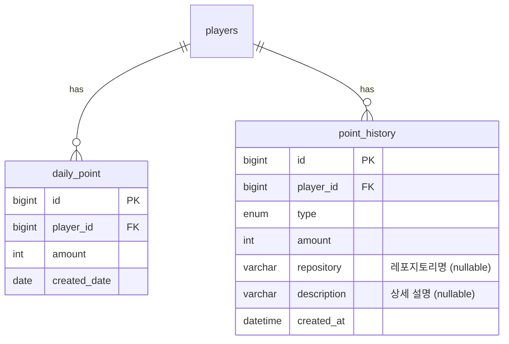

# 포인트 시스템

## 개요

플레이어의 활동에 따라 포인트를 획득하고 소비하는 시스템

---

## 현재 구현 상태

| 기능 | 상태 | 비고 |
|------|------|------|
| 포인트 조회 | ✅ 구현 | GET `/api/points` |
| 포인트 획득 (GitHub) | ✅ 구현 | 폴링 시 자동 적립 |
| 포인트 획득 (Task) | ✅ 구현 | Task 완료 시 +1 |
| 포인트 획득 (집중) | ✅ 구현 | 30분마다 +1 |
| 포인트 소비 | ❌ 미구현 | 펫 시스템 연동 필요 |
| 포인트 히스토리 | ✅ 구현 | point_history 테이블 사용 |

---

## 데이터 모델

### DailyPoint (일별 포인트)

```typescript
@Entity('daily_point')
class DailyPoint {
  id: number;
  playerId: number;
  amount: number;           // 일별 누적 포인트
  createdDate: Date;        // YYYY-MM-DD
}
```

### PointHistory (포인트 내역)

```typescript
@Entity('point_history')
class PointHistory {
  id: number;
  playerId: number;
  type: PointType;          // 포인트 타입
  amount: number;           // 획득/차감량
  repository: string | null; // 레포지토리명 (GitHub 활동)
  description: string | null; // 상세 설명 (PR/이슈 제목, 커밋 메시지)
  createdAt: Date;          // 생성 시각
}

enum PointType {
  COMMITTED = 'COMMITTED',
  PR_OPEN = 'PR_OPEN',
  PR_MERGED = 'PR_MERGED',
  PR_REVIEWED = 'PR_REVIEWED',
  ISSUE_OPEN = 'ISSUE_OPEN',
  TASK_COMPLETED = 'TASK_COMPLETED',
  FOCUSED = 'FOCUSED',
}
```

---

## 포인트 획득 정책

### GitHub 활동

| 활동 | 포인트 | 비고 |
|------|--------|------|
| 커밋 (COMMITTED) | +2 | 커밋 1개당 |
| PR 생성 (PR_OPEN) | +2 | |
| PR 머지 (PR_MERGED) | +4 | |
| PR 리뷰 (PR_REVIEWED) | +4 | Submit review 시 |
| 이슈 생성 (ISSUE_OPEN) | +1 | |

### Task 활동

| 활동 | 포인트 | 비고 |
|------|--------|------|
| Task 완료 (TASK_COMPLETED) | +1 | 완료 처리 시 |

### 집중 시간

| 활동 | 포인트 | 비고 |
|------|--------|------|
| 집중 30분 (FOCUSED) | +1 | 누적 30분마다 |

---

## 포인트 소비처 (설계)

### 펫 시스템

| 항목 | 비용 | 현재 값 |
|------|------|--------|
| 가챠 1회 | 100 | 0 (무료) |
| 먹이주기 1회 | 10 | 0 (무료) |

> **Note:** 현재 모든 비용이 0으로 설정되어 테스트 용이

---

## API

### 포인트 조회

```
GET /api/points
```

**Response:**
```json
{
  "points": [
    {
      "id": 1,
      "amount": 150,
      "createdDate": "2026-01-22"
    }
  ]
}
```

### 포인트 요약 (Planned)

```
GET /api/points?date=YYYY-MM-DD&aggregate=summary
```

**Response:**
```json
{
  "date": "2026-01-22",
  "amount": 150
}
```

### 포인트 히스토리 (Planned)

```
GET /api/points/history?limit=20
```

**Response:**
```json
{
  "items": [
    {
      "type": "COMMITTED",
      "amount": 2,
      "createdAt": "2026-01-22T10:30:00Z"
    },
    {
      "type": "TASK_COMPLETED",
      "amount": 1,
      "createdAt": "2026-01-22T11:00:00Z"
    }
  ]
}
```

---

## 클라이언트 상태 (usePointStore)

현재 Mock 데이터만 사용:

```typescript
interface PointState {
  points: number;  // 기본값: 1000
}

interface PointActions {
  addPoints(amount: number): void;
  subtractPoints(amount: number): boolean;  // 부족 시 false
  setPoints(amount: number): void;
}
```

> **Note:** 백엔드 연동 없이 로컬 상태만 관리 중

---

## 구현 계획

### Phase 1: GitHub 활동 포인트 ✅ 구현 완료



**point_history 저장 예시:**

| type | repository | description |
|------|------------|-------------|
| COMMITTED | `owner/repo` | `feat: 새 기능 추가` (커밋 메시지) |
| PR_OPEN | `owner/repo` | `로그인 기능 구현` (PR 제목) |
| PR_MERGED | `owner/repo` | `버그 수정` (PR 제목) |
| ISSUE_OPEN | `owner/repo` | `버그 리포트` (이슈 제목) |
| PR_REVIEWED | `owner/repo` | `새 기능` (리뷰한 PR 제목) |

### Phase 2: Task/집중 포인트 ✅ 구현 완료



### Phase 3: 포인트 소비 (Planned)



---

## 프론트엔드 연동 계획

### 포인트 표시 UI

```typescript
// 헤더 또는 사이드바에 포인트 표시
const { points } = usePointStore();
return <PointBadge>{points} P</PointBadge>;
```

### 포인트 부족 알림

```typescript
const handleGacha = async () => {
  const success = await subtractPoints(100);
  if (!success) {
    showToast('포인트가 부족합니다!');
    return;
  }
  await performGacha();
};
```

---

## ERD 연관



---

## 관련 문서

- [ERD.md](../guides/ERD.md) - 데이터베이스 스키마
- [PET_SYSTEM.md](./PET_SYSTEM.md) - 펫 시스템 (포인트 소비처)
- [GITHUB_POLLING.md](../api/GITHUB_POLLING.md) - GitHub 활동 감지
