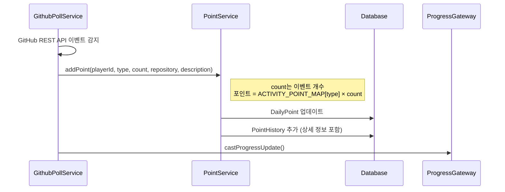
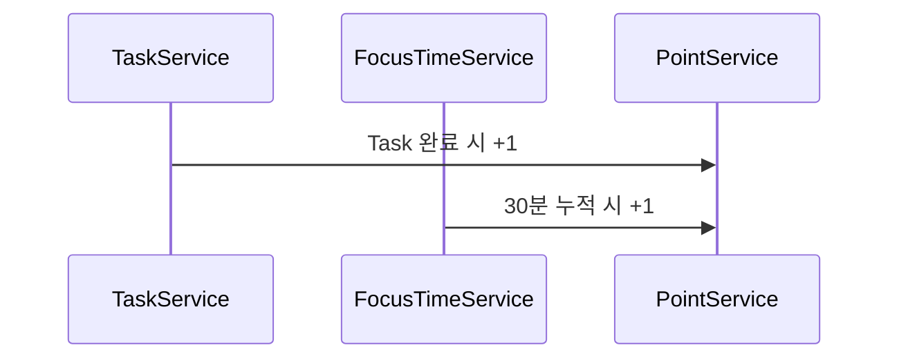
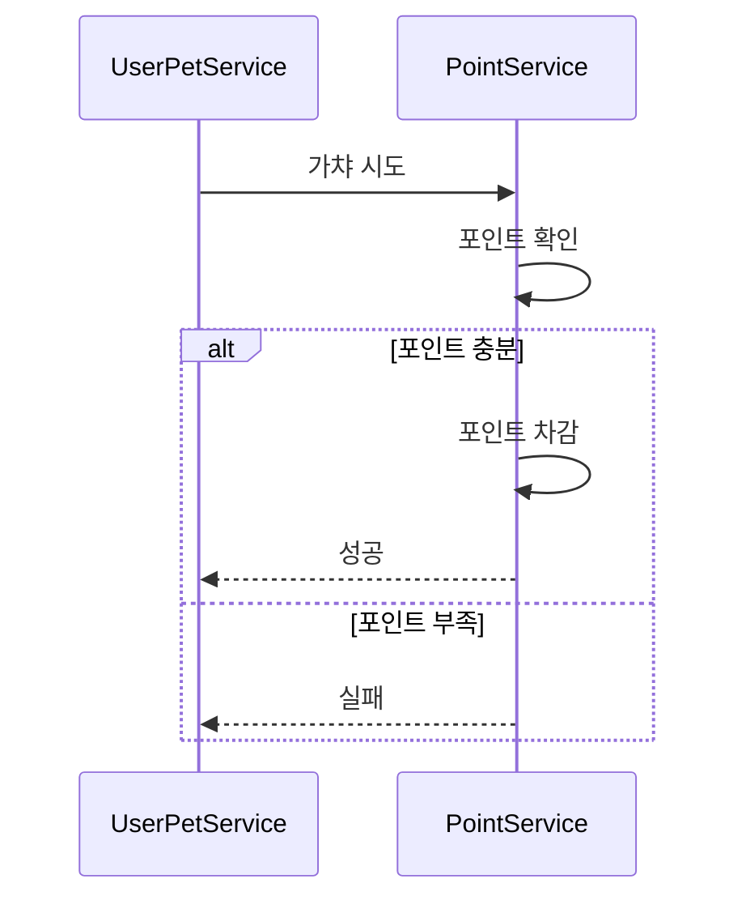
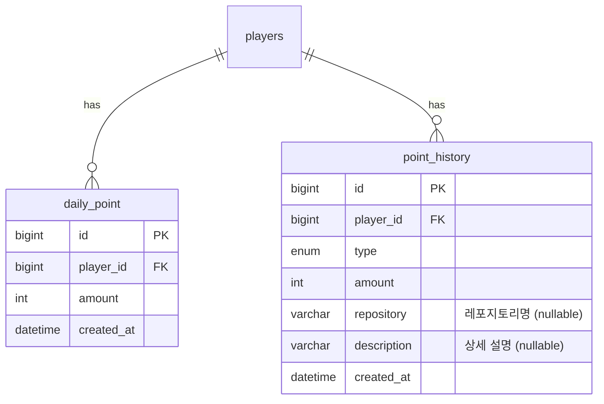

# 포인트 시스템

## 개요

플레이어의 활동에 따라 포인트를 획득하고 소비하는 시스템

---

## 현재 구현 상태

| 기능 | 상태 | 비고 |
|------|------|------|
| 포인트 조회 | ✅ 구현 | GET `/api/points?targetPlayerId&currentTime` |
| 포인트 랭킹 | ✅ 구현 | GET `/api/points/ranks?weekendStartAt` |
| 포인트 획득 (GitHub) | ✅ 구현 | 폴링 시 자동 적립 |
| 포인트 획득 (Task) | ✅ 구현 | Task 완료 시 +1 |
| 포인트 획득 (집중) | ✅ 구현 | 30분마다 +1 |
| 포인트 소비 | ✅ 구현 | 펫 가챠/먹이주기에서 차감 |
| 포인트 히스토리 | ✅ 구현 | point_history 테이블 사용 |

---

## 데이터 모델

### DailyPoint (일별 포인트)

```typescript
@Entity('daily_point')
class DailyPoint {
  id: number;
  playerId: number;
  amount: number;           // 일별 누적 포인트
  createdDate: Date;        // YYYY-MM-DD
}
```

### PointHistory (포인트 내역)

```typescript
@Entity('point_history')
class PointHistory {
  id: number;
  playerId: number;
  type: PointType;          // 포인트 타입
  amount: number;           // 획득/차감량
  repository: string | null; // 레포지토리명 (GitHub 활동)
  description: string | null; // 상세 설명 (PR/이슈 제목, 커밋 메시지)
  createdAt: Date;          // 생성 시각
}

enum PointType {
  COMMITTED = 'COMMITTED',
  PR_OPEN = 'PR_OPEN',
  PR_MERGED = 'PR_MERGED',
  PR_REVIEWED = 'PR_REVIEWED',
  ISSUE_OPEN = 'ISSUE_OPEN',
  TASK_COMPLETED = 'TASK_COMPLETED',
  FOCUSED = 'FOCUSED',
}
```

---

## 포인트 획득 정책

### GitHub 활동

| 활동 | 포인트 | 비고 |
|------|--------|------|
| 커밋 (COMMITTED) | +2 | 커밋 1개당 |
| PR 생성 (PR_OPEN) | +2 | |
| PR 머지 (PR_MERGED) | +4 | |
| PR 리뷰 (PR_REVIEWED) | +4 | Submit review 시 |
| 이슈 생성 (ISSUE_OPEN) | +1 | |

### Task 활동

| 활동 | 포인트 | 비고 |
|------|--------|------|
| Task 완료 (TASK_COMPLETED) | +1 | 완료 처리 시 |

### 집중 시간

| 활동 | 포인트 | 비고 |
|------|--------|------|
| 집중 30분 (FOCUSED) | +1 | 누적 30분마다 |

---

## 포인트 소비처

### 펫 시스템

| 항목 | 비용 | 현재 값 |
|------|------|--------|
| 가챠 1회 | 100 | 적용 중 |
| 먹이주기 1회 | 10 | 적용 중 |
| 중복 가챠 환급 | 50 | `POST /api/pets/gacha/refund` |

---

## API

### 포인트 조회

```
GET /api/points?targetPlayerId=:playerId&currentTime=:date
```

**Response:**
```json
[
  {
    "id": 1,
    "amount": 150,
    "createdAt": "2026-01-22T00:00:00.000Z"
  }
]
```

### 주간 포인트 랭킹

```
GET /api/points/ranks?weekendStartAt=:date
```

**Response:**
```json
[
  {
    "playerId": 1,
    "nickname": "octocat",
    "totalPoints": 42,
    "rank": 1
  }
]
```

### 활동 히스토리 (Git/Task/Focus)

```
GET /api/git-histories?targetPlayerId=:playerId&startAt=:date&endAt=:date
```

**Response:**
```json
[
  {
    "type": "COMMITTED",
    "amount": 2,
    "createdAt": "2026-01-22T10:30:00Z"
  },
  {
    "type": "TASK_COMPLETED",
    "amount": 1,
    "createdAt": "2026-01-22T11:00:00Z"
  }
]
```

---

## 클라이언트 연동

- 포인트/랭킹 데이터는 React Query 기반 API 훅으로 조회
- 실시간 기여도는 `useContributionStore`로 관리 (`progress_update` 수신)

---

## 구현 계획

### Phase 1: GitHub 활동 포인트 ✅ 구현 완료


```mermaid
sequenceDiagram
    participant Poll as GithubPollService
    participant PS as PointService
    participant DB as Database
    participant GW as ProgressGateway

    Poll->>Poll: GitHub REST API 이벤트 감지
    Poll->>PS: addPoint(playerId, type, count, repository, description)
    Note right of PS: count는 이벤트 개수<br/>포인트 = ACTIVITY_POINT_MAP[type] × count
    PS->>DB: DailyPoint 업데이트
    PS->>DB: PointHistory 추가 (상세 정보 포함)
    Poll->>GW: castProgressUpdate()
```

**point_history 저장 예시:**

| type | repository | description |
|------|------------|-------------|
| COMMITTED | `owner/repo` | `feat: 새 기능 추가` (커밋 메시지) |
| PR_OPEN | `owner/repo` | `로그인 기능 구현` (PR 제목) |
| PR_MERGED | `owner/repo` | `버그 수정` (PR 제목) |
| ISSUE_OPEN | `owner/repo` | `버그 리포트` (이슈 제목) |
| PR_REVIEWED | `owner/repo` | `새 기능` (리뷰한 PR 제목) |

### Phase 2: Task/집중 포인트 ✅ 구현 완료


```mermaid
sequenceDiagram
    participant Task as TaskService
    participant Focus as FocusTimeService
    participant PS as PointService

    Task->>PS: Task 완료 시 +1
    Focus->>PS: 30분 누적 시 +1
```

### 일일 정산 스케줄 (구현)

- 매일 KST 00:00에 전날 데이터 기준으로 Task/Focus 정산
- 정산 히스토리는 `activityAt`을 전날 23:59:59로 기록
- 일요일 자정 정산은 주간 실시간 랭킹(progress)에는 반영하지 않음

### Phase 3: 포인트 소비 (Planned)


```mermaid
sequenceDiagram
    participant Pet as UserPetService
    participant PS as PointService

    Pet->>PS: 가챠 시도
    PS->>PS: 포인트 확인
    alt 포인트 충분
        PS->>PS: 포인트 차감
        PS-->>Pet: 성공
    else 포인트 부족
        PS-->>Pet: 실패
    end
```

---

## 프론트엔드 연동 계획

### 포인트 표시 UI

```typescript
// React Query로 조회된 일별 포인트 합계를 표시
const total = points.reduce((sum, p) => sum + p.amount, 0);
return <PointBadge>{total} P</PointBadge>;
```

### 포인트 부족 알림

```typescript
const handleGacha = async () => {
  const success = await subtractPoints(100);
  if (!success) {
    showToast('포인트가 부족합니다!');
    return;
  }
  await performGacha();
};
```

---

## ERD 연관


```mermaid
erDiagram
    players ||--o{ daily_point : has
    players ||--o{ point_history : has

    daily_point {
        bigint id PK
        bigint player_id FK
        int amount
        datetime created_at
    }

    point_history {
        bigint id PK
        bigint player_id FK
        enum type
        int amount
        varchar repository "레포지토리명 (nullable)"
        varchar description "상세 설명 (nullable)"
        datetime created_at
    }
```

---

## 관련 문서

- [ERD.md](../guides/ERD.md) - 데이터베이스 스키마
- [PET_SYSTEM.md](./PET_SYSTEM.md) - 펫 시스템 (포인트 소비처)
- [GITHUB_POLLING.md](../api/GITHUB_POLLING.md) - GitHub 활동 감지
