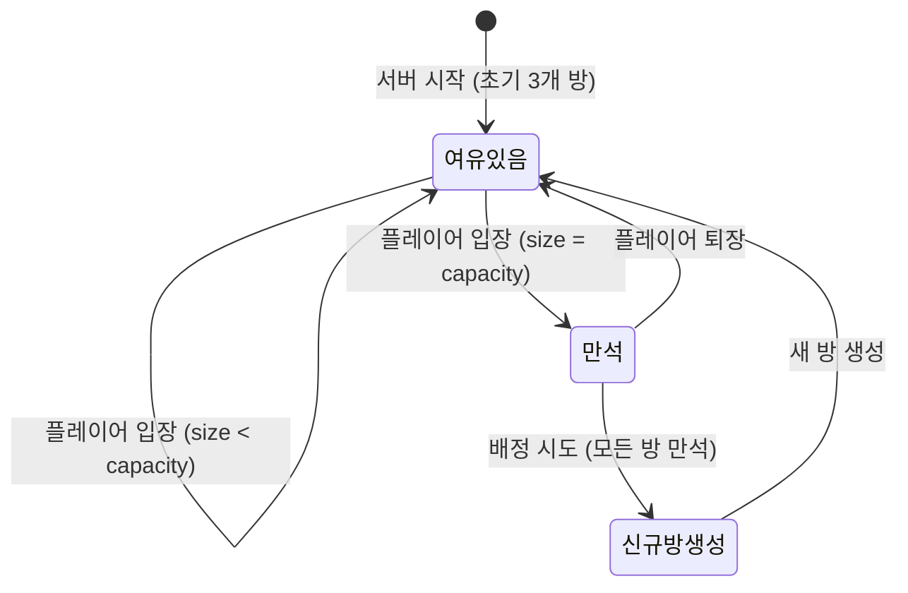
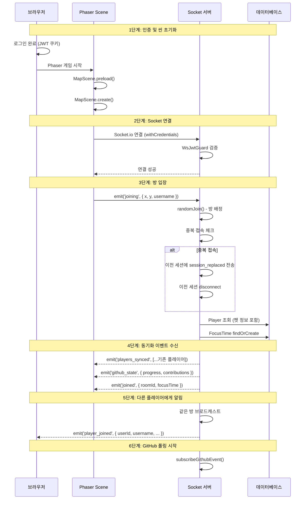
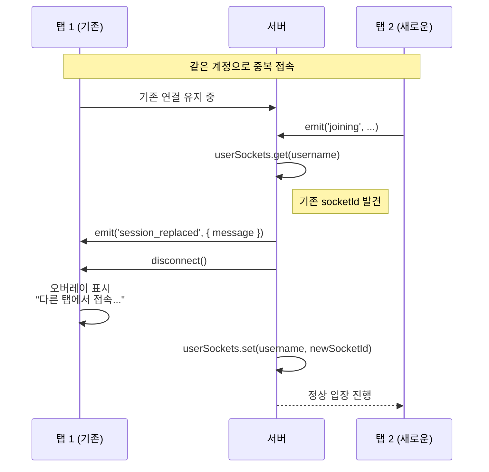
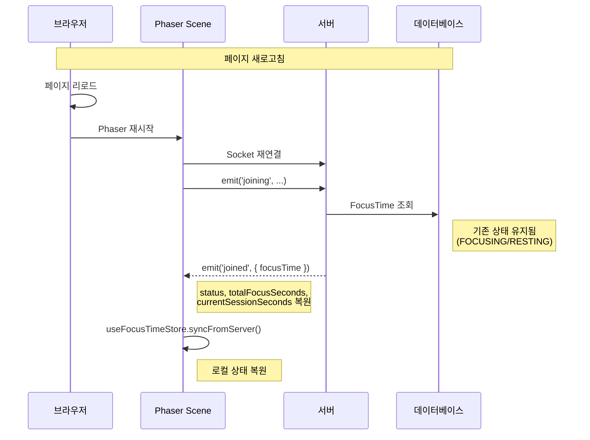
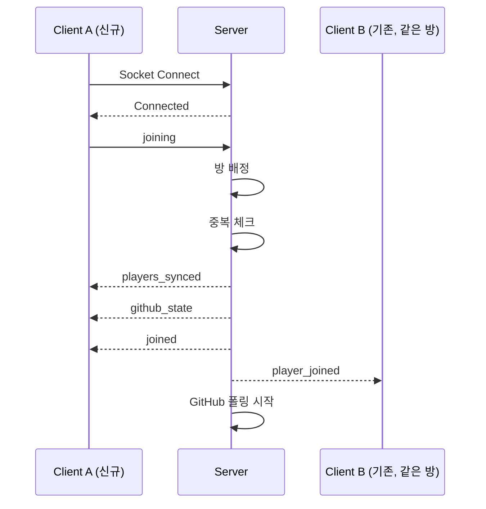

# 방 입장 및 게임 시작 흐름

## 개요

플레이어가 로그인 후 게임에 입장하여 다른 플레이어들과 상호작용을 시작하는 전체 흐름

---

## 방 관리 정책

### 방 설정

| 항목 | 값 | 설명 |
|------|---|------|
| 용량 | 14명 | 방당 최대 인원 |
| 초기 방 | 3개 | room-1, room-2, room-3 |
| 자동 생성 | Yes | 모든 방이 가득 차면 새 방 생성 |
| 배정 방식 | 랜덤 | 여유 있는 방 중 랜덤 선택 |

### 방 상태 전이



---

## 전체 흐름 시퀀스

### 1. 게임 입장 (정상 흐름)



### 2. 중복 접속 처리



### 3. 새로고침 시 상태 복원



---

## 이벤트 상세

### joining (C→S)

클라이언트가 방 입장을 요청

```typescript
socket.emit('joining', {
  x: number,        // 초기 X 좌표
  y: number,        // 초기 Y 좌표
  username: string  // 표시용 사용자명
});
```

**서버 처리:**
1. `randomJoin()` - 방 배정
2. 중복 접속 체크 및 이전 세션 종료
3. `players` Map에 정보 저장
4. DB에서 Player, FocusTime 조회
5. 동기화 이벤트 전송

---

### joined (S→C)

로컬 플레이어에게 입장 완료 알림

```typescript
socket.on('joined', (data: {
  roomId: string,
  focusTime: {
    status: 'FOCUSING' | 'RESTING',
    totalFocusSeconds: number,
    currentSessionSeconds: number
  }
}) => {
  // roomId 저장
  // focusTime으로 로컬 상태 복원
});
```

---

### players_synced (S→C)

기존 플레이어 목록 전송

```typescript
socket.on('players_synced', (players: Array<{
  socketId: string,
  userId: string,
  username: string,
  roomId: string,
  x: number,
  y: number,
  playerId: number,
  petImage: string | null,
  status: 'FOCUSING' | 'RESTING',
  lastFocusStartTime: string | null,
  totalFocusSeconds: number,
  currentSessionSeconds: number
}>) => {
  // 각 플레이어에 대해 RemotePlayer 생성
});
```

---

### player_joined (S→C)

새 플레이어 입장 알림 (다른 플레이어들에게)

```typescript
socket.on('player_joined', (data: {
  userId: string,
  username: string,
  x: number,
  y: number,
  playerId: number,
  petImage: string | null,
  status: 'FOCUSING' | 'RESTING',
  totalFocusSeconds: number,
  currentSessionSeconds: number
}) => {
  // RemotePlayer 생성
});
```

---

### github_state (S→C)

현재 방의 GitHub 상태 전송

```typescript
socket.on('github_state', (state: {
  progress: number,                      // 0-99
  contributions: Record<string, number>  // username -> points
}) => {
  // 프로그레스바 초기값 설정
  // 기여도 목록 초기값 설정
});
```

---

### session_replaced (S→C)

다른 탭에서 로그인으로 인한 세션 종료

```typescript
socket.on('session_replaced', (data: {
  message: string
}) => {
  // 연결 해제
  // 오버레이 표시
});
```

---

## 이벤트 흐름 다이어그램



---

## 관련 문서

- [SOCKET_EVENTS.md](../api/SOCKET_EVENTS.md) - 소켓 이벤트 전체 명세
- [AUTH_FLOW.md](./AUTH_FLOW.md) - 인증 흐름
- [FOCUS_TIME.md](./FOCUS_TIME.md) - 포커스 타임 시스템
- [GAME_ENGINE.md](../architecture/GAME_ENGINE.md) - 게임 엔진 구조
