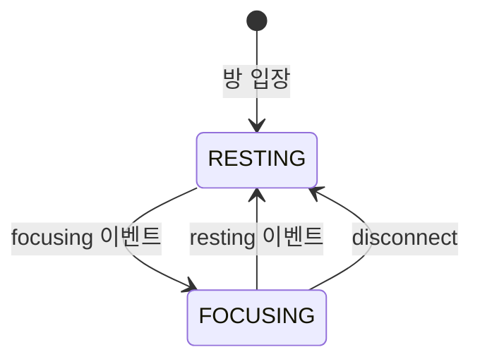

# 도메인 용어집

## 개요

프로젝트에서 사용하는 핵심 도메인 개념과 용어 정의

---

## 플레이어 상태

### FOCUSING (집중 중)

플레이어가 작업에 집중하고 있는 상태

- `DailyFocusTime.status = 'FOCUSING'`
- 집중 시간이 1초씩 누적됨
- 다른 플레이어에게 집중 중임이 표시됨 (말풍선)
- `lastFocusStartTime`에 집중 시작 시각 기록

### RESTING (휴식 중)

플레이어가 휴식 중인 상태

- `DailyFocusTime.status = 'RESTING'`
- 집중 시간 누적 정지
- 방 입장 시 기본 상태

### 상태 전이



---

## 시간 관련

### totalFocusSeconds (누적 집중 시간)

하루 동안 누적된 총 집중 시간 (초 단위)

- `DailyFocusTime.total_focus_seconds`에 저장
- RESTING으로 전환될 때 누적됨
- 자정 기준으로 리셋 (새 레코드 생성)

### currentSessionSeconds (현재 세션 경과 시간)

현재 집중 세션에서 경과한 시간 (초 단위)

- **서버에서 계산**: `now() - lastFocusStartTime`
- 클라이언트 시계 오차 문제 해결을 위해 서버가 계산
- 클라이언트에서는 이 값을 받아 1초마다 +1 증가

### lastFocusStartTime (마지막 집중 시작 시각)

가장 최근에 집중을 시작한 시각

- 서버 시계 기준 `datetime`
- FOCUSING 상태일 때만 의미 있음
- 경과 시간 계산에 사용

### baseFocusSeconds (기준 집중 시간)

집중 시작 시점의 누적 시간 (클라이언트 전용)

- 집중 시작 시 `totalFocusSeconds` 값을 저장
- 현재 표시 시간 = `baseFocusSeconds + 경과 시간`

---

## GitHub 폴링

### Baseline (기준점)

사용자의 GitHub 기여 기준점

- 첫 폴링 시 현재 커밋/PR 수를 기준점으로 저장
- 이후 폴링: `현재값 - 기준점 = 새 기여 수`
- 새로고침해도 기준점 유지 (중복 알림 방지)

```typescript
interface UserBaseline {
  lastCommitCount: number;
  lastPRCount: number;
  lastIssueCount: number;
  lastPRReviewCount: number;
  isFirstPoll: boolean;
}
```

### Progress (프로그레스)

방의 GitHub 기여 진행 게이지

- 범위: 0-99%
- 커밋 1개 = +2%
- PR 1개 = +5%
- 100% 도달 시 다음 맵으로 전환, 0%로 리셋

### Contributions (기여도)

방에서 각 플레이어의 누적 GitHub 활동 수

```typescript
contributions: Record<username, count>
```

- 프로그레스바 아래 기여도 목록에 표시
- 상위 5명만 표시

---

## 방 (Room)

### Room (방)

플레이어들이 함께 활동하는 공간

| 속성 | 값 |
|------|---|
| 최대 인원 | 14명 |
| 초기 방 수 | 3개 (room-1, room-2, room-3) |
| 배정 방식 | 여유 있는 방 중 랜덤 |
| 자동 생성 | 모든 방이 가득 차면 새 방 생성 |

### RoomState (방 상태)

방의 현재 GitHub 상태

```typescript
interface RoomState {
  progress: number;                      // 0-99
  contributions: Record<string, number>; // username -> count
}
```

---

## 세션

### Session (세션)

하나의 WebSocket 연결

- 브라우저 탭 하나 = 세션 하나
- 세션마다 고유한 `socketId` 부여

### Session Replaced (세션 교체)

같은 계정으로 중복 접속 시 이전 세션 종료

- 새 탭 접속 → 이전 탭에 `session_replaced` 이벤트 전송
- 이전 탭은 "다른 탭에서 접속하여..." 오버레이 표시

---

## 플레이어 동기화

### Lerp (선형 보간)

원격 플레이어를 부드럽게 이동시키는 기법

- 현재 위치에서 목표 위치로 점진적 이동
- 네트워크 지연으로 인한 끊김 현상 완화

```typescript
// 매 프레임
x = Phaser.Math.Linear(currentX, targetX, 0.2);
y = Phaser.Math.Linear(currentY, targetY, 0.2);
```

### RemotePlayer (원격 플레이어)

다른 사용자를 표현하는 게임 객체

- 서버에서 위치/상태 수신
- Lerp로 부드럽게 이동
- 집중 상태, 말풍선, 접속 시간 표시

### LocalPlayer (로컬 플레이어)

현재 사용자를 표현하는 게임 객체

- 키보드 입력으로 직접 조작
- 이동 시 `moving` 이벤트로 서버에 전송
- 카메라가 팔로우

---

## 펫 시스템

### Gacha (가챠)

랜덤 펫 뽑기 시스템

- Stage 1 펫 중 랜덤 획득
- 이미 보유한 펫이면 저장 안 됨 (중복)

### Codex (도감)

플레이어가 한 번이라도 획득한 펫 기록

- `UserPetCodex` 테이블에 저장
- 펫 장착 권한 검증에 사용
- 진화 시에도 자동 등록

### Evolution (진화)

펫이 다음 단계로 성장

- 경험치(exp)가 `evolutionRequiredExp` 도달 시 가능
- Stage 1 → 2 → 3 (최대)
- 진화 후 경험치 0으로 리셋

### Equipped Pet (장착 펫)

현재 게임에서 표시되는 펫

- `Player.equipped_pet_id`에 저장
- 도감에 있는 펫만 장착 가능
- 실시간으로 다른 플레이어에게 반영

---

## 좌표 시스템

### World Coordinate (월드 좌표)

게임 내 위치 기준 좌표계

- 플레이어 위치, 충돌 계산에 사용
- 맵 이미지의 원본 크기 기준

### worldScale (월드 스케일)

이미지와 좌표 간 변환 비율

- 현재 값: 2
- 의미: 이미지는 2배 크기, 좌표는 원본 기준
- Tiled 좌표 → 월드 좌표: `÷ worldScale`

---

## Task (작업)

### Task (작업)

플레이어가 설정한 할 일 항목

- 최대 100자 설명
- 일별로 생성/관리
- 집중 시간 누적 가능

### Running Task (실행 중 작업)

현재 집중하고 있는 작업

- `task.isRunning = true`
- 말풍선에 작업명 표시
- 집중 시간이 해당 Task에 누적

---

## 낙관적 업데이트

### Optimistic Update (낙관적 업데이트)

API 응답을 기다리지 않고 UI를 먼저 업데이트하는 패턴

1. 사용자 액션 발생
2. UI 즉시 업데이트 (낙관적)
3. API/소켓 요청 전송
4. 성공 시: 유지
5. 실패 시: 이전 상태로 롤백

### Rollback (롤백)

낙관적 업데이트 실패 시 이전 상태로 복원

```typescript
// 예시
const previousState = store.getState();
store.setState(newState);  // 낙관적 업데이트

try {
  await api.call();
} catch {
  store.setState(previousState);  // 롤백
}
```

---

## 관련 문서

- [FOCUS_TIME.md](../features/FOCUS_TIME.md) - 포커스 타임 상세
- [PET_SYSTEM.md](../features/PET_SYSTEM.md) - 펫 시스템 상세
- [ROOM_JOIN_FLOW.md](../features/ROOM_JOIN_FLOW.md) - 방 입장 흐름
- [GITHUB_POLLING.md](../api/GITHUB_POLLING.md) - GitHub 폴링 상세
