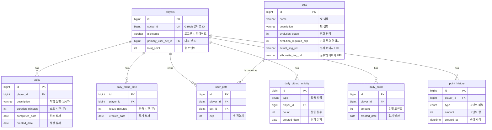

# ERD (Entity Relationship Diagram)

## 개요

GitHub 활동 기반 게이미피케이션 서비스의 데이터베이스 스키마

---

## ERD 다이어그램



---

## 테이블 상세

### players (플레이어)

플레이어 기본 정보

| 컬럼 | 타입 | 제약조건 | 설명 |
|------|------|----------|------|
| id | bigint | PK, AUTO_INCREMENT | 고유 ID |
| social_id | bigint | UNIQUE, NOT NULL | GitHub 유니크 ID |
| nickname | varchar(20) | NOT NULL | 닉네임 (로그인 시 업데이트) |
| primary_user_pet_id | bigint | FK → user_pets.id | 대표 펫 ID |
| total_point | int | DEFAULT 0 | 총 누적 포인트 |

---

### tasks (작업)

플레이어의 작업 기록

| 컬럼 | 타입 | 제약조건 | 설명 |
|------|------|----------|------|
| id | bigint | PK, AUTO_INCREMENT | 고유 ID |
| player_id | bigint | FK → players.id | 플레이어 ID |
| description | varchar(100) | | 작업 설명 |
| duration_minutes | int | DEFAULT 0 | 소요 시간 (분) |
| completed_date | date | NOT NULL | 완료 날짜 |
| created_date | date | NOT NULL | 생성 날짜 |

---

### daily_focus_time (일별 집중 시간)

일별 집중 시간 집계 테이블

| 컬럼 | 타입 | 제약조건 | 설명 |
|------|------|----------|------|
| id | bigint | PK, AUTO_INCREMENT | 고유 ID |
| player_id | bigint | FK → players.id | 플레이어 ID |
| focus_minutes | int | DEFAULT 0 | 집중 시간 (분) |
| created_date | date | NOT NULL | 집계 기준 날짜 |

**인덱스:** `UNIQUE(player_id, created_date)` - 플레이어별 일별 1개 레코드

---

### pets (펫 마스터)

펫 기본 정보 (시드 데이터)

| 컬럼 | 타입 | 제약조건 | 설명 |
|------|------|----------|------|
| id | bigint | PK, AUTO_INCREMENT | 고유 ID |
| name | varchar(20) | | 펫 이름 (예: 알콜중독 듀크) |
| description | varchar(100) | | 펫 설명 |
| evolution_stage | int | | 진화 단계 (1, 2, 3...) |
| evolution_required_exp | int | | 다음 진화에 필요한 경험치 |
| actual_img_url | varchar(100) | | 실제 이미지 경로 |
| silhouette_img_url | varchar(100) | | 실루엣 이미지 경로 |

---

### user_pets (유저 보유 펫)

플레이어가 보유한 펫

| 컬럼 | 타입 | 제약조건 | 설명 |
|------|------|----------|------|
| id | bigint | PK, AUTO_INCREMENT | 고유 ID |
| player_id | bigint | FK → players.id | 플레이어 ID |
| pet_id | bigint | FK → pets.id | 펫 ID |
| exp | int | DEFAULT 0 | 현재 경험치 |

**인덱스:** `UNIQUE(player_id, pet_id)` - 플레이어별 펫 1개

---

### daily_github_activity (일별 GitHub 활동)

일별 GitHub 활동 집계 테이블

| 컬럼 | 타입 | 제약조건 | 설명 |
|------|------|----------|------|
| id | bigint | PK, AUTO_INCREMENT | 고유 ID |
| type | enum | NOT NULL | 활동 타입 |
| player_id | bigint | FK → players.id | 플레이어 ID |
| count | int | DEFAULT 0 | 활동 횟수 |
| created_date | date | NOT NULL | 집계 기준 날짜 |

**활동 타입 (type):**
- `ISSUE_OPEN` - 이슈 생성
- `PR_OPEN` - PR 생성
- `PR_MERGED` - PR 머지
- `PR_REVIEWED` - PR 리뷰
- `COMMITTED` - 커밋

**인덱스:** `UNIQUE(player_id, type, created_date)` - 플레이어별 타입별 일별 1개 레코드

---

### daily_point (일별 포인트)

일별 포인트 집계 테이블

| 컬럼 | 타입 | 제약조건 | 설명 |
|------|------|----------|------|
| id | bigint | PK, AUTO_INCREMENT | 고유 ID |
| player_id | bigint | FK → players.id | 플레이어 ID |
| amount | int | DEFAULT 0 | 일별 누적 포인트 |
| created_date | date | NOT NULL | 집계 기준 날짜 |

**인덱스:** `UNIQUE(player_id, created_date)` - 플레이어별 일별 1개 레코드

---

### point_history (포인트 내역)

포인트 획득/차감 상세 내역

| 컬럼 | 타입 | 제약조건 | 설명 |
|------|------|----------|------|
| id | bigint | PK, AUTO_INCREMENT | 고유 ID |
| player_id | bigint | FK → players.id | 플레이어 ID |
| type | enum | NOT NULL | 포인트 타입 |
| amount | int | NOT NULL | 포인트 량 |
| created_at | datetime | NOT NULL | 생성 시각 |

**포인트 타입 (type):**
- `ISSUE_OPEN` - 이슈 생성
- `PR_OPEN` - PR 생성
- `PR_MERGED` - PR 머지
- `PR_REVIEWED` - PR 리뷰
- `COMMITTED` - 커밋
- `TASK_COMPLETED` - 작업 완료
- `FOCUSED` - 집중 시간

---

## 포인트 시스템

### 포인트 획득 기준 (예시)

| 활동 | 포인트 |
|------|--------|
| 커밋 (COMMITTED) | +2 |
| PR 생성 (PR_OPEN) | +5 |
| PR 머지 (PR_MERGED) | +10 |
| PR 리뷰 (PR_REVIEWED) | +3 |
| 이슈 생성 (ISSUE_OPEN) | +3 |
| 작업 완료 (TASK_COMPLETED) | +1 |
| 집중 시간 10분 (FOCUSED) | +1 |

---

## 펫 진화 시스템

```
[1단계 펫] ---(exp 도달)---> [2단계 펫] ---(exp 도달)---> [3단계 펫]
```

- 펫 경험치는 포인트 획득 시 함께 증가
- `evolution_required_exp` 도달 시 다음 단계로 진화 가능
- 진화 시 새로운 `user_pets` 레코드 생성 또는 `pet_id` 업데이트

---

## 설계 특징

### 일별 집계 테이블

- `daily_focus_time`, `daily_github_activity`, `daily_point`
- 조회 성격이 일별 조회가 강하기 때문에 별도 집계 테이블로 분리
- 쿼리 성능 최적화

### 시드 데이터

- `pets` 테이블은 시드 데이터로 미리 채워야 함
- 진화 단계별 펫 정보 포함
