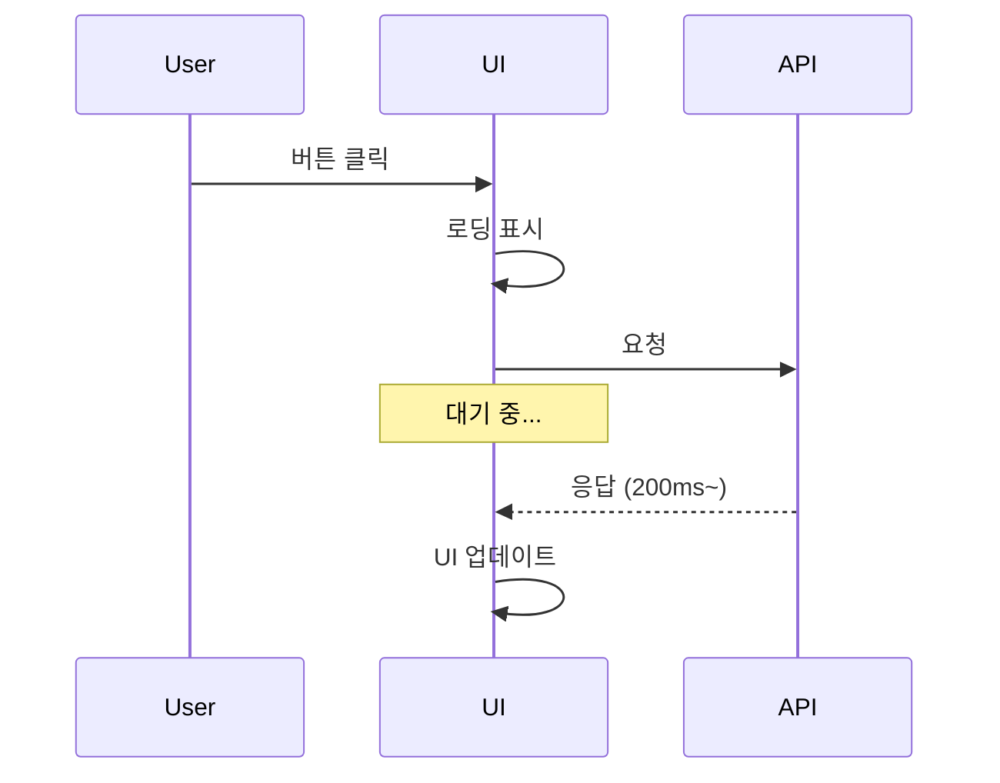
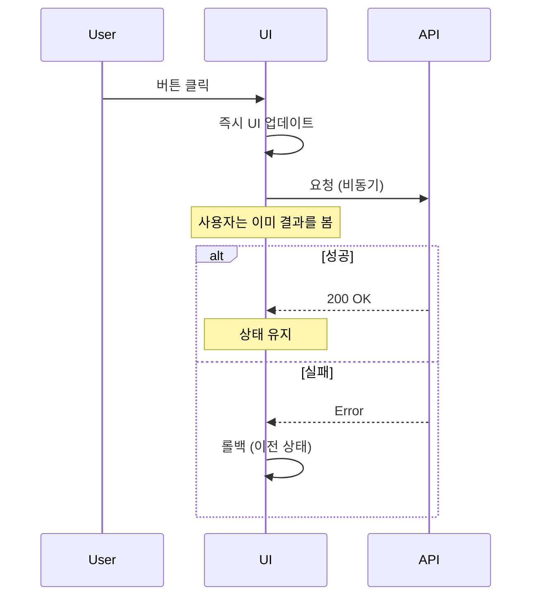

# 낙관적 업데이트 패턴

## 개요

API 응답을 기다리지 않고 UI를 먼저 업데이트하는 패턴

---

## 왜 필요한가?

### 일반적인 방식 (비관적)



**문제점:** 네트워크 지연으로 인한 느린 반응

### 낙관적 업데이트



**장점:** 즉각적인 UI 반응, 더 나은 사용자 경험

---

## 구현 패턴

### 기본 구조

```typescript
async function optimisticAction(id: number) {
  // 1. 이전 상태 저장
  const previousState = store.getState();

  // 2. 낙관적 업데이트 (즉시 UI 반영)
  store.setState(newState);

  try {
    // 3. API 요청
    await api.call(id);
    // 성공 시 유지
  } catch (error) {
    // 4. 실패 시 롤백
    store.setState(previousState);
    console.error('Action failed:', error);
  }
}
```

---

## 프로젝트 적용 사례

### 1. Task 완료 토글 (useTasksStore)

```typescript
async toggleTask(id: number) {
  const { tasks, pendingTaskIds } = get();

  // 중복 요청 방지
  if (pendingTaskIds.includes(id)) return;

  const task = tasks.find(t => t.id === id);
  if (!task) return;

  // 이전 상태 저장
  const previousCompleted = task.isCompleted;

  // 낙관적 업데이트
  set({
    tasks: tasks.map(t =>
      t.id === id ? { ...t, isCompleted: !t.isCompleted } : t
    ),
    pendingTaskIds: [...pendingTaskIds, id]
  });

  try {
    if (previousCompleted) {
      await uncompleteTask(id);
    } else {
      await completeTask(id);
    }
  } catch {
    // 롤백
    set({
      tasks: tasks.map(t =>
        t.id === id ? { ...t, isCompleted: previousCompleted } : t
      ),
      error: '작업 상태 변경에 실패했습니다.'
    });
  } finally {
    // pending 상태 해제
    set({
      pendingTaskIds: get().pendingTaskIds.filter(x => x !== id)
    });
  }
}
```

### 2. Task 삭제 (useTasksStore)

```typescript
async deleteTask(id: number) {
  const { tasks, pendingTaskIds } = get();

  if (pendingTaskIds.includes(id)) return;

  const task = tasks.find(t => t.id === id);
  const taskIndex = tasks.findIndex(t => t.id === id);

  // 낙관적 삭제
  set({
    tasks: tasks.filter(t => t.id !== id),
    pendingTaskIds: [...pendingTaskIds, id]
  });

  try {
    await deleteTaskApi(id);
  } catch {
    // 롤백: 원래 위치에 복원
    const currentTasks = get().tasks;
    const restoredTasks = [
      ...currentTasks.slice(0, taskIndex),
      task!,
      ...currentTasks.slice(taskIndex)
    ];
    set({
      tasks: restoredTasks,
      error: 'Task 삭제에 실패했습니다.'
    });
  } finally {
    set({
      pendingTaskIds: get().pendingTaskIds.filter(x => x !== id)
    });
  }
}
```

### 3. 집중 시작 (useFocusTimeStore)

```typescript
startFocusing(taskName?: string, taskId?: number) {
  const socket = getSocket();
  if (!socket) return;

  // 이전 상태 저장
  const previousStatus = get().status;

  // 낙관적 업데이트
  set({
    status: 'FOCUSING',
    isFocusTimerRunning: true,
    focusStartTimestamp: Date.now(),
    baseFocusSeconds: get().focusTime
  });

  // 소켓 요청 (콜백으로 응답 처리)
  socket.emit('focusing', { taskName, taskId }, (response) => {
    if (!response.success) {
      // 롤백
      set({
        status: previousStatus,
        isFocusTimerRunning: previousStatus === 'FOCUSING',
        error: response.error || '집중 시작에 실패했습니다.'
      });
    }
  });
}
```

### 4. Task 이름 수정 + 소켓 브로드캐스트

```typescript
async editTask(id: number, newText: string) {
  const { tasks } = get();
  const task = tasks.find(t => t.id === id);
  if (!task) return;

  // 이전 값 저장
  const previousText = task.description;

  // 낙관적 업데이트
  set({
    tasks: tasks.map(t =>
      t.id === id ? { ...t, description: newText } : t
    )
  });

  try {
    await updateTask(id, newText);

    // 집중 중인 Task 이름 변경 시 다른 플레이어에게 알림
    if (task.isRunning) {
      const socket = getSocket();
      socket?.emit('focus_task_updating', { taskName: newText });
    }
  } catch {
    // 롤백
    set({
      tasks: tasks.map(t =>
        t.id === id ? { ...t, description: previousText } : t
      ),
      error: 'Task 수정에 실패했습니다.'
    });
  }
}
```

---

## 중복 요청 방지

### pendingTaskIds 패턴

```typescript
interface TasksState {
  tasks: Task[];
  pendingTaskIds: number[];  // 작업 중인 ID 추적
}

// 사용
if (pendingTaskIds.includes(id)) {
  return;  // 이미 처리 중이면 무시
}

set({ pendingTaskIds: [...pendingTaskIds, id] });

try {
  await action();
} finally {
  set({
    pendingTaskIds: pendingTaskIds.filter(x => x !== id)
  });
}
```

### UI 비활성화

```typescript
// 버튼 비활성화
<button
  disabled={pendingTaskIds.includes(task.id)}
  onClick={() => toggleTask(task.id)}
>
  {pendingTaskIds.includes(task.id) ? '처리 중...' : '완료'}
</button>
```

---

## 소켓 콜백 패턴

REST API 대신 소켓 이벤트를 사용할 때:

```typescript
// 클라이언트
socket.emit('focusing', data, (response) => {
  if (response.success) {
    // 성공 처리
  } else {
    // 롤백
  }
});

// 서버 (NestJS Gateway)
@SubscribeMessage('focusing')
async handleFocusing(client, data) {
  try {
    const result = await this.service.startFocusing(...);
    return { success: true, data: result };
  } catch (error) {
    return { success: false, error: error.message };
  }
}
```

---

## 주의사항

### 언제 사용해야 하는가

✅ **적합한 경우:**
- 성공 확률이 높은 작업
- 즉각적인 피드백이 중요한 UI
- 실패 시 롤백이 간단한 경우

❌ **부적합한 경우:**
- 결제, 송금 등 되돌릴 수 없는 작업
- 복잡한 상태 의존성이 있는 경우
- 실패 확률이 높은 작업

### 데이터 정합성

- 서버 응답이 항상 정확한 상태
- 롤백 시 서버 상태로 동기화 고려
- 동시 수정 충돌 처리 필요할 수 있음

---

## 테스트

### 실패 시나리오 테스트

```typescript
it('API 실패 시 이전 상태로 롤백된다', async () => {
  // Given: 기존 Task
  const initialTasks = [{ id: 1, isCompleted: false }];
  useTasksStore.setState({ tasks: initialTasks });

  // API 실패 설정
  server.use(
    http.patch('*/api/tasks/completion/1', () =>
      HttpResponse.json({ error: 'fail' }, { status: 500 })
    )
  );

  // When: toggleTask 호출
  await useTasksStore.getState().toggleTask(1);

  // Then: 롤백되어 원래 상태
  expect(useTasksStore.getState().tasks[0].isCompleted).toBe(false);
  expect(useTasksStore.getState().error).toBeTruthy();
});
```

---

## 관련 문서

- [STATE_MANAGEMENT.md](../architecture/STATE_MANAGEMENT.md) - 상태 관리 전체
- [TEST_CONVENTION.md](../conventions/TEST_CONVENTION.md) - 테스트 작성법
