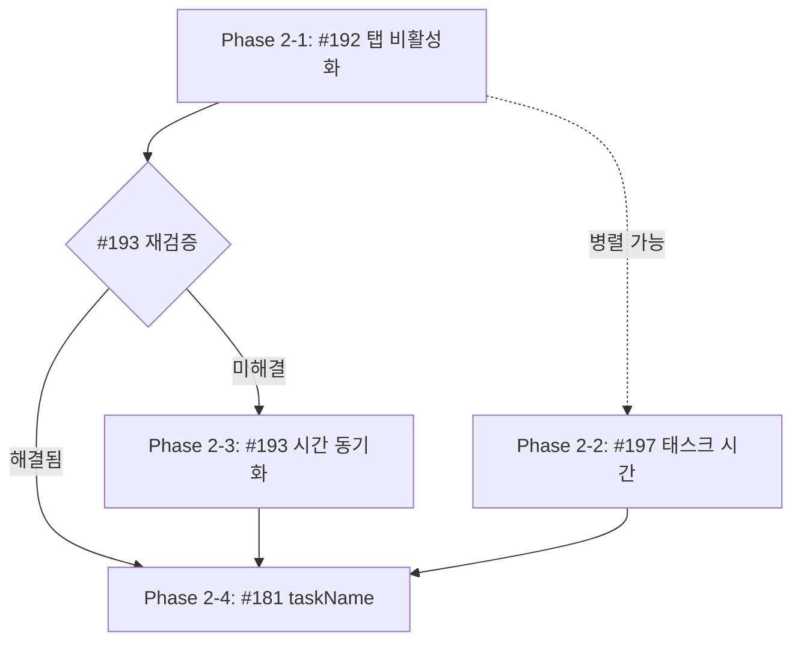

# FocusTime 버그 수정 Phase 2

## 개요

FocusTime 관련 4건의 버그를 수정하는 계획 문서

| 이슈 | 제목 | 우선순위 | 난이도 |
|------|------|---------|--------|
| #192 | 탭 비활성화/최소화 시 개인 태스크 시간이 업데이트되지 않음 | CRITICAL | 중간 |
| #197 | 태스크 전환 후 새로고침 시 이전 태스크에 시간이 합산됨 | CRITICAL | 중간 |
| #193 | 나의 집중 시간이 다른 플레이어에게 낮게 표시됨 | HIGH | 중간 |
| #181 | 새 플레이어 입장 시 기존 플레이어의 태스크 이름이 표시되지 않음 | HIGH | 쉬움 |

---

## 버그 상관관계

```
#192 (탭 비활성화) ─┐
                   ├──▶ #193 (다른 플레이어에게 낮게 표시) - 부분적 영향
#197 (태스크 전환) ─┘

#181 (taskName 누락) ──▶ 독립적 버그
```

- **#192**와 **#197**이 근본 원인, **#193**은 결과 증상일 가능성
- **#181**은 독립적인 버그로 별도 수정 가능

---

## 작업 순서 및 브랜치 전략

### Phase 2-1: 탭 비활성화 타이머 수정 (#192)

**브랜치:** `fix/#192-focustime-background-timer`

| 순서 | 작업 | 파일 |
|------|------|------|
| 1 | Phaser Timer → setInterval 전환 | `RemotePlayer.ts` |
| 2 | 로컬 플레이어 타이머 로직 추가 | `useFocusTimeStore.ts` |
| 3 | visibilitychange 이벤트 핸들링 | `SocketManager.ts` |
| 4 | 테스트 추가 | `focus.socket.spec.ts` |

**예상 결과:** 탭 비활성화 시에도 정확한 시간 계산

---

### Phase 2-2: 태스크별 시간 분리 (#197)

**브랜치:** `fix/#197-task-time-accumulation`

| 순서 | 작업 | 파일 |
|------|------|------|
| 1 | 태스크 전환 시 시간 누적 로직 수정 | `focustime.service.ts` |
| 2 | totalFocusSeconds 중복 누적 방지 | `focustime.service.ts` |
| 3 | Task별 시간 분리 검증 | `task.service.ts` |
| 4 | 테스트 추가 | `focustime.service.spec.ts` |

**예상 결과:** 태스크 전환 후 새로고침해도 각 태스크에 정확한 시간만 표시

---

### Phase 2-3: 시간 동기화 개선 (#193)

**브랜치:** `fix/#193-focustime-sync`

> **Note:** #192 해결 후 증상이 개선되었는지 먼저 검증 필요

| 순서 | 작업 | 파일 |
|------|------|------|
| 1 | #192 수정 후 재현 테스트 | - |
| 2 | 필요 시 서버 타임스탬프 기준 동기화 | `focustime.gateway.ts`, `RemotePlayer.ts` |
| 3 | focused/players_synced 이벤트 데이터 검증 | `player.gateway.ts` |
| 4 | 테스트 추가 | `focustime.e2e-spec.ts` |

**예상 결과:** 모든 플레이어에게 동일한 집중 시간 표시

---

### Phase 2-4: taskName 누락 수정 (#181)

**브랜치:** `fix/#181-players-synced-taskname`

| 순서 | 작업 | 파일 |
|------|------|------|
| 1 | findAllStatuses()에서 currentTask 조회 | `focustime.service.ts` |
| 2 | players_synced에 taskName 필드 추가 | `player.gateway.ts` |
| 3 | SocketManager에서 taskName 처리 | `SocketManager.ts` |
| 4 | 테스트 추가 | `player.gateway.spec.ts` |

**예상 결과:** 새 플레이어 입장 시 기존 플레이어의 태스크 이름 정상 표시

---

## 상세 구현 계획

### #192: 탭 비활성화 타이머 수정

#### 원인

브라우저가 백그라운드 탭의 `setInterval`/Phaser Timer를 쓰로틀링

#### 해결 방안

**1. RemotePlayer 타이머 변경**

```typescript
// frontend/src/game/players/RemotePlayer.ts
// 기존: Phaser Timer (쓰로틀링 영향 받음)
this.focusTimeTimer = this.scene.time.addEvent({ ... });

// 변경: setInterval (브라우저 독립)
this.focusTimeInterval = setInterval(() => {
  currentSeconds++;
  this.updateFocusTime(this.baseFocusSeconds + currentSeconds);
}, 1000);
```

**2. 로컬 플레이어 타이머 추가**

```typescript
// frontend/src/stores/useFocusTimeStore.ts
interface FocusTimeState {
  timerInterval: NodeJS.Timeout | null;
  focusStartTimestamp: number | null;  // 집중 시작 시점
}

startFocusTimer: () => {
  const { timerInterval } = get();
  if (timerInterval) return;  // 이미 실행 중

  set({ focusStartTimestamp: Date.now() });

  const interval = setInterval(() => {
    const { focusStartTimestamp, baseFocusSeconds } = get();
    if (focusStartTimestamp) {
      const elapsed = Math.floor((Date.now() - focusStartTimestamp) / 1000);
      set({ focusTime: baseFocusSeconds + elapsed });
    }
  }, 1000);

  set({ timerInterval: interval });
},

stopFocusTimer: () => {
  const { timerInterval } = get();
  if (timerInterval) {
    clearInterval(timerInterval);
    set({ timerInterval: null, focusStartTimestamp: null });
  }
},
```

**3. visibilitychange 핸들링**

```typescript
// frontend/src/game/managers/SocketManager.ts
document.addEventListener('visibilitychange', () => {
  if (document.visibilityState === 'visible') {
    // 탭 복귀 시 서버와 시간 재동기화
    const { status, syncTimeFromServer } = useFocusTimeStore.getState();
    if (status === 'FOCUSING') {
      // 서버에 현재 시간 요청하여 보정
    }
  }
});
```

---

### #197: 태스크별 시간 분리

#### 원인

`startFocusing()` 호출 시 이전 태스크와 현재 태스크 모두에 시간이 중복 누적

#### 해결 방안

```typescript
// backend/src/focustime/focustime.service.ts
async startFocusing(playerId: number, taskId?: number): Promise<DailyFocusTime> {
  const focusTime = await this.findOrCreate(playerId);

  // 이미 FOCUSING 상태에서 새 태스크로 전환하는 경우
  if (focusTime.status === FocusStatus.FOCUSING && focusTime.lastFocusStartTime) {
    const now = new Date();
    const diffMs = now.getTime() - focusTime.lastFocusStartTime.getTime();
    const diffSeconds = Math.floor(diffMs / 1000);

    // 1. 일별 누적 시간에 추가
    focusTime.totalFocusSeconds += diffSeconds;

    // 2. 이전 태스크에만 시간 추가 (새 태스크 아님!)
    if (focusTime.currentTaskId) {
      await this.addFocusTimeToTask(focusTime.currentTaskId, diffSeconds);
    }
  }

  // 새 태스크로 시작
  focusTime.status = FocusStatus.FOCUSING;
  focusTime.lastFocusStartTime = new Date();
  focusTime.currentTaskId = taskId ?? null;

  return this.focusTimeRepository.save(focusTime);
}
```

---

### #193: 시간 동기화 개선

#### 원인

1. 로컬 플레이어: 클라이언트 타이머 기반
2. 원격 플레이어: 서버 시간 + 클라이언트 타이머 (불일치 가능)

#### 해결 방안

**#192 수정 후 먼저 검증**

#192가 수정되면 로컬/원격 모두 타임스탬프 기반 계산이 되어 자연스럽게 해결될 가능성 있음

**추가 수정 필요 시:**

```typescript
// backend/src/focustime/focustime.gateway.ts
// focused 이벤트에 서버 타임스탬프 추가
client.to(roomId).emit('focused', {
  ...existingData,
  serverTimestamp: Date.now(),  // 서버 현재 시간
});

// frontend/src/game/players/RemotePlayer.ts
// 서버 타임스탬프 기준으로 계산
const serverTimeDiff = Date.now() - data.serverTimestamp;  // 네트워크 지연
const adjustedSessionSeconds = data.currentSessionSeconds + Math.floor(serverTimeDiff / 1000);
```

---

### #181: taskName 누락 수정

#### 원인

`players_synced` 이벤트에 `taskName` 필드가 없음

#### 해결 방안

```typescript
// backend/src/focustime/focustime.service.ts
async findAllStatuses(playerIds: number[]): Promise<Map<number, DailyFocusTimeStatus>> {
  const focusTimes = await this.focusTimeRepository.find({
    where: { player: { id: In(playerIds) }, createdDate: today },
    relations: ['player', 'currentTask'],  // currentTask 관계 추가
  });

  const statusMap = new Map();
  for (const ft of focusTimes) {
    statusMap.set(ft.player.id, {
      status: ft.status,
      lastFocusStartTime: ft.lastFocusStartTime,
      totalFocusSeconds: ft.totalFocusSeconds,
      taskName: ft.currentTask?.description ?? null,  // taskName 추가
    });
  }
  return statusMap;
}

// backend/src/player/player.gateway.ts
// players_synced 이벤트에 taskName 포함
return {
  ...p,
  status: status?.status ?? 'RESTING',
  lastFocusStartTime: status?.lastFocusStartTime?.toISOString() ?? null,
  totalFocusSeconds: status?.totalFocusSeconds ?? 0,
  currentSessionSeconds,
  taskName: status?.taskName ?? null,  // 추가!
};
```

---

## 작업 흐름



### 권장 진행 순서

1. **#192 + #197 병렬 작업** (독립적)
2. **#193 검증** (#192 완료 후)
3. **#181 작업** (마지막, 간단)

---

## 브랜치 머지 순서

```
main
 │
 ├── fix/#192-focustime-background-timer (PR #1)
 │    └── Squash Merge → main
 │
 ├── fix/#197-task-time-accumulation (PR #2)
 │    └── Squash Merge → main
 │
 ├── fix/#193-focustime-sync (PR #3, #192 머지 후)
 │    └── Squash Merge → main
 │
 └── fix/#181-players-synced-taskname (PR #4)
      └── Squash Merge → main
```

---

## 테스트 체크리스트

### #192 테스트

- [ ] 탭 비활성화 후 복귀 시 시간이 정확히 표시됨
- [ ] 브라우저 최소화 후 복원 시 시간이 정확히 표시됨
- [ ] RemotePlayer의 시간도 정확히 업데이트됨

### #197 테스트

- [ ] 태스크 A → B 전환 후 새로고침 시 각 태스크에 정확한 시간 표시
- [ ] 일별 totalFocusSeconds는 전체 누적값 유지
- [ ] Task별 totalFocusSeconds는 해당 태스크만의 시간

### #193 테스트

- [ ] 로컬 플레이어와 원격 플레이어 화면의 시간이 동일
- [ ] 새 플레이어 입장 시 기존 플레이어의 시간이 정확히 표시

### #181 테스트

- [ ] 새 플레이어 입장 시 기존 집중 중인 플레이어의 태스크 이름 표시
- [ ] "작업중" 대신 실제 태스크 이름 표시

---

## 참고 문서

- [SOCKET_EVENTS.md](../api/SOCKET_EVENTS.md) - 소켓 이벤트 스펙
- [FOCUS_TIME.md](../features/FOCUS_TIME.md) - 포커스 타임 기능 문서
- [FOCUSTIME_BUGS_COMPLETED.md](./20260121_FOCUSTIME_BUGS_COMPLETED.md) - Phase 1 완료 내역
