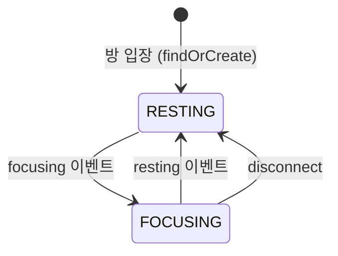
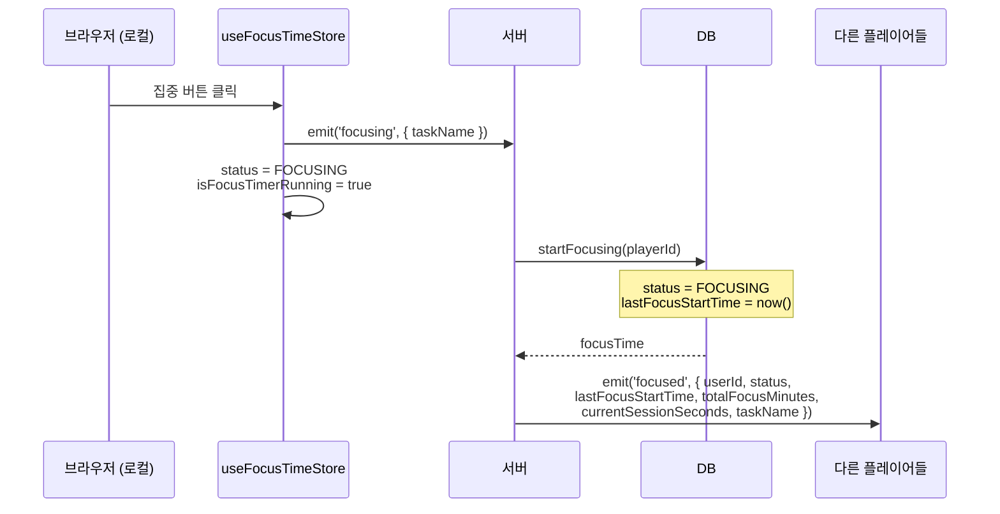
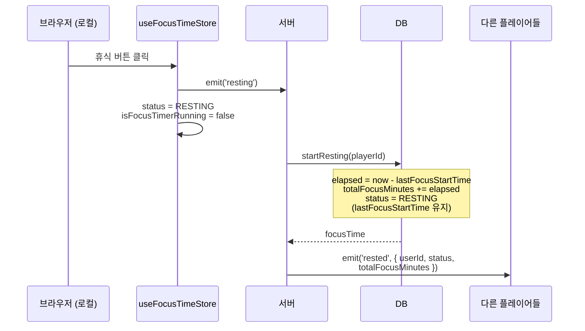
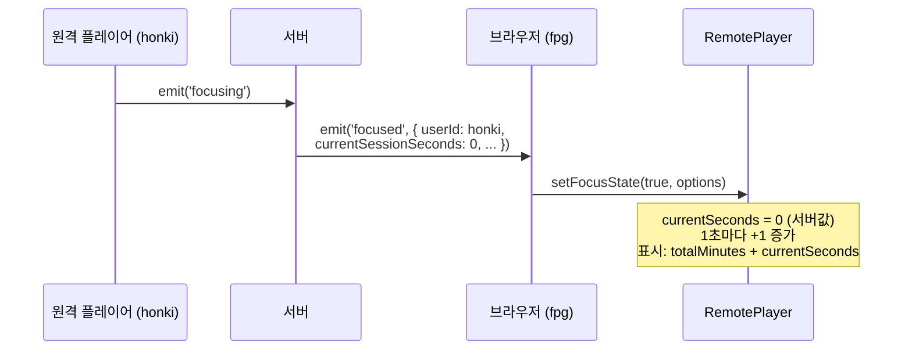
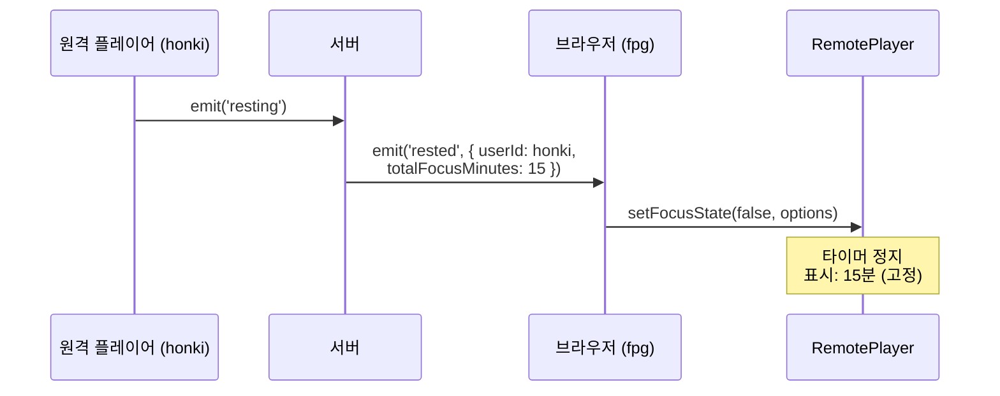
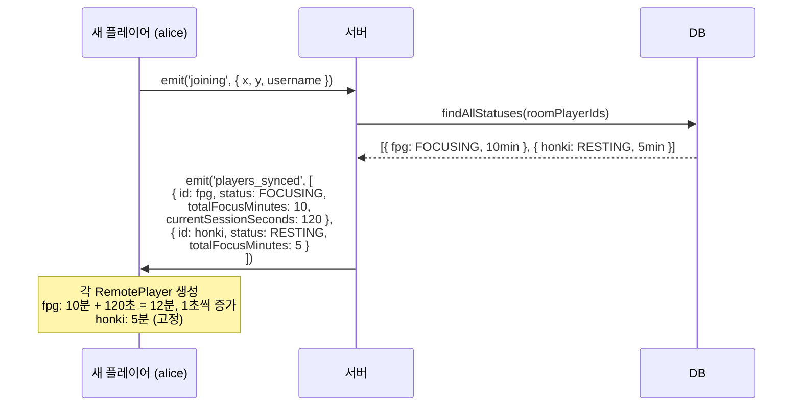
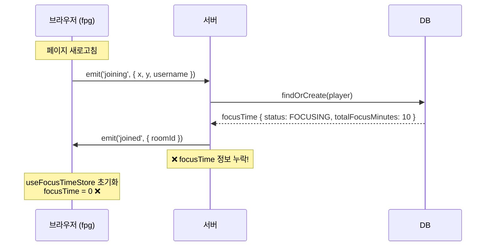
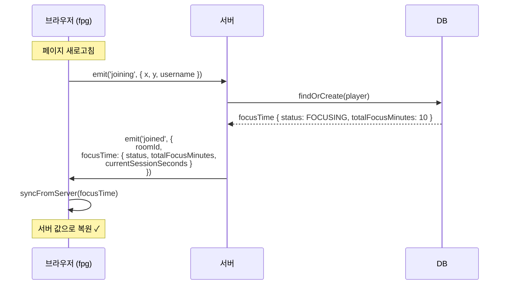
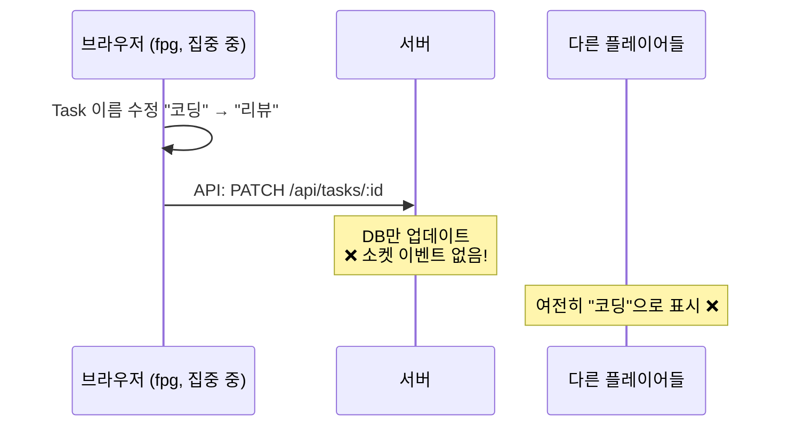
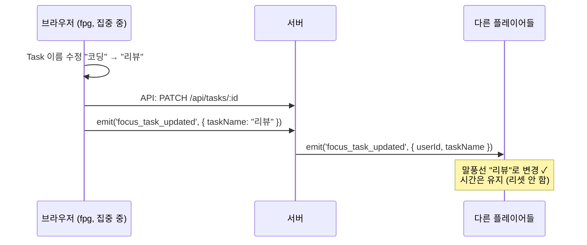

# 포커스 타임

## 개요

플레이어의 일별 집중 상태와 누적 집중 시간을 기록한다. 상태는 `FOCUSING` 또는 `RESTING`이며,
집중 시작/종료는 소켓 이벤트로 전파된다.

---

## 데이터 모델

`DailyFocusTime`은 하루에 하나의 레코드를 사용한다.

| 필드 | 타입 | 설명 |
|------|------|------|
| `player_id` | bigint | 플레이어 ID |
| `total_focus_minutes` | int | 누적 집중 시간(분) |
| `status` | enum | `FOCUSING` \| `RESTING` |
| `created_date` | date | `YYYY-MM-DD` |
| `last_focus_start_time` | datetime | 마지막 집중 시작 시각 (nullable) |

---

## 상태 전이

1. **방 입장**: `findOrCreate`로 당일 레코드 생성/조회
2. **focusing**: 상태를 `FOCUSING`으로 변경하고 `last_focus_start_time` 기록
3. **resting**: 집중 시간 누적 후 상태를 `RESTING`으로 변경 (`last_focus_start_time`은 유지)
4. **disconnect**: `RESTING` 처리 시도 (예외는 로깅)



---

## 소켓 이벤트

### 클라이언트 → 서버

```typescript
socket.emit('focusing', { taskName?: string });  // taskName은 선택
socket.emit('resting');
```

### 서버 → 클라이언트

```typescript
socket.on('focused', (data: {
  userId: string,
  username: string,
  status: 'FOCUSING',
  lastFocusStartTime: string,
  totalFocusMinutes: number,
  currentSessionSeconds: number,  // 서버가 계산한 경과 시간
  taskName?: string
}) => {});

socket.on('rested', (data: {
  userId: string,
  username: string,
  status: 'RESTING',
  totalFocusMinutes: number
}) => {});
```

---

## 시퀀스 다이어그램

### 1. 로컬 플레이어 집중 시작



### 2. 로컬 플레이어 휴식 시작



### 3. 다른 플레이어 집중 시작 (focused 이벤트 수신)



### 4. 다른 플레이어 휴식 시작 (rested 이벤트 수신)



### 5. 새 플레이어 입장 (players_synced)



### 6. 새로고침 (joined 이벤트)

> ⚠️ **버그 #121**: 현재 `joined` 이벤트에 focusTime 정보가 없어서 새로고침 시 집중 시간이 0으로 초기화됨



**수정 후 (버그 #121 해결):**



### 7. Task 이름 변경

> ⚠️ **버그 #122**: 현재 Task 이름 변경 시 다른 플레이어에게 전파되지 않음



**수정 후 (버그 #122 해결):**



---

## 시간 계산 방식

### 문제점

클라이언트에서 `Date.now() - lastFocusStartTime`으로 계산하면 클라이언트 시계에 의존하게 되어 음수가 발생할 수 있음.

### 해결 방식

서버에서 `currentSessionSeconds`를 계산하여 전송:

```typescript
// 서버
currentSessionSeconds = Math.floor((Date.now() - lastFocusStartTime.getTime()) / 1000)

// 클라이언트
let seconds = currentSessionSeconds;  // 서버 값으로 시작
setInterval(() => seconds++, 1000);   // 1초마다 +1 증가
```

---

## 주의사항

- 방 입장 전에 `focusing/resting`을 호출하면 에러가 발생할 수 있다.
- `created_date`는 `YYYY-MM-DD` 문자열을 기준으로 조회한다.
- 클라이언트 시계와 서버 시계가 다를 수 있으므로 시간 계산은 서버에서 수행한다.
