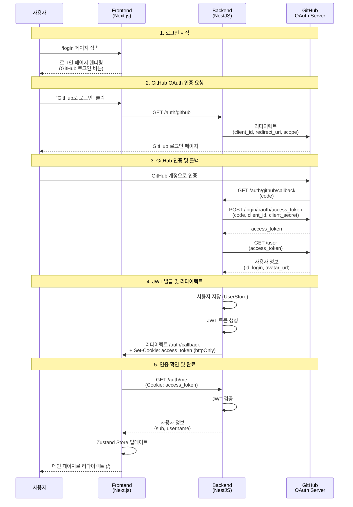

# GitHub OAuth2 인증 흐름 시퀀스 다이어그램

## 주요 엔드포인트

| 메서드 | 경로 | 설명 |
|-------|------|------|
| GET | `/auth/github` | GitHub 로그인 시작 (리다이렉트) |
| GET | `/auth/github/callback` | OAuth 콜백 처리 + JWT 쿠키 설정 |
| GET | `/auth/me` | 현재 사용자 정보 조회 (JWT 필요) |
| GET | `/auth/logout` | 로그아웃 (쿠키 삭제) |

## 인증 상태 관리

- **Backend**: httpOnly 쿠키에 JWT 저장 (XSS 방지)
- **Frontend**: Zustand store로 인증 상태 관리
- **보호된 페이지**: AuthGuard 컴포넌트로 비로그인 시 /login으로 리다이렉트
