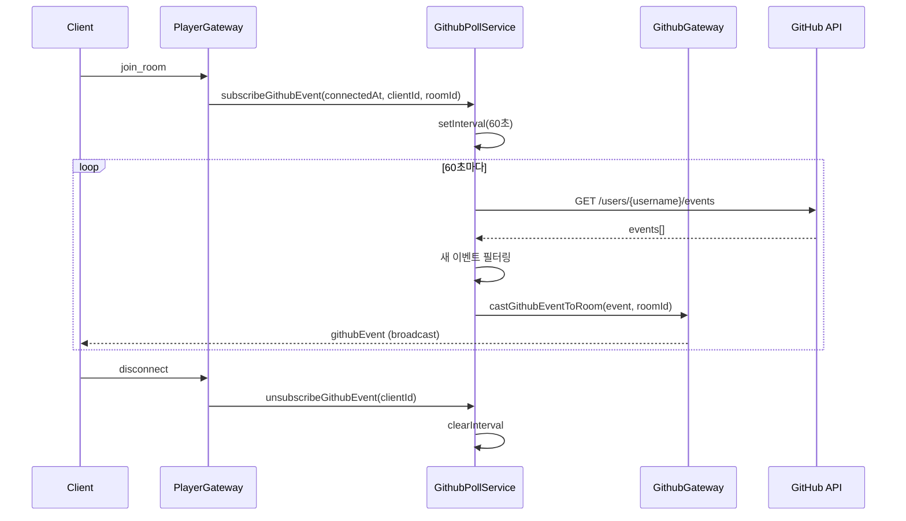
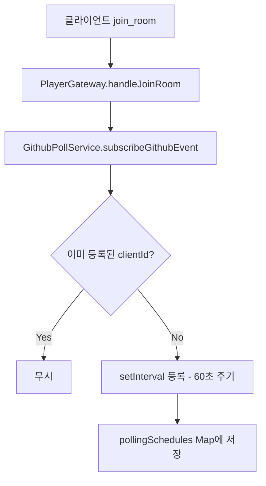
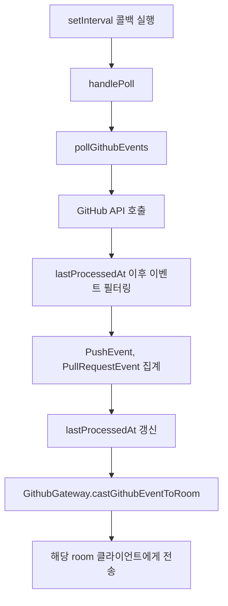
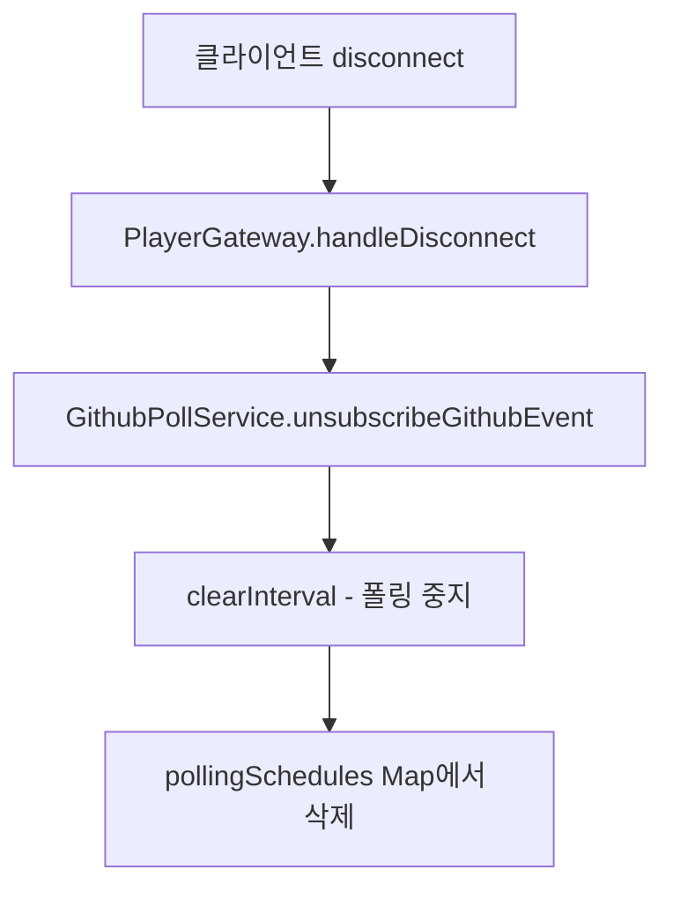

# GitHub Polling 흐름

## 개요

클라이언트가 방에 입장하면 GitHub 이벤트 폴링이 시작되고, 퇴장 시 중지됩니다.

---

## 전체 흐름



---

## 컴포넌트 역할

| 컴포넌트 | 역할 |
|----------|------|
| **PlayerGateway** | 클라이언트 연결/해제 감지, 폴링 등록/해제 트리거 |
| **GithubPollService** | 폴링 스케줄 관리, GitHub API 호출, 이벤트 필터링 |
| **GithubGateway** | 폴링 결과를 해당 방의 클라이언트들에게 브로드캐스트 |

---

## 데이터 구조

### PollingSchedule (클라이언트별 폴링 상태)

```
Map<clientId, {
  interval: NodeJS.Timeout,    // setInterval 참조
  lastProcessedAt: Date        // 마지막 처리 시점
}>
```

### 브로드캐스트 데이터

```
{
  clientId: string,
  pushCount: number,           // PushEvent 개수
  pullRequestCount: number     // PullRequestEvent 개수
}
```

---

## 상세 흐름

### 1. 폴링 등록



### 2. 폴링 실행 (60초마다)



### 3. 폴링 해제



---

## 설계 특징

### 클라이언트 단위 폴링

- 각 클라이언트마다 독립적인 폴링 스케줄 관리
- 연결 시점(`connectedAt`)을 기준으로 새 이벤트만 감지

### 중복 이벤트 방지

- `lastProcessedAt`보다 이후의 이벤트만 필터링
- 폴링 시마다 `lastProcessedAt` 갱신

### Room 기반 브로드캐스트

- Socket.IO의 room 기능 활용
- 같은 방의 모든 클라이언트에게 이벤트 전송

---

## 현재 제약 사항

| 항목 | 현재 상태 | 비고 |
|------|----------|------|
| 사용자 식별 | 하드코딩된 테스트 유저 | 추후 OAuth 연동 필요 |
| API 인증 | Public API (인증 없음) | Rate Limit 제한적 |
| 폴링 주기 | 60초 고정 | 설정 가능하게 개선 가능 |
| ETag 최적화 | 미적용 | Rate Limit 절약 가능 |
