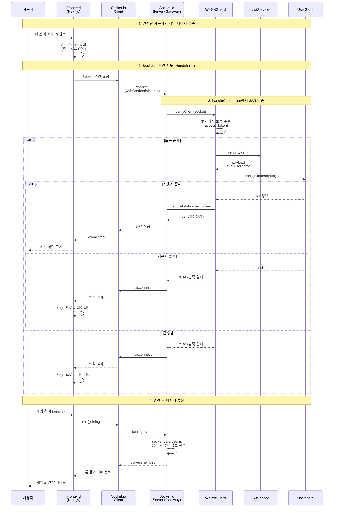

# Socket.io Handshake JWT 검증 시퀀스 다이어그램



## Socket.io 인증 처리 방식

| 단계 | 위치 | 설명 |
|-----|------|------|
| 1 | Client | `withCredentials: true`로 쿠키 전송 |
| 2 | handleConnection | WsJwtGuard.verifyClient() 호출 |
| 3 | WsJwtGuard | 쿠키에서 JWT 추출 → 검증 → UserStore 조회 |
| 4 | Gateway | socket.data.user에 사용자 정보 저장 |
| 5 | @SubscribeMessage | socket.data.user로 인증된 사용자 접근 |

## 클라이언트 연결 코드 예시

```typescript
const socket = io(API_URL, {
  withCredentials: true, // httpOnly 쿠키 전송
});
```

## 서버 검증 코드 구조

```typescript
@WebSocketGateway({ cors: { origin: FRONTEND_URL, credentials: true } })
export class PlayerGateway implements OnGatewayConnection {
  constructor(private wsJwtGuard: WsJwtGuard) {}

  async handleConnection(client: Socket) {
    const isValid = await this.wsJwtGuard.verifyClient(client);
    if (!isValid) {
      client.disconnect();
      return;
    }
    // client.data.user에 인증된 사용자 정보 저장됨
  }
}
```
